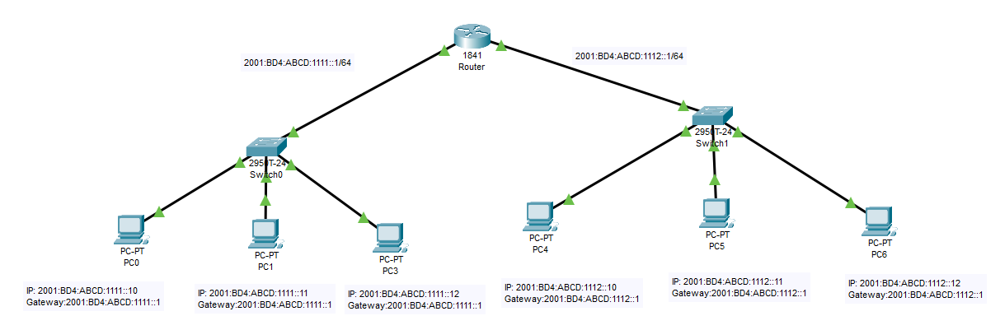

# Configuración de un router con IPv6

Configuración de un router para conectar dos redes con enrutamiento por defecto.

## Creamo una red para la practica

Creamos una red de prueba y nos conectamos via consola.



## Asegurarse que el router es compatible con IPv6

Para ver si el router es compatible con IPv6 podemos ver los comandos dentro de config terminal  y exista ipv6.

``` cisco ios
Router>enable
Router#configure terminal
Router(config)#?
....
 ipv6               Global IPv6 configuration commands
....
```

## Activamos la compativilidad para IPv6

Ejecutar el siguente comando

``` cisco
Router>en
Router#config te
Enter configuration commands, one per line.  End with CNTL/Z.
Router(config)#ipv6 unicast-routing
```

## Para configura los interfaces de un router

Para ver la configuración de puertos del router.

``` cisco ios
Router>enable
Router#show ip interface brief
Interface              IP-Address      OK? Method Status                Protocol 
FastEthernet0/0        unassigned      YES unset  administratively down down 
FastEthernet1/0        unassigned      YES unset  administratively down down
```

## Para configura un interface de un Router

Cambiamos la configuración de los interefaces del router, con los comandos

* **ip address**: Indica la dirección ip y la máscara.
* **no shutdown**: Enciende el interface.
* **duplex auto**: Dirección de comunicación a duplex en automatico.
* **speed auto**: Velocidad dle intereface en automatico.

``` cisco ios
Router(config)#interface FastEthernet0/0
Router(config-if)#ipv6 address 2001:BD4:ABCD:1111::1/64
Router(config-if)#ipv6 address FE80::1 link-local
Router(config-if)#no shutdown
Router(config-if)#interface FastEthernet0/1
Router(config-if)#ipv6 address 2001:BD4:ABCD:1112::1/64
Router(config-if)#ipv6 address FE80::1 link-local
Router(config-if)#no shutdown
Router(config-if)#exit
Router(config)#exit
Router#
```

## Para comprobar la configuración

Para comprobar la configuración podemos volver a ver la configuración de los interfaces:

``` cisco ios
Router#show ipv6 interface brief
FastEthernet0/0            [up/up]
    FE80::1
    2001:BD4:ABCD:1111::1
FastEthernet0/1            [up/up]
    FE80::1
    2001:BD4:ABCD:1112::1
Router#
```

Tambien podemos ver el fichero de configuración:

``` cisco ios
Router#show running-config 
Building configuration...

Current configuration : 637 bytes
!
version 12.4
no service timestamps log datetime msec
no service timestamps debug datetime msec
no service password-encryption
!
hostname Router
!
!
!
!
!
!
!
!
no ip cef
ipv6 unicast-routing
!
no ipv6 cef
!
!
!
!
!
!
!
!
!
!
!
!
spanning-tree mode pvst
!
!
!
!
!
!
interface FastEthernet0/0
 no ip address
 duplex auto
 speed auto
 ipv6 address 2001:BD4:ABCD:1111::1/64
!
interface FastEthernet0/1
 no ip address
 duplex auto
 speed auto
 ipv6 address 2001:BD4:ABCD:1112::1/64
!
interface Vlan1
 no ip address
 shutdown
!
ip classless
!
ip flow-export version 9
!
!
!
!
!
!
!
!
line con 0
!
line aux 0
!
line vty 0 4
 login
!
!
!
end
```

## Para comprobar que todo funciona

El comando más sencillo para comprobar que tenemos conexión es el **ping**

### Realizar un ping desde el router

Podemos realizar un ping desde el router a uno de los PCs

``` cisco ios
Router>ping 2001:BD4:ABCD:1112::10

Type escape sequence to abort.
Sending 5, 100-byte ICMP Echos to 2001:BD4:ABCD:1112::10, timeout is 2 seconds:
!!!!!
Success rate is 100 percent (5/5), round-trip min/avg/max = 0/0/0 ms
```

### Realizar un ping desde un PC

Desde una consola (o Command Prompt) podemos comprobar que tenemos conexión al router.

``` shell
C:\>ping 2001:BD4:ABCD:1111::1

Pinging 2001:BD4:ABCD:1111::1 with 32 bytes of data:

Reply from 2001:BD4:ABCD:1111::1: bytes=32 time<1ms TTL=127
Reply from 2001:BD4:ABCD:1111::1: bytes=32 time<1ms TTL=127
Reply from 2001:BD4:ABCD:1111::1: bytes=32 time<1ms TTL=127
Reply from 2001:BD4:ABCD:1111::1: bytes=32 time<1ms TTL=127

Ping statistics for 2001:BD4:ABCD:1111::1:
    Packets: Sent = 4, Received = 4, Lost = 0 (0% loss),
Approximate round trip times in milli-seconds:
    Minimum = 0ms, Maximum = 0ms, Average = 0ms
```

Comprobar que tenemos conexión a un ordenador de la otra red

``` shell
C:\>ping 2001:BD4:ABCD:1112::10

Pinging 2001:BD4:ABCD:1112::10 with 32 bytes of data:

Request timed out.
Reply from 2001:BD4:ABCD:1112::10: bytes=32 time=6ms TTL=127
Reply from 2001:BD4:ABCD:1112::10: bytes=32 time<1ms TTL=127
Reply from 2001:BD4:ABCD:1112::10: bytes=32 time<1ms TTL=127

Ping statistics for 2001:BD4:ABCD:1112::10:
    Packets: Sent = 4, Received = 3, Lost = 1 (25% loss),
Approximate round trip times in milli-seconds:
    Minimum = 0ms, Maximum = 6ms, Average = 2ms
```

## Para guardar los cambio

El router tiene dos ficheros de configuración,

* **running-config**: Configuración que está ejecutando.
* **startup-config**: Configuración que tendrá la proxima vez que se reinicie.

Si reiniciamos el router, se perderan todos los cambios realizados.

Si queremos revertir los cambios, podemso ejecutar.

``` cisco ios
Router#copy startup-config running-config
```

Si queremos guardar la cunfiguración para hacerla persistente

``` cisco ios
Router#copy running-config  startup-config 
```

## Comprobar las rutas

### Para ver la ruta desde un ordenador

``` shell
C:\>tracert 2001:BD4:ABCD:1112::10

Tracing route to 2001:BD4:ABCD:1112::10 over a maximum of 30 hops: 

  1   0 ms      0 ms      0 ms      2001:BD4:ABCD:1111::1
  2   1 ms      0 ms      0 ms      2001:BD4:ABCD:1112::10

Trace complete.
```

### Ver direcciones mac

Para poder ver las MAC de la red local, en IPv6 existen ARP ya que este funciona por brodcast y este protocolo no existe en IPv6. 
Como alternativa podemos utilizar la siguiente linea de comandos

Para Windows

``` cmd
netsh interface ipv6 show neighbors
```

para Linux

``` shell
ip nei
```

### Alternativa en IPv6

Es posible utilizar como dirección de puerta de enlace la IP del link-local del router,
con esto podemos poner la misma dirección de link-local en todos los interfaces del router y así tendran todos los PC's la misma configuración.

Probar configurar los PC's con:

``` text
Default Gateway: FE80::1
```
