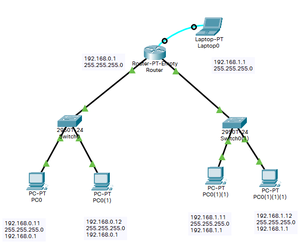

# Configuración de un router

Configuración de un router para conectar dos redes con enrutamiento por defecto.

## Creamo una red para la practica

Creamos una red de prueba y nos conectamos via consola.



## Para configura los interfaces de un router

Para ver la configuración de puertos del router.

``` cisco ios
Router>enable
Router#show ip interface brief
Interface              IP-Address      OK? Method Status                Protocol 
FastEthernet0/0        unassigned      YES unset  administratively down down 
FastEthernet1/0        unassigned      YES unset  administratively down down
```

## Para configura un interface de un Router

Cambiamos la configuración de los interefaces del router, con los comandos

* **ip address**: Indica la dirección ip y la máscara.
* **no shutdown**: Enciende el interface.
* **duplex auto**: Dirección de comunicación a duplex en automatico.
* **speed auto**: Velocidad dle intereface en automatico.

``` cisco ios
Switch>enable
Switch#configure terminal 
%SYS-5-CONFIG_I: Configured from console by console
Router(config)#interface fastEthernet 0/0
Router(config-if)#ip address 192.168.0.1 255.255.255.0
Router(config-if)#no shutdown
%LINK-5-CHANGED: Interface FastEthernet0/0, changed state to up

%LINEPROTO-5-UPDOWN: Line protocol on Interface FastEthernet0/0, changed state to up

Router(config-if)#duplex auto
Router(config-if)#speed auto
Router(config-if)#exit
Router(config)#
```

De igual forma configuramos el otro interface.

``` cisco ios
Switch>enable
Switch#configure terminal 
%SYS-5-CONFIG_I: Configured from console by console
Router(config)#interface fastEthernet 1/0
Router(config-if)#ip address 192.168.1.1 255.255.255.0
Router(config-if)#no shutdown
%LINK-5-CHANGED: Interface FastEthernet1/0, changed state to up

%LINEPROTO-5-UPDOWN: Line protocol on Interface FastEthernet0/0, changed state to up

Router(config-if)#duplex auto
Router(config-if)#speed auto
Router(config-if)#exit
Route
```

## Para comprobar la configuración

Para comprobar la configuración podemos volver a ver la configuración de los interfaces:

``` cisco ios
Router#show ip interface brief
Interface              IP-Address      OK? Method Status                Protocol 
FastEthernet0/0        192.168.0.1     YES manual up                    up 
FastEthernet1/0        192.168.1.1     YES manual up                    up
Router#
```

Tambien podemos ver el fichero de configuración:

``` cisco ios
Router#show running-config 
Building configuration...

Current configuration : 515 bytes
!
version 12.2
no service timestamps log datetime msec
no service timestamps debug datetime msec
no service password-encryption
!
hostname Router
!
!
!
!
!
!
!
!
no ip cef
no ipv6 cef
!
!
!
!
!
!
!
!
!
!
!
!
!
!
!
!
!
!
interface FastEthernet0/0
 ip address 192.168.0.1 255.255.255.0
 duplex auto
 speed auto
!
interface FastEthernet1/0
 ip address 192.168.1.1 255.255.255.0
 duplex auto
 speed auto
!
ip classless
!
ip flow-export version 9
!
!
!
!
!
!
!
!
line con 0
!
line aux 0
!
line vty 0 4
 login
!
!
!
end
```

## Para comprobar que todo funciona

El comando más sencillo para comprobar que tenemos conexión es el **ping**

### Realizar un ping desde el router

Podemos realizar un ping desde el router a uno de los PCs

``` cisco ios
Router>ping 192.168.0.11

Type escape sequence to abort.
Sending 5, 100-byte ICMP Echos to 192.168.0.11, timeout is 2 seconds:
!!!!!
Success rate is 100 percent (5/5), round-trip min/avg/max = 0/0/0 ms
```

### Realizar un ping desde un PC

Desde una consola (o Command Prompt) podemos comprobar que tenemos conexión al router.

``` shell
C:\>ping 192.168.0.1

Pinging 192.168.0.1 with 32 bytes of data:

Reply from 192.168.0.1: bytes=32 time<1ms TTL=255
Reply from 192.168.0.1: bytes=32 time<1ms TTL=255
Reply from 192.168.0.1: bytes=32 time<1ms TTL=255
Reply from 192.168.0.1: bytes=32 time<1ms TTL=255

Ping statistics for 192.168.0.1:
    Packets: Sent = 4, Received = 4, Lost = 0 (0% loss),
Approximate round trip times in milli-seconds:
    Minimum = 0ms, Maximum = 0ms, Average = 0ms
```

Comprobar que tenemos conexión a un ordenador de la otra red

``` shell
C:\>ping 192.168.1.11

Pinging 192.168.1.11 with 32 bytes of data:

Request timed out.
Reply from 192.168.1.11: bytes=32 time=6ms TTL=127
Reply from 192.168.1.11: bytes=32 time<1ms TTL=127
Reply from 192.168.1.11: bytes=32 time<1ms TTL=127

Ping statistics for 192.168.1.11:
    Packets: Sent = 4, Received = 3, Lost = 1 (25% loss),
Approximate round trip times in milli-seconds:
    Minimum = 0ms, Maximum = 6ms, Average = 2ms
```

## Para guardar los cambio

El router tiene dos ficheros de configuración,
* **running-config**: Configuración que está ejecutando.
* **startup-config**: Configuración que tendrá la proxima vez que se reinicie.

Si reiniciamos el router, se perderan todos los cambios realizados.

Si queremos revertir los cambios, podemso ejecutar.

``` cisco ios
Router#copy startup-config running-config
```

Si queremos guardar la cunfiguración para hacerla persistente

``` cisco ios
Router#copy running-config  startup-config 
```

