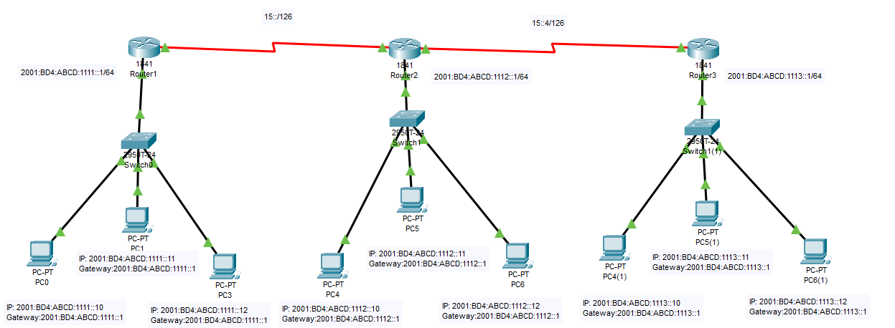

# Enrutamiento estático router con IPv6

Configuración de varios router para conectar varias redes con encaminamiento estatico con RIP

## Creamo una red para la practica

Creamos una red de prueba y nos conectamos via consola.



## Configuramos el primer router (Router 1)

## Asegurarse que el router es compatible con IPv6

Para ver si el router es compatible con IPv6 podemos ver los comandos dentro de config terminal  y exista ipv6.

``` cisco ios
Router>enable
Router#configure terminal
Router(config)#?
....
 ipv6               Global IPv6 configuration commands
....
```

### Nombramos el printer router

Le damos un nombre al router

``` cisco ios
Router>enable
Router#configure terminal 
%SYS-5-CONFIG_I: Configured from console by console
Router(config)#hostname Router1
Router1(config)#exit
Router1#
```

### Activamos la compativilidad para IPv6

Ejecutar el siguente comando

``` cisco
Router1>en
Router1#config te
Enter configuration commands, one per line.  End with CNTL/Z.
Router1(config)#ipv6 unicast-routing
```

### Para configura los interfaces del primer router

Para ver la configuración de puertos del router.

``` cisco ios
Router>enable
Router#show ip interface brief
Interface              IP-Address      OK? Method Status                Protocol 
FastEthernet0/0        unassigned      YES NVRAM  up                    up 
FastEthernet0/1        unassigned      YES NVRAM  up                    down 
Serial0/1/0            unassigned      YES unset  up                    up 
Vlan1                  unassigned      YES unset  administratively down down
```

Cambiamos la configuración de los interefaces del router, con los comandos

* **ip address**: Indica la dirección ip y la máscara.
* **no shutdown**: Enciende el interface.
* **duplex auto**: Dirección de comunicación a duplex en automatico.
* **speed auto**: Velocidad dle intereface en automatico.

``` cisco ios
Router1>enable
Router1#configure terminal 
%SYS-5-CONFIG_I: Configured from console by console
Router1(config)#interface fastEthernet 0/0
Router1(config-if)#ipv6 address 2001:BD4:ABCD:1111::1/64
Router1(config-if)#ipv6 address FE80::1 link-local
Router1(config-if)#no shutdown
Router1(config-if)#duplex auto
Router1(config-if)#speed auto
Router1(config-if)#exit
Router1(config)#
```

De igual forma configuramos el otro interface.

``` cisco ios
Router1>enable
Router1#configure terminal 
%SYS-5-CONFIG_I: Configured from console by console
Router1(config)#interface serial0/1/0
Router1(config-if)#ipv6 address 15::1/126
Router1(config-if)#no shutdown
Router1(config-if)#exit
Router1#
```

### Configuramos la ruta estatica del primer router

Configurar las rutas estaticas

``` cisco ios
Router1>enable
Router1#configure terminal 
Router1(config)#ipv6 route 2001:BD4:ABCD:1112::/64 15::2
Router1(config)#ipv6 route 2001:BD4:ABCD:1113::/64 15::2
```

Podemos ver las rutas con

Router#show ip route

``` cisco ios
Router#show ipv6 route
IPv6 Routing Table - 7 entries
Codes: C - Connected, L - Local, S - Static, R - RIP, B - BGP
       U - Per-user Static route, M - MIPv6
       I1 - ISIS L1, I2 - ISIS L2, IA - ISIS interarea, IS - ISIS summary
       ND - ND Default, NDp - ND Prefix, DCE - Destination, NDr - Redirect
       O - OSPF intra, OI - OSPF inter, OE1 - OSPF ext 1, OE2 - OSPF ext 2
       ON1 - OSPF NSSA ext 1, ON2 - OSPF NSSA ext 2
       D - EIGRP, EX - EIGRP external
C   15::/126 [0/0]
     via ::, Serial0/1/0
L   15::1/128 [0/0]
     via ::, Serial0/1/0
C   2001:BD4:ABCD:1111::/64 [0/0]
     via ::, FastEthernet0/0
L   2001:BD4:ABCD:1111::1/128 [0/0]
     via ::, FastEthernet0/0
S   2001:BD4:ABCD:1112::/64 [1/0]
     via 15::2
S   2001:BD4:ABCD:1113::/64 [1/0]
     via 15::2
L   FF00::/8 [0/0]
     via ::, Null0
```

### Guardamos la configuración del primer router

Guardamos la cunfiguración

``` cisco ios
Router1#copy running-config  startup-config 
```

## Configuramos el primer router (Router 2)

### Nombramos el segundo router

Le damos un nombre al router

``` cisco ios
Router>enable
Router#configure terminal 
%SYS-5-CONFIG_I: Configured from console by console
Router(config)#hostname Router2
Router2(config)#exit
```

### Activamos la compativilidad para IPv6

Ejecutar el siguente comando

``` cisco
Router2>en
Router2#config te
Enter configuration commands, one per line.  End with CNTL/Z.
Router2(config)#ipv6 unicast-routing
```

### Para configura los interfaces del segundo router

Para ver la configuración de puertos del router.

``` cisco ios
Router2>enable
Router2#show ip interface brief
Interface              IP-Address      OK? Method Status                Protocol 
FastEthernet0/0        unassigned      YES NVRAM  up                    up 
FastEthernet0/1        unassigned      YES NVRAM  up                    down 
Serial0/1/0            unassigned      YES unset  up                    up 
Serial0/1/1            unassigned      YES unset  up                    up 
Vlan1                  unassigned      YES unset  administratively down down
```

Cambiamos la configuración de los interefaces del router, con los comandos

* **ip address**: Indica la dirección ip y la máscara.
* **no shutdown**: Enciende el interface.
* **duplex auto**: Dirección de comunicación a duplex en automatico.
* **speed auto**: Velocidad dle intereface en automatico.

``` cisco ios
Router2>enable
Router2#configure terminal 
%SYS-5-CONFIG_I: Configured from console by console
Router2(config)#interface fastEthernet 0/0
Router2(config-if)#ipv6 address 2001:BD4:ABCD:1112::1/64
Router2(config-if)#ipv6 address FE80::1 link-local
Router2(config-if)#no shutdown
%LINK-5-CHANGED: Interface FastEthernet0/0, changed state to up

%LINEPROTO-5-UPDOWN: Line protocol on Interface FastEthernet0/0, changed state to up

Router2(config-if)#duplex auto
Router2(config-if)#speed auto
Router2(config-if)#exit
Router2(config)#
```

De igual forma configuramos los otros interface.

``` cisco ios
Router2>enable
Router2#configure terminal 
%SYS-5-CONFIG_I: Configured from console by console
Router2(config)#interface serial 0/1/0
Router1(config-if)#ipv6 address 15::2/126
Router2(config-if)#no shutdown
Router2(config-if)#exit
Router2#
Router2(config)#interface serial 0/1/1
Router2(config-if)#ipv6 address 15::5/126
Router2(config-if)#no shutdown
Router2#
```

### Configuramos la ruta estatica del segundo router

Configurar las rutas estaticas

``` cisco ios
Router2>enable
Router2#configure terminal 
Router2(config)#ipv6 route 2001:BD4:ABCD:1111::/64 15::1
Router2(config)#ipv6 route 2001:BD4:ABCD:1113::/64 15::6
```

Podemos ver las rutas con

``` cisco ios
Router2#show ipv6 route
IPv6 Routing Table - 8 entries
Codes: C - Connected, L - Local, S - Static, R - RIP, B - BGP
       U - Per-user Static route, M - MIPv6
       I1 - ISIS L1, I2 - ISIS L2, IA - ISIS interarea, IS - ISIS summary
       ND - ND Default, NDp - ND Prefix, DCE - Destination, NDr - Redirect
       O - OSPF intra, OI - OSPF inter, OE1 - OSPF ext 1, OE2 - OSPF ext 2
       ON1 - OSPF NSSA ext 1, ON2 - OSPF NSSA ext 2
       D - EIGRP, EX - EIGRP external
C   15::/126 [0/0]
     via ::, Serial0/1/0
L   15::2/128 [0/0]
     via ::, Serial0/1/0
C   15:0:0:4::/126 [0/0]
     via ::, Serial0/1/1
L   15:0:0:4::2/128 [0/0]
     via ::, Serial0/1/1
S   2001:BD4:ABCD:1111::/64 [1/0]
     via 15::1
C   2001:BD4:ABCD:1112::/64 [0/0]
     via ::, FastEthernet0/0
L   2001:BD4:ABCD:1112::1/128 [0/0]
     via ::, FastEthernet0/0
L   FF00::/8 [0/0]
     via ::, Null0
```

### Guardamos la configuración del segundo router

Guardamos la cunfiguración

``` cisco ios
Router2#copy running-config  startup-config 
```

## Configuramos el primer router (Router 3)

### Nombramos el router

Le damos un nombre al router

``` cisco ios
Router3>enable
Router3#configure terminal 
%SYS-5-CONFIG_I: Configured from console by console
Router(config)#hostname Router3
Router3(config)#exit
Router3#
```

### Activamos la compativilidad para IPv6

Ejecutar el siguente comando

``` cisco
Router3>en
Router3#config te
Enter configuration commands, one per line.  End with CNTL/Z.
Router3(config)#ipv6 unicast-routing
```

### Para configura los interfaces del tercer router

Para ver la configuración de puertos del router.

``` cisco ios
Router3#show ip interface brief
Interface              IP-Address      OK? Method Status                Protocol 
FastEthernet0/0        unassigned      YES NVRAM  up                    up 
FastEthernet0/1        unassigned      YES NVRAM  up                    down 
Serial0/1/0            unassigned      YES unset  up                    up 
Vlan1                  unassigned      YES unset  administratively down down
```

Cambiamos la configuración de los interefaces del router, con los comandos

* **ip address**: Indica la dirección ip y la máscara.
* **no shutdown**: Enciende el interface.
* **duplex auto**: Dirección de comunicación a duplex en automatico.
* **speed auto**: Velocidad dle intereface en automatico.

``` cisco ios
Router>enable
Router#configure terminal 
%SYS-5-CONFIG_I: Configured from console by console
Router3(config)#interface fastEthernet 0/0
Router3(config-if)#ipv6 address 2001:BD4:ABCD:1113::1/64
Router3(config-if)#ipv6 address FE80::1 link-local
Router3(config-if)#no shutdown
Router3(config-if)#duplex auto
Router3(config-if)#speed auto
Router3(config-if)#exit
Router3(config)#
```

De igual forma configuramos el otro interface.

``` cisco ios
Router3>enable
Router3#configure terminal 
%SYS-5-CONFIG_I: Configured from console by console
Router3(config)#interface Serial0/1/0 
Router3(config-if)#ipv6 address 15::6/126
Router3(config-if)#no shutdown
```

### Configuramos la ruta estatica del tercer router

Configurar las rutas estaticas

``` cisco ios
Router3>enable
Router3#configure terminal 
Router3(config)#ipv6 route 2001:BD4:ABCD:1111::/64 15::5
Router3(config)#ipv6 route 2001:BD4:ABCD:1112::/64 15::5
```

Podemos ver las rutas con

``` cisco ios
Router3#show ipv6 route
IPv6 Routing Table - 5 entries
Codes: C - Connected, L - Local, S - Static, R - RIP, B - BGP
       U - Per-user Static route, M - MIPv6
       I1 - ISIS L1, I2 - ISIS L2, IA - ISIS interarea, IS - ISIS summary
       ND - ND Default, NDp - ND Prefix, DCE - Destination, NDr - Redirect
       O - OSPF intra, OI - OSPF inter, OE1 - OSPF ext 1, OE2 - OSPF ext 2
       ON1 - OSPF NSSA ext 1, ON2 - OSPF NSSA ext 2
       D - EIGRP, EX - EIGRP external
C   15:0:0:4::/126 [0/0]
     via ::, Serial0/1/0
L   15:0:0:4::1/128 [0/0]
     via ::, Serial0/1/0
C   2001:BD4:ABCD:1113::/64 [0/0]
     via ::, FastEthernet0/0
L   2001:BD4:ABCD:1113::1/128 [0/0]
     via ::, FastEthernet0/0
L   FF00::/8 [0/0]
     via ::, Null0
```

### Guardamos la configuración del tercer router

Guardamos la cunfiguración

``` cisco ios
Router3#copy running-config  startup-config 
```

## Para comprobar que todo funciona

El comando más sencillo para comprobar que tenemos conexión es el **ping**

### Realizar un ping desde el router

Podemos realizar un ping desde el router a uno de los PCs

``` cisco ios
Router>ping 15::2

Type escape sequence to abort.
Sending 5, 100-byte ICMP Echos to 15::2, timeout is 2 seconds:
!!!!!
Success rate is 100 percent (5/5), round-trip min/avg/max = 0/0/0 ms
```

### Realizar un ping desde un PC

Desde una consola (o Command Prompt) podemos comprobar que tenemos conexión al router.

``` shell
C:\>ping 2001:BD4:ABCD:1111::1

Pinging 2001:BD4:ABCD:1111::1 with 32 bytes of data:

Reply from 2001:BD4:ABCD:1111::1: bytes=32 time<1ms TTL=255
Reply from 2001:BD4:ABCD:1111::1: bytes=32 time<1ms TTL=255
Reply from 2001:BD4:ABCD:1111::1: bytes=32 time<1ms TTL=255
Reply from 2001:BD4:ABCD:1111::1: bytes=32 time<1ms TTL=255

Ping statistics for 2001:BD4:ABCD:1111::1:
    Packets: Sent = 4, Received = 4, Lost = 0 (0% loss),
Approximate round trip times in milli-seconds:
    Minimum = 0ms, Maximum = 0ms, Average = 0ms
```

Tambien podemos acceder al router a traves del link-local

``` shell
C:\>ping FE80::1

Pinging FE80::1 with 32 bytes of data:

Reply from FE80::1: bytes=32 time<1ms TTL=255
Reply from FE80::1: bytes=32 time<1ms TTL=255
Reply from FE80::1: bytes=32 time=8ms TTL=255
Reply from FE80::1: bytes=32 time<1ms TTL=255

Ping statistics for FE80::1:
    Packets: Sent = 4, Received = 4, Lost = 0 (0% loss),
Approximate round trip times in milli-seconds:
    Minimum = 0ms, Maximum = 8ms, Average = 2ms
```

Comprobar que tenemos conexión a un ordenador de la otra red

``` shell
C:\>ping 192.168.1.11

Pinging 192.168.1.11 with 32 bytes of data:

Request timed out.
Reply from 192.168.1.11: bytes=32 time=6ms TTL=127
Reply from 192.168.1.11: bytes=32 time<1ms TTL=127
Reply from 192.168.1.11: bytes=32 time<1ms TTL=127

Ping statistics for 192.168.1.11:
    Packets: Sent = 4, Received = 3, Lost = 1 (25% loss),
Approximate round trip times in milli-seconds:
    Minimum = 0ms, Maximum = 6ms, Average = 2ms
```

### Enrutamiento

Desde un router podemos ver el camino de los paquetes con el comando **traceroute**

``` cisco ios
Router1>traceroute 192.168.2.12
Type escape sequence to abort.
Tracing the route to 192.168.2.12

  1   93.25.36.2      0 msec    0 msec    0 msec    
  2   93.25.36.6      0 msec    0 msec    0 msec    
  3   192.168.2.12    0 msec    0 msec    0 msec   
```

Desde el PC podemos ver el camino de los paquetes con el comando **tracert**.

``` shell
C:\>tracert 192.168.2.12

Tracing route to 192.168.2.12 over a maximum of 30 hops: 

  1   0 ms      0 ms      0 ms      192.168.0.1
  2   0 ms      0 ms      0 ms      93.25.36.2
  3   0 ms      0 ms      0 ms      93.25.36.6
  4   *         0 ms      0 ms      192.168.2.12

Trace complete.
```

### Alternativa en IPv6

Es posible utilizar como dirección de puerta de enlace la IP del link-local del router,
con esto podemos poner la misma dirección de link-local en todos los interfaces del router y así tendran todos los PC's la misma configuración.

Probar configurar los PC's con:

``` text
Default Gateway: FE80::1
```
