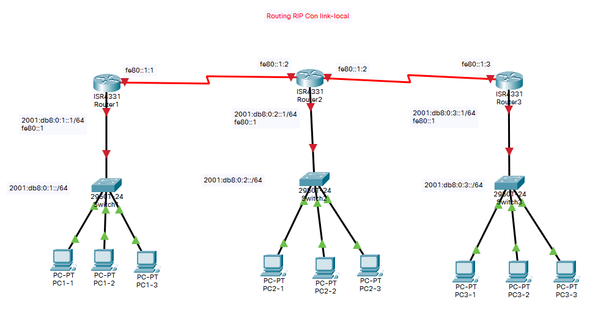

# Enrutamiento dinámico router con RIPng (IPv6) con enlaces link-local

Configuración de varios router para conectar varias redes con encaminamiento estatico

## Creamo una red para la practica

Creamos una red de prueba y nos conectamos via consola.



## Asegurarse que el router es compatible con IPv6

Para ver si el router es compatible con IPv6 podemos ver los comandos dentro de config terminal  y exista ipv6.

``` cisco ios
Router>enable
Router#configure terminal
Router(config)#?
....
 ipv6               Global IPv6 configuration commands
....
```

## Configuramos el primer router (Router 1)

### Nombramos el router

Le damos un nombre al router

``` cisco ios
Router>enable
Router#configure terminal 
%SYS-5-CONFIG_I: Configured from console by console
Router(config)#hostname Router1
Router1(config)#exit
Router1#
```

### Activamos la compativilidad para IPv6

Ejecutar el siguente comando

``` cisco
Router1>en
Router1#config te
Enter configuration commands, one per line.  End with CNTL/Z.
Router1(config)#ipv6 unicast-routing
```

### Para configura los interfaces de un router

Para ver la configuración de puertos del router.

``` cisco ios
Router>enable
Router#show ip interface brief
Interface              IP-Address      OK? Method Status                Protocol 
FastEthernet0/0        unassigned      YES unset  administratively down down 
GigabitEthernet1/0     unassigned      YES unset  administratively down down
```

Notamos que ambien se puede listar las interfaces que utilizan IPv6, pero solo se lestaran tras ser configuradas.

``` cisco ios
Router#show ipv6 interface brief
Interface              IP-Address      OK? Method Status                Protocol 
```

Cambiamos la configuración de los interefaces del router, con los comandos e indicamos que interfaces tienen que funcionar con RIP y el nombre del proceso.

``` cisco ios
Router1>enable
Router1#configure terminal 
%SYS-5-CONFIG_I: Configured from console by console
Router1(config)#interface gigabitEthernet 0/0/0
Router1(config-if)#ipv6 address 2001:db8:0:1::1/64
Router1(config-if)#ipv6 address fe80::1 link-local
Router1(config-if)#no shutdown
Router1(config-if)#exit
Router1(config)#
```

De igual forma configuramos el interface que comunica con los otros router y lo hacemos solo a traves del link-local.

``` cisco ios
Router1>enable
Router1#configure terminal 
%SYS-5-CONFIG_I: Configured from console by console
Router1(config)#interface serial 0/1/0
Router1(config-if)#ipv6 address fe80::1:1 link-local
Router1(config-if)#no shutdown
Router1(config-if)#clock rate 2000000
Router1(config-if)#exit
Router1#
```

### Configuramos el enrutamiento dinámico con RIP

Indicamos que vamos a usar RIP y damos un nombre al proceso de ejecución de rip que ha de ser igual en todos los router que queremos que se sincronicen,
en este ejemplo *PracticaRIP*.

``` cisco
Router1(config)#ipv6 router rip PracticaRIP
Router1(config-rtr)#exit
Router1(config)#
```

Indicamos que interface que queremos que actue sobre el protoco,
indicando con el comando *ipv6 PracticaRIP enable*

``` cisco ios
Router1(config)#interface gigabitEthernet 0/0/0
Router1(config-if)#ipv6 rip PracticaRIP enable
Router1(config-if)#no shutdown
Router1(config-if)#exit
Router1(config)#
```

``` cisco ios
Router1(config)#interface serial 0/1/0
Router1(config-if)#ipv6 rip PracticaRIP enable
Router1(config-if)#no shutdown
Router1(config-if)#exit
Router1(config)#exit
Router1#
```

Podemos ver las rutas con

``` cisco ios
Router1#show ipv6 route
IPv6 Routing Table - 5 entries
Codes: C - Connected, L - Local, S - Static, R - RIP, B - BGP
       U - Per-user Static route, M - MIPv6
       I1 - ISIS L1, I2 - ISIS L2, IA - ISIS interarea, IS - ISIS summary
       ND - ND Default, NDp - ND Prefix, DCE - Destination, NDr - Redirect
       O - OSPF intra, OI - OSPF inter, OE1 - OSPF ext 1, OE2 - OSPF ext 2
       ON1 - OSPF NSSA ext 1, ON2 - OSPF NSSA ext 2
       D - EIGRP, EX - EIGRP external
C   2001:DB8:0:1::/64 [0/0]
     via GigabitEthernet0/0/0, directly connected
L   2001:DB8:0:1::1/128 [0/0]
     via GigabitEthernet0/0/0, receive
R   2001:DB8:0:2::/64 [120/2]
     via FE80::1:2, Serial0/1/0
R   2001:DB8:0:3::/64 [120/3]
     via FE80::1:2, Serial0/1/0
L   FF00::/8 [0/0]
     via Null0, receive
```

### Guardamos la configuración

Guardamos la cunfiguración

``` cisco ios
Router1#copy running-config  startup-config 
```

## Configuramos el primer router (Router 2)

### Nombramos el router

Le damos un nombre al router

``` cisco ios
Router>enable
Router#configure terminal 
%SYS-5-CONFIG_I: Configured from console by console
Router(config)#hostname Router2
Router2(config)#exit
```

### Activamos la compativilidad para IPv6

Ejecutar el siguente comando

``` cisco
Router2>en
Router2#config te
Enter configuration commands, one per line.  End with CNTL/Z.
Router2(config)#ipv6 unicast-routing
```

### Para configura los interfaces de un router

Para ver la configuración de puertos del router.

``` cisco ios
Router>enable
Router#show ip interface brief
Interface              IP-Address      OK? Method Status                Protocol 
FastEthernet0/0        unassigned      YES unset  administratively down down 
GigabitEthernet1/0     unassigned      YES unset  administratively down down
```

Notamos que ambien se puede listar las interfaces que utilizan IPv6, pero solo se lestaran tras ser configuradas.

``` cisco ios
Router#show ipv6 interface brief
Interface              IP-Address      OK? Method Status                Protocol 
```

Cambiamos la configuración de los interefaces del router, con los comandos e indicamos que interfaces tienen que funcionar con RIP y el nombre del proceso.

``` cisco ios
Router2>enable
Router2#configure terminal 
%SYS-5-CONFIG_I: Configured from console by console
Router2(config)#interface GigabitEthernet0/0/0
Router2(config-if)#ipv6 address 2001:db8:0:2::1/64
Router2(config-if)#ipv6 address fe80::1 link-local
Router2(config-if)#ipv6 rip PracticaRIP enable
Router2(config-if)#no shutdown
%LINK-5-CHANGED: Interface FastEthernet0/0, changed state to up

%LINEPROTO-5-UPDOWN: Line protocol on Interface FastEthernet0/0, changed state to up

Router2(config-if)#duplex auto
Router2(config-if)#speed auto
Router2(config-if)#exit
Router2(config)#
```

De igual forma configuramos los otros interface.

``` cisco ios
Router2>enable
Router2#configure terminal 
%SYS-5-CONFIG_I: Configured from console by console
Router2(config)#interface Serial0/1/0
Router2(config-if)#ipv6 address fe80::1:2 link-local
Router2(config-if)#ipv6 rip PracticaRIP enable
Router2(config-if)#clock rate 2000000
Router2(config-if)#no shutdown
Router2(config-if)#exit

Router2(config)#interface Serial0/1/1
Router2(config-if)#ipv6 address fe80::1:2 link-local
Router2(config-if)#ipv6 rip PracticaRIP enable
Router2(config-if)#clock rate 2000000
Router2(config-if)#no shutdown
Router2(config-if)#exit
Router2(config)#exit
Router2#
```

### Configuramos el enrutamiento dinámico con RIP

Indicamos que vamos a usar RIP y damos un nombre al proceso de ejecución de rip que ha de ser igual en todos los router que queremos que se sincronicen,
en este ejemplo *PracticaRIP*.

``` cisco
Router2(config)#ipv6 router rip PracticaRIP
Router2(config-rtr)#exit
Router2(config)#
```

Indicamos que interface que queremos que actue sobre el protoco,
indicando con el comando *ipv6 PracticaRIP enable*

``` cisco ios
Router2(config)#interface gigabitEthernet 0/0/0
Router2(config-if)#ipv6 rip PracticaRIP enable
Router2(config-if)#no shutdown
Router2(config-if)#exit
Router2(config)#
```

``` cisco ios
Router2(config)#interface serial 0/1/0
Router2(config-if)#ipv6 rip PracticaRIP enable
Router2(config-if)#no shutdown
Router2(config-if)#exit
Router2(config)#exit
Router2#
```

``` cisco ios
Router2(config)#interface serial 0/1/1
Router2(config-if)#ipv6 rip PracticaRIP enable
Router2(config-if)#no shutdown
Router2(config-if)#exit
Router2(config)#exit
Router2#
```

Podemos ver las rutas con

``` cisco ios
Router2#show ipv6 route
IPv6 Routing Table - 5 entries
Codes: C - Connected, L - Local, S - Static, R - RIP, B - BGP
       U - Per-user Static route, M - MIPv6
       I1 - ISIS L1, I2 - ISIS L2, IA - ISIS interarea, IS - ISIS summary
       ND - ND Default, NDp - ND Prefix, DCE - Destination, NDr - Redirect
       O - OSPF intra, OI - OSPF inter, OE1 - OSPF ext 1, OE2 - OSPF ext 2
       ON1 - OSPF NSSA ext 1, ON2 - OSPF NSSA ext 2
       D - EIGRP, EX - EIGRP external
R   2001:DB8:0:1::/64 [120/2]
     via FE80::1:1, Serial0/1/0
C   2001:DB8:0:2::/64 [0/0]
     via GigabitEthernet0/0/0, directly connected
L   2001:DB8:0:2::1/128 [0/0]
     via GigabitEthernet0/0/0, receive
R   2001:DB8:0:3::/64 [120/2]
     via FE80::1:3, Serial0/1/1
L   FF00::/8 [0/0]
     via Null0, receive
```

### Guardamos la configuración

Guardamos la cunfiguración

``` cisco ios
Router2#copy running-config  startup-config 
```

## Configuramos el primer router (Router 3)

### Nombramos el router

Le damos un nombre al router

``` cisco ios
Router3>enable
Router3#configure terminal 
%SYS-5-CONFIG_I: Configured from console by console
Router(config)#hostname Router3
Router3(config)#exit
Router3#
```

### Activamos la compativilidad para IPv6

Ejecutar el siguente comando

``` cisco
Router3>en
Router3#config te
Enter configuration commands, one per line.  End with CNTL/Z.
Router3(config)#ipv6 unicast-routing
```

### Para configura los interfaces de un router

Para ver la configuración de puertos del router.

``` cisco ios
Router>enable
Router#show ip interface brief
Interface              IP-Address      OK? Method Status                Protocol 
FastEthernet0/0        unassigned      YES unset  administratively down down 
GigabitEthernet1/0     unassigned      YES unset  administratively down down
```

Notamos que ambien se puede listar las interfaces que utilizan IPv6, pero solo se lestaran tras ser configuradas.

``` cisco ios
Router#show ipv6 interface brief
Interface              IP-Address      OK? Method Status                Protocol 
```

Cambiamos la configuración de los interefaces del router, con los comandos e indicamos que interfaces tienen que funcionar con RIP y el nombre del proceso.

``` cisco ios
Router3>enable
Router3#configure terminal 
%SYS-5-CONFIG_I: Configured from console by console
Router3(config)#interface GigabitEthernet0/0/0
Router3(config-if)#ipv6 address 2001:db8:0:3::1/64
Router3(config-if)#ipv6 address fe80::1 link-local
Router3(config-if)#no shutdown
%LINK-5-CHANGED: Interface FastEthernet0/0, changed state to up

%LINEPROTO-5-UPDOWN: Line protocol on Interface FastEthernet0/0, changed state to up

Router3(config-if)#duplex auto
Router3(config-if)#speed auto
Router3(config-if)#exit
Router3(config)#
```

De igual forma configuramos el otro interface.

``` cisco ios
Router3>enable
Router3#configure terminal 
%SYS-5-CONFIG_I: Configured from console by console
Router3(config)#interface Serial0/1/0
Router3(config-if)#ipv6 address fe80::1:3 link-local
Router3(config-if)#clock rate 2000000
Router3(config-if)#no shutdown
Router3(config-if)#exit
Router3#
```

### Configuramos el enrutamiento dinámico con RIP

Indicamos que vamos a usar RIP y damos un nombre al proceso de ejecución de rip que ha de ser igual en todos los router que queremos que se sincronicen,
en este ejemplo *PracticaRIP*.

``` cisco
Router3(config)#ipv6 router rip PracticaRIP
Router3(config-rtr)#exit
Router3(config)#
```

Indicamos que interface que queremos que actue sobre el protoco,
indicando con el comando *ipv6 PracticaRIP enable*

``` cisco ios
Router3(config)#interface gigabitEthernet 0/0/0
Router3(config-if)#ipv6 rip PracticaRIP enable
Router3(config-if)#no shutdown
Router3(config-if)#exit
Router3(config)#
```

``` cisco ios
Router3(config)#interface serial 0/1/0
Router3(config-if)#ipv6 rip PracticaRIP enable
Router3(config-if)#no shutdown
Router3(config-if)#exit
Router3(config)#exit
Router3#
```

Podemos ver las rutas con

``` cisco ios
Router3#show ipv6 route
IPv6 Routing Table - 5 entries
Codes: C - Connected, L - Local, S - Static, R - RIP, B - BGP
       U - Per-user Static route, M - MIPv6
       I1 - ISIS L1, I2 - ISIS L2, IA - ISIS interarea, IS - ISIS summary
       ND - ND Default, NDp - ND Prefix, DCE - Destination, NDr - Redirect
       O - OSPF intra, OI - OSPF inter, OE1 - OSPF ext 1, OE2 - OSPF ext 2
       ON1 - OSPF NSSA ext 1, ON2 - OSPF NSSA ext 2
       D - EIGRP, EX - EIGRP external
R   2001:DB8:0:1::/64 [120/3]
     via FE80::1:2, Serial0/1/0
R   2001:DB8:0:2::/64 [120/2]
     via FE80::1:2, Serial0/1/0
C   2001:DB8:0:3::/64 [0/0]
     via GigabitEthernet0/0/0, directly connected
L   2001:DB8:0:3::1/128 [0/0]
     via GigabitEthernet0/0/0, receive
L   FF00::/8 [0/0]
     via Null0, receive
```

### Guardamos la configuración

Guardamos la cunfiguración

``` cisco ios
Router3#copy running-config  startup-config 
```

## Para comprobar que todo funciona

El comando más sencillo para comprobar que tenemos conexión es el **ping**

### Realizar un ping desde el router

Podemos realizar un ping desde el router a uno de los PCs

``` cisco ios
Router1>ping 2001:db8:0:1::a

Type escape sequence to abort.
Sending 5, 100-byte ICMP Echos to 2001:db8:0:1::a, timeout is 2 seconds:
!!!!!
Success rate is 100 percent (5/5), round-trip min/avg/max = 0/0/0 ms
```

### Realizar un ping desde un PC

Desde una consola (o Command Prompt) podemos comprobar que tenemos conexión al router.

``` shell
C:\>ping 2001:db8:0:1::1

Pinging 2001:db8:0:1::1 with 32 bytes of data:

Reply from 2001:DB8:0:1::1: bytes=32 time<1ms TTL=255
Reply from 2001:DB8:0:1::1: bytes=32 time<1ms TTL=255
Reply from 2001:DB8:0:1::1: bytes=32 time<1ms TTL=255
Reply from 2001:DB8:0:1::1: bytes=32 time<1ms TTL=255

Ping statistics for 2001:DB8:0:1::1:
    Packets: Sent = 4, Received = 4, Lost = 0 (0% loss),
Approximate round trip times in milli-seconds:
    Minimum = 0ms, Maximum = 0ms, Average = 0ms
```

Tambien podemos acceder al router a traves del link-local.

``` shell
C:\>ping fe80::1

Pinging fe80::1 with 32 bytes of data:

Reply from FE80::1: bytes=32 time<1ms TTL=255
Reply from FE80::1: bytes=32 time<1ms TTL=255
Reply from FE80::1: bytes=32 time<1ms TTL=255
Reply from FE80::1: bytes=32 time<1ms TTL=255

Ping statistics for FE80::1:
    Packets: Sent = 4, Received = 4, Lost = 0 (0% loss),
Approximate round trip times in milli-seconds:
    Minimum = 0ms, Maximum = 0ms, Average = 0ms
```

Comprobar que tenemos conexión a un ordenador de la otra red

``` shell
C:\>ping 2001:db8:0:3::a

Pinging 2001:db8:0:3::a with 32 bytes of data:

Reply from 2001:DB8:0:3::A: bytes=32 time=14ms TTL=125
Reply from 2001:DB8:0:3::A: bytes=32 time=12ms TTL=125
Reply from 2001:DB8:0:3::A: bytes=32 time=11ms TTL=125
Reply from 2001:DB8:0:3::A: bytes=32 time=13ms TTL=125

Ping statistics for 2001:DB8:0:3::A:
    Packets: Sent = 4, Received = 4, Lost = 0 (0% loss),
Approximate round trip times in milli-seconds:
    Minimum = 11ms, Maximum = 14ms, Average = 12ms
```

Comrpo

### Ver direcciones MAC

Para poder ver las MAC de la red local, en IPv6 existen ARP ya que este funciona por brodcast y este protocolo no existe en IPv6.
Como alternativa podemos utilizar la siguiente linea de comandos

Para Windows

``` cmd
netsh interface ipv6 show neighbors
```

para Linux

``` shell
ip nei
```

### Enrutamiento

Desde un router podemos ver el camino de los paquetes con el comando **traceroute**

``` cisco ios
Router1>traceroute 2001:DB8:0:3::A
Type escape sequence to abort.
Tracing the route to 2001:DB8:0:3::A

  1   2001:DB8:0:2::1 8 msec    0 msec    3 msec    
  2   2001:DB8:0:3::1 2 msec    6 msec    6 msec    
  3   2001:DB8:0:3::A 4 msec    7 msec    1 msec    
```

Desde el PC podemos ver el camino de los paquetes con el comando **tracert**.

``` shell
C:\>ping 2001:db8:0:3::a

Pinging 2001:db8:0:3::a with 32 bytes of data:

Reply from 2001:DB8:0:3::A: bytes=32 time=14ms TTL=125
Reply from 2001:DB8:0:3::A: bytes=32 time=12ms TTL=125
Reply from 2001:DB8:0:3::A: bytes=32 time=11ms TTL=125
Reply from 2001:DB8:0:3::A: bytes=32 time=13ms TTL=125

Ping statistics for 2001:DB8:0:3::A:
    Packets: Sent = 4, Received = 4, Lost = 0 (0% loss),
Approximate round trip times in milli-seconds:
    Minimum = 11ms, Maximum = 14ms, Average = 12ms
```
