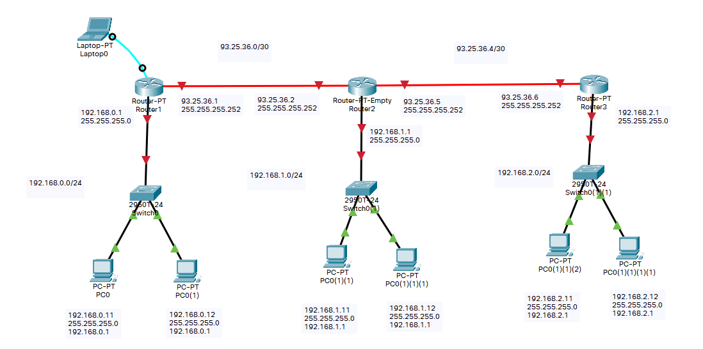

# Enrutamiento dinámico router con Rip

Configuración de varios router para conectar varias redes con encaminamiento estatico

## Creamo una red para la practica

Creamos una red de prueba y nos conectamos via consola.



## Configuramos el primer router (Router 1)

### Nombramos el router

Le damos un nombre al router

``` cisco ios
Router>enable
Router#configure terminal 
%SYS-5-CONFIG_I: Configured from console by console
Router(config)#hostname Router1
Router1(config)#exit
Router1#
```

### Para configura los interfaces de un router

Para ver la configuración de puertos del router.

``` cisco ios
Router>enable
Router#show ip interface brief
Interface              IP-Address      OK? Method Status                Protocol 
FastEthernet0/0        unassigned      YES unset  administratively down down 
GigabitEthernet1/0     unassigned      YES unset  administratively down down
```

Cambiamos la configuración de los interefaces del router, con los comandos

* **ip address**: Indica la dirección ip y la máscara.
* **no shutdown**: Enciende el interface.
* **duplex auto**: Dirección de comunicación a duplex en automatico.
* **speed auto**: Velocidad dle intereface en automatico.

``` cisco ios
Router1>enable
Router1#configure terminal 
%SYS-5-CONFIG_I: Configured from console by console
Router1(config)#interface fastEthernet 0/0
Router1(config-if)#ip address 192.168.0.1 255.255.255.0
Router1(config-if)#no shutdown
%LINK-5-CHANGED: Interface FastEthernet0/0, changed state to up

%LINEPROTO-5-UPDOWN: Line protocol on Interface FastEthernet0/0, changed state to up

Router1(config-if)#duplex auto
Router1(config-if)#speed auto
Router1(config-if)#exit
Router1(config)#
```

De igual forma configuramos el otro interface.

``` cisco ios
Router1>enable
Router1#configure terminal 
%SYS-5-CONFIG_I: Configured from console by console
Router1(config)#interface GigabitEthernet 1/0
Router1(config-if)#ip address 93.25.36.1 255.255.255.252
Router1(config-if)#no shutdown
%LINK-5-CHANGED: Interface GigabitEthernet1/0, changed state to up

%LINEPROTO-5-UPDOWN: Line protocol on Interface FastEthernet0/0, changed state to up

Router1(config-if)#duplex auto
Router1(config-if)#speed auto
Router1(config-if)#exit
Router1#
```

### Configuramos el enrutamiento dinámico con RIP

Se utiliza el comando Router RIP para realizar enrutamiento dinamico y
especificamos las redes que ve directamente nuestro router.

``` cisco ios
Router1>enable
Router1#configure terminal 
Router1(config)#router rip
Router1(config-router)#version 2
Router1(config-router)#no auto-summary
Router1(config-router)#network 192.168.0.0
Router1(config-router)#network 93.25.36.0
Router1(config-router)#exit
Router1(config)#
```

Podemos ver las rutas con

``` cisco ios
Router1#show ip route 
Codes: C - connected, S - static, I - IGRP, R - RIP, M - mobile, B - BGP
       D - EIGRP, EX - EIGRP external, O - OSPF, IA - OSPF inter area
       N1 - OSPF NSSA external type 1, N2 - OSPF NSSA external type 2
       E1 - OSPF external type 1, E2 - OSPF external type 2, E - EGP
       i - IS-IS, L1 - IS-IS level-1, L2 - IS-IS level-2, ia - IS-IS inter area
       * - candidate default, U - per-user static route, o - ODR
       P - periodic downloaded static route

Gateway of last resort is not set

     93.0.0.0/30 is subnetted, 2 subnets
C       93.25.36.0 is directly connected, GigabitEthernet1/0
R       93.25.36.4 [120/1] via 93.25.36.2, 00:00:04, GigabitEthernet1/0
C    192.168.0.0/24 is directly connected, FastEthernet0/0
R    192.168.1.0/24 [120/1] via 93.25.36.2, 00:00:04, GigabitEthernet1/0
R    192.168.2.0/24 [120/2] via 93.25.36.2, 00:00:04, GigabitEthernet1/0
```

<!-- Se puede indicar que un interface no propague las rutas si se configura en modo pasivo
con  el comando
Router1(config-router)#passive-interface fastEthernet0/0
Router1(config-router)#redistribute static -->

### Guardamos la configuración

Guardamos la cunfiguración

``` cisco ios
Router1#copy running-config  startup-config 
```

## Configuramos el primer router (Router 2)

### Nombramos el router

Le damos un nombre al router

``` cisco ios
Router>enable
Router#configure terminal 
%SYS-5-CONFIG_I: Configured from console by console
Router(config)#hostname Router2
Router2(config)#exit
```

### Para configura los interfaces de un router

Para ver la configuración de puertos del router.

``` cisco ios
Router2>enable
Router2#show ip interface brief
Interface              IP-Address      OK? Method Status                Protocol 
FastEthernet0/0        unassigned      YES unset  administratively down down 
GigabitEthernet1/0     unassigned      YES unset  administratively down down 
GigabitEthernet2/0     unassigned      YES unset  administratively down down
```

Cambiamos la configuración de los interefaces del router, con los comandos

* **ip address**: Indica la dirección ip y la máscara.
* **no shutdown**: Enciende el interface.
* **duplex auto**: Dirección de comunicación a duplex en automatico.
* **speed auto**: Velocidad dle intereface en automatico.

``` cisco ios
Router2>enable
Router2#configure terminal 
%SYS-5-CONFIG_I: Configured from console by console
Router2(config)#interface fastEthernet 0/0
Router2(config-if)#ip address 192.168.1.1 255.255.255.0
Router2(config-if)#no shutdown
%LINK-5-CHANGED: Interface FastEthernet0/0, changed state to up

%LINEPROTO-5-UPDOWN: Line protocol on Interface FastEthernet0/0, changed state to up

Router2(config-if)#duplex auto
Router2(config-if)#speed auto
Router2(config-if)#exit
Router2(config)#
```

De igual forma configuramos los otros interface.

``` cisco ios
Router2>enable
Router2#configure terminal 
%SYS-5-CONFIG_I: Configured from console by console
Router2(config)#interface GigabitEthernet 1/0
Router2(config-if)#ip address 93.25.36.2 255.255.255.252
Router2(config-if)#no shutdown
%LINK-5-CHANGED: Interface GigabitEthernet1/0, changed state to up

%LINEPROTO-5-UPDOWN: Line protocol on Interface FastEthernet0/0, changed state to up

Router2(config-if)#duplex auto
Router2(config-if)#speed auto
Router2(config-if)#exit
Router2(config)#interface GigabitEthernet 2/0
Router2(config-if)#ip address 93.25.36.5 255.255.255.252
Router2(config-if)#no shutdown
%LINK-5-CHANGED: Interface GigabitEthernet1/0, changed state to up

%LINEPROTO-5-UPDOWN: Line protocol on Interface FastEthernet0/0, changed state to up

Router2(config-if)#duplex auto
Router2(config-if)#speed auto
Router2#
```

### Configuramos el enrutamiento dinámico con RIP

Se utiliza el comando Router RIP para realizar enrutamiento dinamico y
especificamos las redes que ve directamente nuestro router.

``` cisco ios
Router2>enable
Router2#configure terminal 
Router2(config)#router rip
Router2(config-router)#version 2
Router2(config-router)#no auto-summary
Router2(config-router)#network 192.168.1.0
Router2(config-router)#network 93.25.36.0
Router2(config-router)#network 93.25.36.4
Router2(config-router)#exit
Router2(config)#
```

Podemos ver las rutas con

``` cisco ios
Router2#show ip route 
Codes: C - connected, S - static, I - IGRP, R - RIP, M - mobile, B - BGP
       D - EIGRP, EX - EIGRP external, O - OSPF, IA - OSPF inter area
       N1 - OSPF NSSA external type 1, N2 - OSPF NSSA external type 2
       E1 - OSPF external type 1, E2 - OSPF external type 2, E - EGP
       i - IS-IS, L1 - IS-IS level-1, L2 - IS-IS level-2, ia - IS-IS inter area
       * - candidate default, U - per-user static route, o - ODR
       P - periodic downloaded static route

Gateway of last resort is not set

     93.0.0.0/30 is subnetted, 2 subnets
C       93.25.36.0 is directly connected, GigabitEthernet1/0
C       93.25.36.4 is directly connected, GigabitEthernet2/0
R    192.168.0.0/24 [120/1] via 93.25.36.1, 00:00:01, GigabitEthernet1/0
C    192.168.1.0/24 is directly connected, FastEthernet0/0
R    192.168.2.0/24 [120/1] via 93.25.36.6, 00:00:17, GigabitEthernet2/0
```

### Guardamos la configuración

Guardamos la cunfiguración

``` cisco ios
Router2#copy running-config  startup-config 
```

## Configuramos el primer router (Router 3)

### Nombramos el router

Le damos un nombre al router

``` cisco ios
Router3>enable
Router3#configure terminal 
%SYS-5-CONFIG_I: Configured from console by console
Router(config)#hostname Router3
Router3(config)#exit
Router3#
```
### Para configura los interfaces de un router

Para ver la configuración de puertos del router.

``` cisco ios
Router>enable
Router#show ip interface brief
Interface              IP-Address      OK? Method Status                Protocol 
FastEthernet0/0        unassigned      YES unset  administratively down down 
GigabitEthernet1/0     unassigned      YES unset  administratively down down
```

Cambiamos la configuración de los interefaces del router, con los comandos

* **ip address**: Indica la dirección ip y la máscara.
* **no shutdown**: Enciende el interface.
* **duplex auto**: Dirección de comunicación a duplex en automatico.
* **speed auto**: Velocidad dle intereface en automatico.

``` cisco ios
Router3>enable
Router3#configure terminal 
%SYS-5-CONFIG_I: Configured from console by console
Router3(config)#interface fastEthernet 0/0
Router3(config-if)#ip address 192.168.2.1 255.255.255.0
Router3(config-if)#no shutdown
%LINK-5-CHANGED: Interface FastEthernet0/0, changed state to up

%LINEPROTO-5-UPDOWN: Line protocol on Interface FastEthernet0/0, changed state to up

Router3(config-if)#duplex auto
Router3(config-if)#speed auto
Router3(config-if)#exit
Router3(config)#
```

De igual forma configuramos el otro interface.

``` cisco ios
Router3>enable
Router3#configure terminal 
%SYS-5-CONFIG_I: Configured from console by console
Router3(config)#interface GigabitEthernet 1/0
Router3(config-if)#ip address 93.25.36.6 255.255.255.252
Router3(config-if)#no shutdown
%LINK-5-CHANGED: Interface GigabitEthernet1/0, changed state to up

%LINEPROTO-5-UPDOWN: Line protocol on Interface FastEthernet0/0, changed state to up

Router3(config-if)#duplex auto
Router3(config-if)#speed auto
Router3(config-if)#exit
Router3#
```

### Configuramos el enrutamiento dinámico con RIP

Se utiliza el comando Router RIP para realizar enrutamiento dinamico y
especificamos las redes que ve directamente nuestro router.

``` cisco ios
Router3>enable
Router3#configure terminal 
Router3(config)#router rip
Router3(config-router)#version 2
Router3(config-router)#no auto-summary
Router3(config-router)#network 192.168.2.0
Router3(config-router)#network 93.25.36.4
Router3(config-router)#exit
Router3(config)#
```

Podemos ver las rutas con 

``` cisco ios
Router3#show ip route 
Codes: C - connected, S - static, I - IGRP, R - RIP, M - mobile, B - BGP
       D - EIGRP, EX - EIGRP external, O - OSPF, IA - OSPF inter area
       N1 - OSPF NSSA external type 1, N2 - OSPF NSSA external type 2
       E1 - OSPF external type 1, E2 - OSPF external type 2, E - EGP
       i - IS-IS, L1 - IS-IS level-1, L2 - IS-IS level-2, ia - IS-IS inter area
       * - candidate default, U - per-user static route, o - ODR
       P - periodic downloaded static route

Gateway of last resort is not set

     93.0.0.0/30 is subnetted, 2 subnets
R       93.25.36.0 [120/1] via 93.25.36.5, 00:00:03, GigabitEthernet1/0
C       93.25.36.4 is directly connected, GigabitEthernet1/0
R    192.168.0.0/24 [120/2] via 93.25.36.5, 00:00:03, GigabitEthernet1/0
R    192.168.1.0/24 [120/1] via 93.25.36.5, 00:00:03, GigabitEthernet1/0
C    192.168.2.0/24 is directly connected, FastEthernet0/0
```

### Guardamos la configuración

Guardamos la cunfiguración

``` cisco ios
Router3#copy running-config  startup-config 
```

## Para comprobar que todo funciona

El comando más sencillo para comprobar que tenemos conexión es el **ping**

### Realizar un ping desde el router

Podemos realizar un ping desde el router a uno de los PCs

``` cisco ios
Router>ping 192.168.0.11

Type escape sequence to abort.
Sending 5, 100-byte ICMP Echos to 192.168.0.11, timeout is 2 seconds:
!!!!!
Success rate is 100 percent (5/5), round-trip min/avg/max = 0/0/0 ms
```

### Realizar un ping desde un PC

Desde una consola (o Command Prompt) podemos comprobar que tenemos conexión al router.

``` shell
C:\>ping 192.168.0.1

Pinging 192.168.0.1 with 32 bytes of data:

Reply from 192.168.0.1: bytes=32 time<1ms TTL=255
Reply from 192.168.0.1: bytes=32 time<1ms TTL=255
Reply from 192.168.0.1: bytes=32 time<1ms TTL=255
Reply from 192.168.0.1: bytes=32 time<1ms TTL=255

Ping statistics for 192.168.0.1:
    Packets: Sent = 4, Received = 4, Lost = 0 (0% loss),
Approximate round trip times in milli-seconds:
    Minimum = 0ms, Maximum = 0ms, Average = 0ms
```

Comprobar que tenemos conexión a un ordenador de la otra red

``` shell
C:\>ping 192.168.1.11

Pinging 192.168.1.11 with 32 bytes of data:

Request timed out.
Reply from 192.168.1.11: bytes=32 time=6ms TTL=127
Reply from 192.168.1.11: bytes=32 time<1ms TTL=127
Reply from 192.168.1.11: bytes=32 time<1ms TTL=127

Ping statistics for 192.168.1.11:
    Packets: Sent = 4, Received = 3, Lost = 1 (25% loss),
Approximate round trip times in milli-seconds:
    Minimum = 0ms, Maximum = 6ms, Average = 2ms
```

### Enrutamiento

Desde un router podemos ver el camino de los paquetes con el comando **traceroute**

``` cisco ios
Router1>traceroute 192.168.2.12
Type escape sequence to abort.
Tracing the route to 192.168.2.12

  1   93.25.36.2      0 msec    0 msec    0 msec    
  2   93.25.36.6      0 msec    0 msec    0 msec    
  3   192.168.2.12    0 msec    0 msec    0 msec   
```

Desde el PC podemos ver el camino de los paquetes con el comando **tracert**.

``` shell
C:\>tracert 192.168.2.12

Tracing route to 192.168.2.12 over a maximum of 30 hops: 

  1   0 ms      0 ms      0 ms      192.168.0.1
  2   0 ms      0 ms      0 ms      93.25.36.2
  3   0 ms      0 ms      0 ms      93.25.36.6
  4   *         0 ms      0 ms      192.168.2.12

Trace complete.
```