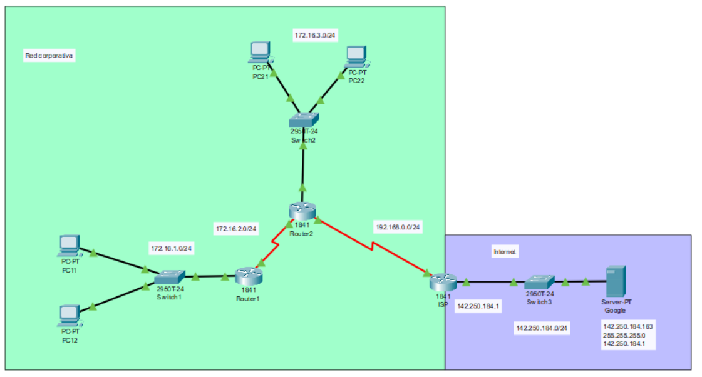

# Configuración de una ruta por defecto

Supongamos que queremos redirigir todo el trafico de nuestra empresa hacia el router de nuestro ISP.

## Creamo una red para la practica

Creamos una red de prueba y nos conectamos via consola.



## Configuramos el router 1

### Nombramos el router 1

Le damos un nombre al router

``` cisco ios
Router>enable
Router#configure terminal 
%SYS-5-CONFIG_I: Configured from console by console
Router(config)#hostname Router1
Router1(config)#exit
Router1#
```

### Configura las interfaces de un router 1
 
Miramos los interfaces de router.

``` cisco ios
Router1#show ip interface brief
Interface              IP-Address      OK? Method Status                Protocol 
FastEthernet0/0        unassigned      YES unset  administratively down down 
FastEthernet0/1        unassigned      YES unset  administratively down down 
Serial0/0/0            unassigned      YES unset  administratively down down 
Serial0/0/1            unassigned      YES unset  administratively down down 
Vlan1                  unassigned      YES unset  administratively down down
```

Configuramos las interfaces del router

``` cisco ios
Router1(config)#interface fastEthernet 0/0
Router1(config-if)#ip address 172.16.1.1 255.255.255.0
Router1(config-if)#no shutdown
Router1(config-if)#exit
Router1(config)#interface serial 0/0/0
Router1(config-if)#ip address 172.16.2.1 255.255.255.252
Router1(config-if)#no shutdown 
Router1(config-if)#exit
Router1(config)#exit
Router1#
```

Guardamos la configuración, se puede guardar con el comando **write**

``` cisco ios
Router1#write
Building configuration...
[OK]
```

## Configuramos el router 2

### Nombramos el router 2

Le damos un nombre al router

``` cisco ios
Router>enable
Router#configure terminal 
%SYS-5-CONFIG_I: Configured from console by console
Router(config)#hostname Router1
Router2(config)#exit
Router1#
```

### Configura las interfaces de un router 2
 
Miramos los interfaces de router.

``` cisco ios
Router2#show ip interface brief
Interface              IP-Address      OK? Method Status                Protocol 
FastEthernet0/0        unassigned      YES unset  administratively down down 
FastEthernet0/1        unassigned      YES unset  administratively down down 
Serial0/0/0            unassigned      YES unset  administratively down down 
Serial0/0/1            unassigned      YES unset  administratively down down 
Vlan1                  unassigned      YES unset  administratively down down
```

Configuramos las interfaces del router

``` cisco ios
Router2(config)#interface fastEthernet 0/0
Router2(config-if)#ip address 172.16.3.1 255.255.255.0
Router2(config-if)#no shutdown
Router2(config-if)#exit
Router2(config)#interface serial 0/0/0
Router2(config-if)#ip address 172.16.2.2 255.255.255.252
Router2(config-if)#no shutdown 
Router2(config-if)#exit
Router2(config)#interface serial 0/0/1
Router2(config-if)#ip address 192.168.0.2 255.255.255.252
Router2(config-if)#no shutdown 
Router2(config-if)#exit
Router2(config)#exit
Router2#
```

Guardamos la configuración, se puede guardar con el comando **write**

``` cisco ios
Router2#write
Building configuration...
[OK]
```

## Configuramos el router del ISP

### Nombramos el router del ISP

Le damos un nombre al router

``` cisco ios
Router>enable
Router#configure terminal 
%SYS-5-CONFIG_I: Configured from console by console
Router(config)#hostname RouterISP
RouterISP(config)#exit
RouterISP#
```

### Configura las interfaces de un router del ISP
 
Miramos los interfaces de router.

``` cisco ios
RouterISP#show ip interface brief
Interface              IP-Address      OK? Method Status                Protocol 
FastEthernet0/0        unassigned      YES unset  administratively down down 
FastEthernet0/1        unassigned      YES unset  administratively down down 
Serial0/0/0            unassigned      YES unset  administratively down down 
Serial0/0/1            unassigned      YES unset  administratively down down 
Vlan1                  unassigned      YES unset  administratively down down
```

Configuramos las interfaces del router

``` cisco ios
RouterISP(config)#interface fastEthernet 0/0
RouterISP(config-if)#ip address 142.250.184.1 255.255.255.0
RouterISP(config-if)#no shutdown
RouterISP(config-if)#exit
RouterISP(config)#interface serial 0/0/0
RouterISP(config-if)#ip address 192.168.0.1 255.255.255.252
RouterISP(config-if)#no shutdown 
RouterISP(config-if)#exit
RouterISP#
```

Guardamos la configuración, se puede guardar con el comando **write**

``` cisco ios
RouterISP#write
Building configuration...
[OK]
```

## Configuramos las rutas con RIP

### Configuramos el router 1

Configuramos el router 1 con rip.

``` cisco ios
Router1>enable
Router1#configure terminal 
%SYS-5-CONFIG_I: Configured from console by console
Router1(config)#router rip
Router1(config-router)#version 2
Router1(config-router)#network 172.16.1.0
Router1(config-router)#network 172.16.2.0
Router1(config-router)#exit
Router1(config)#exit
%SYS-5-CONFIG_I: Configured from console by console
Building configuration...
[OK]
Router1#write
Building configuration...
[OK]
Router2#exit
```

### Configuramos el router 2

Configuramos el router 2 con rip. 
Tenemos 3 redes, pero solo vamos a anunciar dos de ellas, las 172.16.2.0 y la 172.16.3.0.

``` cisco ios
Router2#show ip route
Codes: C - connected, S - static, I - IGRP, R - RIP, M - mobile, B - BGP
       D - EIGRP, EX - EIGRP external, O - OSPF, IA - OSPF inter area
       N1 - OSPF NSSA external type 1, N2 - OSPF NSSA external type 2
       E1 - OSPF external type 1, E2 - OSPF external type 2, E - EGP
       i - IS-IS, L1 - IS-IS level-1, L2 - IS-IS level-2, ia - IS-IS inter area
       * - candidate default, U - per-user static route, o - ODR
       P - periodic downloaded static route

Gateway of last resort is not set

     172.16.0.0/16 is variably subnetted, 3 subnets, 2 masks
C       172.16.0.0/30 is directly connected, Serial0/0/1
C       172.16.2.0/30 is directly connected, Serial0/0/0
C       172.16.3.0/24 is directly connected, FastEthernet0/0
```

Configuramos con rip

``` cisco ios
Router2>enable
Router2#configure terminal
Enter configuration commands, one per line.  End with CNTL/Z.
Router2(config)#router rip
Router2(config-router)#version 2
Router2(config-router)#network 172.16.2.0
Router2(config-router)#network 172.16.3.0
Router2(config-router)#exit
Router2(config)#
```

Y ahora configuramos una ruta estatica por defecto hacia el ruter del ISP, por el interfaza Serial 0/0/0


``` cisco ios
Router2(config)#ip route 0.0.0.0 0.0.0.0 serial 0/0/1
```

Configuramos para que se propague por RIP

``` cisco ios
Router2(config)#router rip
Router2(config-router)#default-information originate
```

Y guardamos la configuración

``` cisco ios
Router2(config)#exit
Router2#
%SYS-5-CONFIG_I: Configured from console by console
Router2#write
Building configuration...
[OK]
Router2#exit
```

### Configuramos el router del ISP

Configuramos el router del ISP para que llegue a las redes internas. 
Para simplificar la tabla de rutas, se puede enrutar toda la red 172.16.0.0 con la mascara 255.255.0.0 
que engloba todas las subredes, incluidas la 172.16.1.0 255.255.255.0, 172.16.2.0 255.255.255.0, 172.16.3.0 255.255.255.0

``` cisco ios
RouterISP(config)#ip route 172.16.0.0 255.255.0.0 serial 0/0/0
```

Otra forma de haber definido estar rutas podria haber sido definiendo las tres redes.

``` cisco ios
RouterISP(config)#ip route 172.16.1.0 255.255.255.0 serial 0/0/0
RouterISP(config)#ip route 172.16.2.0 255.255.255.0 serial 0/0/0
RouterISP(config)#ip route 172.16.3.0 255.255.255.0 serial 0/0/0
```

Y guardamos la configuración

``` cisco ios
RouterISP(config)#exit
RouterISP#
%SYS-5-CONFIG_I: Configured from console by console
RouterISP#write
Building configuration...
[OK]
RouterISP#exit
RouterISP>
```

## Comprobamos la configuración

Desde un PC de la red 172.16.1.0/24 vemos que llegamos a 142.250.184.163

```ps
C:\>ping 142.250.184.163

Pinging 142.250.184.163 with 32 bytes of data:

Request timed out.
Reply from 142.250.184.163: bytes=32 time=11ms TTL=125
Reply from 142.250.184.163: bytes=32 time=7ms TTL=125
Reply from 142.250.184.163: bytes=32 time=11ms TTL=125

Ping statistics for 142.250.184.163:
    Packets: Sent = 4, Received = 3, Lost = 1 (25% loss),
Approximate round trip times in milli-seconds:
    Minimum = 7ms, Maximum = 11ms, Average = 9ms
```

Desde un PC de la red 172.16.1.0/24 vemos que llegamos a la red 172.16.3.0/24

```ps
C:\>ping 172.16.3.21

Pinging 172.16.3.21 with 32 bytes of data:

Request timed out.
Reply from 172.16.3.21: bytes=32 time=4ms TTL=126
Reply from 172.16.3.21: bytes=32 time=13ms TTL=126
Reply from 172.16.3.21: bytes=32 time=6ms TTL=126

Ping statistics for 172.16.3.21:
    Packets: Sent = 4, Received = 3, Lost = 1 (25% loss),
Approximate round trip times in milli-seconds:
    Minimum = 4ms, Maximum = 13ms, Average = 7ms
```

Repetimos el mismo proceso desde un PC de la red 172.16.3.0/24


## Vemos las tablas de enrutamiento


``` cisco ios
Router1#show ip route
Codes: C - connected, S - static, I - IGRP, R - RIP, M - mobile, B - BGP
       D - EIGRP, EX - EIGRP external, O - OSPF, IA - OSPF inter area
       N1 - OSPF NSSA external type 1, N2 - OSPF NSSA external type 2
       E1 - OSPF external type 1, E2 - OSPF external type 2, E - EGP
       i - IS-IS, L1 - IS-IS level-1, L2 - IS-IS level-2, ia - IS-IS inter area
       * - candidate default, U - per-user static route, o - ODR
       P - periodic downloaded static route

Gateway of last resort is 172.16.2.2 to network 0.0.0.0

     172.16.0.0/16 is variably subnetted, 4 subnets, 2 masks
R       172.16.0.0/30 [120/1] via 172.16.2.2, 00:00:14, Serial0/0/0
C       172.16.1.0/24 is directly connected, FastEthernet0/0
C       172.16.2.0/30 is directly connected, Serial0/0/0
R       172.16.3.0/24 [120/1] via 172.16.2.2, 00:00:14, Serial0/0/0
R*   0.0.0.0/0 [120/1] via 172.16.2.2, 00:00:14, Serial0/0/0
```


``` cisco ios
Router2#show ip route
Codes: C - connected, S - static, I - IGRP, R - RIP, M - mobile, B - BGP
       D - EIGRP, EX - EIGRP external, O - OSPF, IA - OSPF inter area
       N1 - OSPF NSSA external type 1, N2 - OSPF NSSA external type 2
       E1 - OSPF external type 1, E2 - OSPF external type 2, E - EGP
       i - IS-IS, L1 - IS-IS level-1, L2 - IS-IS level-2, ia - IS-IS inter area
       * - candidate default, U - per-user static route, o - ODR
       P - periodic downloaded static route

Gateway of last resort is 0.0.0.0 to network 0.0.0.0

     172.16.0.0/16 is variably subnetted, 4 subnets, 2 masks
C       172.16.0.0/30 is directly connected, Serial0/0/1
R       172.16.1.0/24 [120/1] via 172.16.2.1, 00:00:27, Serial0/0/0
C       172.16.2.0/30 is directly connected, Serial0/0/0
C       172.16.3.0/24 is directly connected, FastEthernet0/0
S*   0.0.0.0/0 is directly connected, Serial0/0/1
```

``` cisco ios
RouterISP#show ip route
Codes: C - connected, S - static, I - IGRP, R - RIP, M - mobile, B - BGP
       D - EIGRP, EX - EIGRP external, O - OSPF, IA - OSPF inter area
       N1 - OSPF NSSA external type 1, N2 - OSPF NSSA external type 2
       E1 - OSPF external type 1, E2 - OSPF external type 2, E - EGP
       i - IS-IS, L1 - IS-IS level-1, L2 - IS-IS level-2, ia - IS-IS inter area
       * - candidate default, U - per-user static route, o - ODR
       P - periodic downloaded static route

Gateway of last resort is not set

     142.250.0.0/24 is subnetted, 1 subnets
C       142.250.184.0 is directly connected, FastEthernet0/0
S    172.16.0.0/16 is directly connected, Serial0/0/0
C    192.168.0.0/24 is directly connected, Serial0/0/0
```

