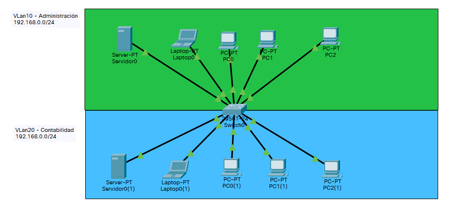
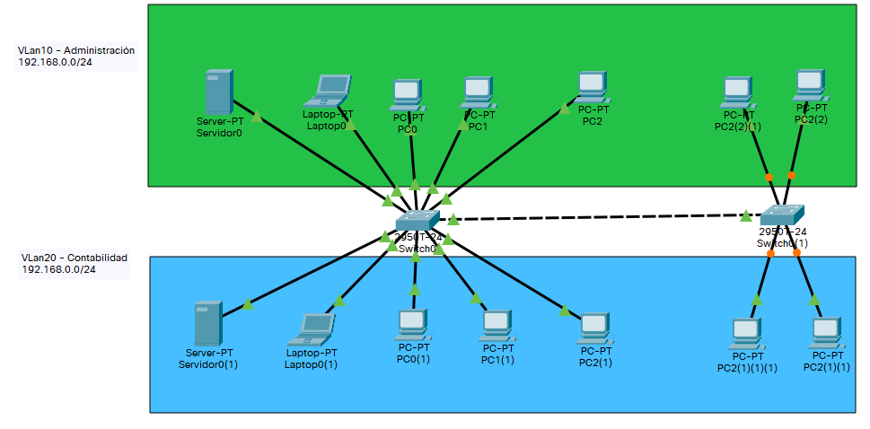

# Practica 1

Configuración de un router para conectar dos redes con enrutamiento por defecto.

## Cración de dos VLAN

Creamos dos VLAN dividendo el switch en dos.

### Creamo una red para la practica

Creamos una red de prueba y nos conectamos via consola.



### Configuramos el switch con dos VLAN

Le damos un nombre al Switch con el comando **hostname**

``` cisco ios
Switch>enable
Switch#configure terminal
Switch#hostname Switch1
Switch1#
```

Creamos la VLan 10 de administración

``` cisco ios
Switch1>enable
Switch1#configure terminal
Enter configuration commands, one per line.  End with CNTL/Z.
Switch1(config)#vlan 10
Switch1(config-vlan)#name Administracion
Switch1(config-vlan)#exit
``` 

Creamos la VLan 20 de contabilidad

``` cisco ios
Switch1>enable
Switch1#configure terminal
Enter configuration commands, one per line.  End with CNTL/Z.
Switch1(config)#vlan 20
Switch1(config-vlan)#name Contabilidad
Switch1(config-vlan)#exit
``` 

Asignamos las interfaces a la VLAN 10

``` cisco ios
Switch1(config)#interface range f0/1-10
Switch1(config-if-range)#switchport access vlan 10
``` 

Asignamos las interfaces a la VLAN 20

``` cisco ios
Switch1(config)#interface range f0/11-20
Switch1(config-if-range)#switchport access vlan 20
``` 

Comprobamos la configuración de VLAN

``` cisco ios
Switch1#show vlan brief

VLAN Name                             Status    Ports
---- -------------------------------- --------- -------------------------------
1    default                          active    Fa0/21, Fa0/22, Fa0/23, Fa0/24
                                                Gig0/1, Gig0/2
10   Administracion                   active    Fa0/1, Fa0/2, Fa0/3, Fa0/4
                                                Fa0/5, Fa0/6, Fa0/7, Fa0/8
                                                Fa0/9, Fa0/10
20   Contabilidad                     active    
210  VLAN0210                         active    Fa0/11, Fa0/12, Fa0/13, Fa0/14
                                                Fa0/15, Fa0/16, Fa0/17, Fa0/18
                                                Fa0/19, Fa0/20
1002 fddi-default                     active    
1003 token-ring-default               active    
1004 fddinet-default                  active    
1005 trnet-default                    active    
```

Guardamos la configuración del switch

``` cisco ios
Switch1#copy running-config startup-config 
```

Y reiniciamos.

Comprobamos que cada VLAN funciona independientemente.

## Creacion enlace troncal

Creamos un enlace troncal para unir los dos swich manteniendo las dos vlan.

### Creamo una red para la practica

Modificamos la practica anterior, para tener dos swich unidos por un enlace troncal.



### Configuracion el switch con dos VLAN

Le damos un nombre al switch2 y lo configuramos de forma similar al primer switch

``` cisco ios
Switch>enable
Switch#configure terminal
Switch#hostname Switch2
Switch2#
```

### Configuración enlaces troncales

Comprobamos la configuración del interfaza gigabitEthernet 0/1
y comprobamos que está asignado a la VLAN 1.
Con el parametro *Operational Mode* a *static access*.

``` cisco ios
Switch1#show interface gigabitEthernet 0/1 switchport 
Name: Gig0/1
Switchport: Enabled
Administrative Mode: dynamic auto
Operational Mode: static access
Administrative Trunking Encapsulation: dot1q
Operational Trunking Encapsulation: native
Negotiation of Trunking: On
Access Mode VLAN: 1 (default)
Trunking Native Mode VLAN: 1 (default)
Voice VLAN: none
Administrative private-vlan host-association: none
Administrative private-vlan mapping: none
Administrative private-vlan trunk native VLAN: none
Administrative private-vlan trunk encapsulation: dot1q
Administrative private-vlan trunk normal VLANs: none
Administrative private-vlan trunk private VLANs: none
Operational private-vlan: none
Trunking VLANs Enabled: All
Pruning VLANs Enabled: 2-1001
Capture Mode Disabled
Capture VLANs Allowed: ALL
Protected: false
Appliance trust: none
```

Comprobamos que no hay ningún interface troncal.

``` cisco ios
Switch1# show interfaces trunk

Switch1#
```

Configuramos el interface gigabitEthernet 0/1 en modo troncal

``` cisco ios
Switch1#configure 
Configuring from terminal, memory, or network [terminal]? 
Enter configuration commands, one per line.  End with CNTL/Z.
Switch1(config)#interface gigabitEthernet 0/1
Switch1(config-if)#switchport mode dynamic desirable
```

Comprobamos que el interface gigabitEthernet 0/1 esta fonfigurado como troncal.
Con el parametro *Operational Mode* a *trunk*

``` cisco ios
Switch1#show interface gigabitEthernet 0/1 switchport 
Name: Gig0/1
Switchport: Enabled
Administrative Mode: dynamic desirable
Operational Mode: trunk
Administrative Trunking Encapsulation: dot1q
Operational Trunking Encapsulation: dot1q
Negotiation of Trunking: On
Access Mode VLAN: 1 (default)
Trunking Native Mode VLAN: 1 (default)
Voice VLAN: none
Administrative private-vlan host-association: none
Administrative private-vlan mapping: none
Administrative private-vlan trunk native VLAN: none
Administrative private-vlan trunk encapsulation: dot1q
Administrative private-vlan trunk normal VLANs: none
Administrative private-vlan trunk private VLANs: none
Operational private-vlan: none
Trunking VLANs Enabled: All
Pruning VLANs Enabled: 2-1001
Capture Mode Disabled
Capture VLANs Allowed: ALL
Protected: false
Appliance trust: none
```

Comprobamos que tenemos configurado el enlace troncal


``` cisco ios
Switch1#show interfaces trunk
Port        Mode         Encapsulation  Status        Native vlan
Gig0/1      desirable    n-802.1q       trunking      1

Port        Vlans allowed on trunk
Gig0/1      1-1005

Port        Vlans allowed and active in management domain
Gig0/1      1,10,20,210

Port        Vlans in spanning tree forwarding state and not pruned
Gig0/1      1,10,20,210
```

Realizamos la misma operción en el segundo switch y comprobamos que 
el segundo swich funciona con dos VLAN.
