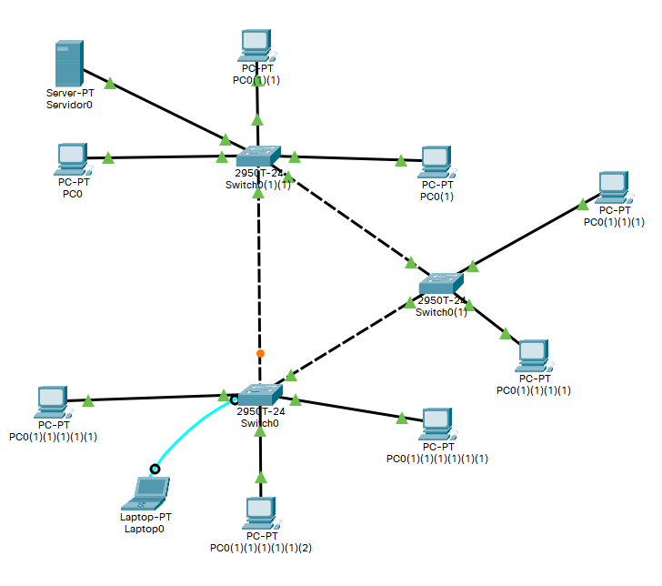

# Configuración de switch

Para configurar los interfaces de un switch.

## Creamo una red para la practica

Creamos una red de prueba y nos conectamos via consola.



## Para configura los interfaces de un switch

Para ver la configuración de puertos del switch.

``` cisco ios
Switch>enable
Switch#show ip interface brief
```

## Para configura un interface de un switch

Cambiar configuración de una interfaz, velocidad y direccionamiento.

``` cisco ios
Switch>enable
Switch#configure terminal 
Enter configuration commands, one per line.  End with CNTL/Z.
Switch(config)#interface fastEthernet 0/1
Switch(config-if)#duplex full
Switch(config-if)#
%LINK-3-UPDOWN: Interface FastEthernet0/1, changed state to down

%LINEPROTO-5-UPDOWN: Line protocol on Interface FastEthernet0/1, changed state to down

Switch(config-if)#speed 10
```

Para asignarle una descripción

``` cisco ios
Switch>enable
Switch#configure terminal 
Enter configuration commands, one per line.  End with CNTL/Z.
Switch(config)#interface fastEthernet 0/1
Switch(config-if)#description Switch personalizado - boca 1
```

## Para configura un rango de interfaces de un switch

Asignamos una configuración a un rango de interfaces a la vez

``` cisco ios
Switch>enable
Switch#configure terminal 
Enter configuration commands, one per line.  End with CNTL/Z.
Switch(config)#interface range fastther
Switch(config)#interface range fastethernet 0/11 - 20
Switch(config-if-range)#description Switch personalizado - bocas 11-20
Switch(config-if-range)#exit
```

## Desactivar una interface del switch

Para desactivar una interface del switch utilizamos el comando **shutdown**.

``` cisco ios
Switch>enable
Switch#configure terminal 
Enter configuration commands, one per line.  End with CNTL/Z.
Switch(config)#interface fastEthernet 0/1
Switch(config-if)#shutdown
```

Para volverla a poner en marcha **no shutdown**.

``` cisco ios
Switch>enable
Switch#configure terminal 
Enter configuration commands, one per line.  End with CNTL/Z.
Switch(config)#interface fastEthernet 0/1
Switch(config-if)#no shutdown
```
