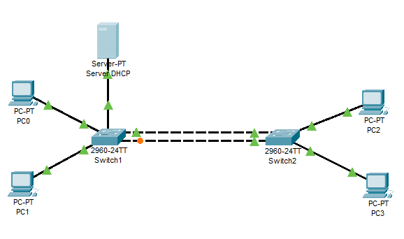

# EtherChannel en Switch CISCO

Es el agrupamiento de enlaces en paralelo para aumentar el rendimiento más allá de un único enlace.

También provee redundancia en caso que un enlace falle.

## Creamos una red para la practica

Creamos una red unida por dos enlaces ethernet entre switch.



Podemos utilizar un servidor DHCP para no tener que configurar la interfaz de red de todos los PC's

Podemos ver, como se produce un bucle y Spanning Tree (STP) desactiva uno de los interfaces del switch.

## Configuramos los Switch

Configuramos los Switch para que los dos enlaces funcionen como un único enlace.

### Configuramos la interface fisica

1. Use el comando **channel-group** number **mode on** para agregar la interfaz al channel. Usar el mismo número en todas las interfaces físicas del switch. El número usado (channel-group number) puede diferir del usado en en los switches vecinos.
<!-- 2. Use el comando **no switchport** para hacer de cada puerto físico un puerto enrutado. -->

Ejecutamos los siguientes comandos en los dos switch.

``` cisco ios
Switch>en
Switch#config terminal
Switch(config)#interface FastEthernet0/1
Switch(config-if)#no switchport mode
Switch(config-if)#channel-group 1 mode on
Switch(config)#interface FastEthernet0/2
Switch(config-if)#no switchport mode
Switch(config-if)#channel-group 1 mode on
Switch(config-if)#end
Switch#
``

## Comprobar que funciona

Ahora disponemos de un nuevo interfaz llamado Port-channel1

Podemos ver la configuración con

``` cisco ios
Switch#show interfaces Port-channel 1
Port-channel1 is up, line protocol is up (connected)
  Hardware is EtherChannel, address is 00e0.a3ea.40e0 (bia 00e0.a3ea.40e0)
  MTU 1500 bytes, BW 300000 Kbit, DLY 1000 usec,
     reliability 255/255, txload 1/255, rxload 1/255
  Encapsulation ARPA, loopback not set
  Keepalive set (10 sec)
  Half-duplex, 300Mb/s
  input flow-control is off, output flow-control is off
  Members in this channel: Fa0/1 ,Fa0/2 ,
  ARP type: ARPA, ARP Timeout 04:00:00
  Last input 00:00:08, output 00:00:05, output hang never
  Last clearing of "show interface" counters never
  Input queue: 0/75/0/0 (size/max/drops/flushes); Total output drops: 0
  Queueing strategy: fifo
  Output queue :0/40 (size/max)
  5 minute input rate 0 bits/sec, 0 packets/sec
  5 minute output rate 0 bits/sec, 0 packets/sec
     956 packets input, 193351 bytes, 0 no buffer
     Received 956 broadcasts, 0 runts, 0 giants, 0 throttles
     0 input errors, 0 CRC, 0 frame, 0 overrun, 0 ignored, 0 abort
     0 watchdog, 0 multicast, 0 pause input
     0 input packets with dribble condition detected
     2357 packets output, 263570 bytes, 0 underruns
     0 output errors, 0 collisions, 10 interface resets
     0 babbles, 0 late collision, 0 deferred
     0 lost carrier, 0 no carrier
     0 output buffer failures, 0 output buffers swapped out
```
