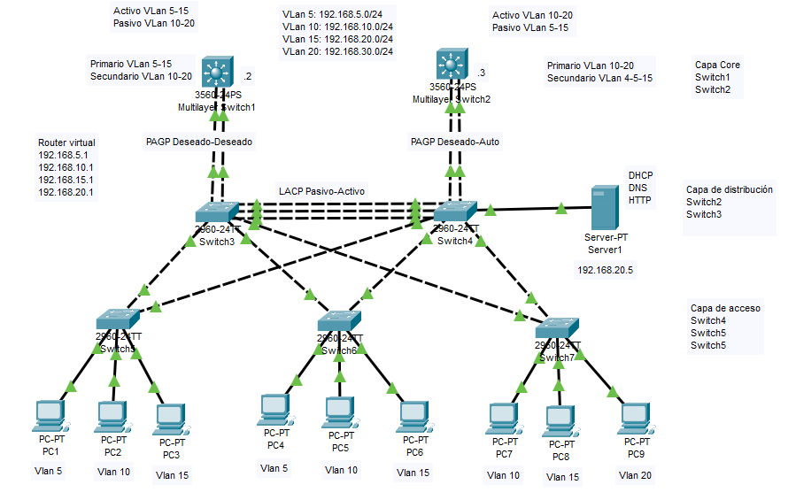

<!-- https://www.youtube.com/watch?v=sG_HCN9ULLI&t=783s -->
# Configurar Spanning Tree más EtherChannel más HSRP Protocol  CISCO

Demostración de las configuraciones para los protocolos Spanning-tree, EtherChannel y HSRP.

<!-- Con STP,se proporciona redundancia de enlaces y se evitan los bucles de conmutación.

Para habilitar STP con Switch de cisco -->

## Creamos una red para la practica

Creamos una red de ejemplo.

  

<!-- Como puede ver después de conectar los interruptores en la posición de bucle, uno de los puertos se bloquea. Porque por defecto STP está habilitado y nos está evitando cualquier Bucle de Conmutación.
Para entender más detalladamente, revisemos las capturas de pantalla del programa.-->

## Switch de la capa de acceso

Vamos a configurar los switch de la capa de acceso, swith 5, 6 y 7.

### Configuramos el Switch 5

Damos un nombre de host al switch.

``` cisco ios
Switch>en
Switch#config terminal
Enter configuration commands, one per line.  End with CNTL/Z.
Switch(config)#hostname Switch5
Switch5(config)#
```

Cramos la Vlan 5, 10, 20 y 30

``` cisco ios
Switch(config)#vlan 5
Switch(config-vlan)#vlan 10
Switch(config-vlan)#vlan 15
Switch(config-vlan)#exit
```

Configuramos los interfaces del Switch para asociarlo a cada vlan y como interfaz de acceso, solo acta para conectar un host.

** Nota: Repasar minuto 5:00 para que sirve cada comando.

``` cisco ios
Switch5(config)#interface faste
Switch5(config)#interface fastethernet 0/5
Switch5(config-if)#switchport mode access
Switch5(config-if)#switchport access vlan 5
Switch5(config-if)#spanning-tree portfast
%Warning: portfast should only be enabled on ports connected to a single
host. Connecting hubs, concentrators, switches, bridges, etc... to this
interface  when portfast is enabled, can cause temporary bridging loops.
Use with CAUTION

%Portfast has been configured on FastEthernet0/5 but will only
have effect when the interface is in a non-trunking mode.
Switch5(config-if)#spanning-tree bpduguard enable
```

De igual modo configuramos el resto de los interfaces asociandolo a su correspondiente VLAN.

``` cisco ios
Switch5(config)#interface fastethernet 0/10
Switch5(config-if)#switchport mode access
Switch5(config-if)#switchport access vlan 10
Switch5(config-if)#spanning-tree portfast
Switch5(config-if)#spanning-tree bpduguard enable
Switch5(config-if)#exit
Switch5(config)#interface fastethernet 0/15
Switch5(config-if)#switchport mode access
Switch5(config-if)#switchport access vlan 15
Switch5(config-if)#spanning-tree portfast
Switch5(config-if)#spanning-tree bpduguard enable
```

Ahora configuramos las interfaces troncales

``` cisco ios
Switch5(config)#interface range fastEthernet 0/23-24
Switch5(config-if-range)#switchport mode trunk
Switch5(config-if-range)#switchport nonegotiate
```

Con el comando *switchport nonegotiate* desabilitamos el protocolo DTP.

### Configuramos el Switch 6 y 7

Los Switch 6 y 7 se configuran de forma similar al Switch 5, atendiendo a las VLan necesarias. En el Switch 7 se han de crear las VLAN 10, 15 y 20 asociado a su interface correspondiente.

## Switch de la capa de distribución

Vamos a configurar los switch de la capa de acceso, swith 3 y 4.

### Configuramos el Switch 3

Damos un nombre de host al switch y cramos las vlan 5, 10, 15 y 20

``` cisco ios
Switch>en
Switch#config terminal
Enter configuration commands, one per line.  End with CNTL/Z.
Switch(config)#hostname Switch3
Switch3(config)#
Switch3(config)#vlan 5
Switch3(config-vlan)#vlan 10
Switch3(config-vlan)#vlan 15
Switch3(config-vlan)#vlan 20
Switch3(config)#exit
```

Configuramos los enlaces que conectan con los switch 5, 6 y 7 como troncales

``` cisco ios
Switch3(config)#interface range fastEthernet 0/22-24
Switch3(config-if)#switchport mode trunk
Switch3(config-if)#switchport nonegotiate
Switch3(config-if-range)#
```

Creamos el Channel Group mediante LACP (Pasivo-Activo), que conectará con el switch 4.

``` cisco ios
Switch3(config)#interface range fastethernet 0/1-3
Switch3(config-if-range)#channel-protocol lacp
Switch3(config-if-range)#channel-group 1 mode passive
Switch3(config-if-range)#
```

Ahora podemos configurar el enlace port-channel 1, que hemos creado anteriormente, como troncal.

``` cisco ios
Switch3(config)#interface port-channel 1
Switch3(config-if)#switchport mode trunk
Switch3(config-if)#switchport nonegotiate
Switch3(config-if)#exit
```

Cramos el Channel Group que conecta con el Switch 1. En este caso con el protocolo PAGP (propidad de CISCO)

``` cisco ios
Switch3(config)#interface range gigabitEthernet 0/1-2
Switch3(config-if-range)#channel-protocol pagp
Switch3(config-if-range)#channel-group 2 mode desirable 
Creating a port-channel interface Port-channel 2
Switch3(config-if-range)#exit
```

Configuramos el port-channel 2 como troncal.

``` cisco ios
Switch3(config-if)#interface port-channel 2
Switch3(config-if)#switchport mode trunk
Switch3(config-if)#switchport nonegotiate
Switch3(config-if)#exit
```

### Configuramos el Switch 4

El switch 4 se configura de manera similar al 3, salvo que el enlace con el swich 3 lo definimos como acitvo.

Damos un nombre de host al switch y cramos las vlan 5, 10, 15 y 20

``` cisco ios
Switch>en
Switch#config terminal
Enter configuration commands, one per line.  End with CNTL/Z.
Switch(config)#hostname Switch4
Switch4(config)#
Switch4(config)#vlan 5
Switch4(config-vlan)#vlan 10
Switch4(config-vlan)#vlan 15
Switch4(config-vlan)#vlan 20
Switch4(config)#exit
```

Configuramos los enlaces que conectan con los switch 5, 6 y 7 como troncales

``` cisco ios
Switch4(config)#interface range fastEthernet 0/22-24
Switch4(config-if)#switchport mode trunk
Switch4(config-if)#switchport nonegotiate
Switch4(config-if-range)#
```

Creamos el Channel Group mediante LACP (Pasivo-Activo), que conectará con el switch 3.

``` cisco ios
Switch4(config)#interface range fastethernet 0/1-3
Switch4(config-if-range)#channel-protocol lacp
Switch4(config-if-range)#channel-group 1 mode passive
Switch4(config-if-range)#
```

Ahora podemos configurar el enlace port-channel 1, que hemos creado anteriormente, como troncal.

``` cisco ios
Switch4(config)#interface port-channel 1
Switch4(config-if)#switchport mode trunk
Switch4(config-if)#switchport nonegotiate
Switch4(config-if)#exit
```

Cramos el Channel Group que conecta con el Switch 2. En este caso con el protocolo PAGP (propidad de CISCO)

``` cisco ios
Switch4(config)#interface range gigabitEthernet 0/1-2
Switch4(config-if-range)#channel-protocol pagp
Switch4(config-if-range)#channel-group 2 mode desirable 
Creating a port-channel interface Port-channel 2
Switch4(config-if-range)#exit
```

Configuramos el port-channel 2 como troncal.

``` cisco ios
Switch3(config-if)#interface port-channel 2
Switch3(config-if)#switchport mode trunk
Switch3(config-if)#switchport nonegotiate
Switch3(config-if)#exit
```


<!-- ``` cisco ios
Switch0>
Switch0>show spanning-tree
VLAN0001
  Spanning tree enabled protocol rstp
  Root ID    Priority    32769
             Address     0003.E4AD.E43C
             Cost        8
             Port        25(GigabitEthernet0/1)
             Hello Time  2 sec  Max Age 20 sec  Forward Delay 15 sec

  Bridge ID  Priority    32769  (priority 32768 sys-id-ext 1)
             Address     0005.5E00.26EA
             Hello Time  2 sec  Max Age 20 sec  Forward Delay 15 sec
             Aging Time  20

Interface        Role Sts Cost      Prio.Nbr Type
---------------- ---- --- --------- -------- --------------------------------
Fa0/1            Desg FWD 19        128.1    P2p
Fa0/2            Desg FWD 19        128.2    P2p
Gi0/1            Root FWD 4         128.25   P2p
Gi0/2            Altn BLK 4         128.26   P2p
```

``` cisco ios
Switch0>
Switch0>show spanning-tree active
VLAN0001
  Spanning tree enabled protocol rstp
  Root ID    Priority    32769
             Address     0003.E4AD.E43C
             Cost        8
             Port        25(GigabitEthernet0/1)
             Hello Time  2 sec  Max Age 20 sec  Forward Delay 15 sec

  Bridge ID  Priority    32769  (priority 32768 sys-id-ext 1)
             Address     0005.5E00.26EA
             Hello Time  2 sec  Max Age 20 sec  Forward Delay 15 sec
             Aging Time  20

Interface        Role Sts Cost      Prio.Nbr Type
---------------- ---- --- --------- -------- --------------------------------
Fa0/1            Desg FWD 19        128.1    P2p
Fa0/2            Desg FWD 19        128.2    P2p
Gi0/1            Root FWD 4         128.25   P2p
Gi0/2            Altn BLK 4         128.26   P2p
```

Podemos ver que el interfaz Gi0/1 está configurado como Root y el Gi0/2 está bloqueado.

## Damos un nombre a los switch

``` cisco ios
Switch>enable
Switch#configure terminal
Switch(config)#hostname Switch1
Switch1(config)#end
Switch1#
```

## Deshabilitar STP

Buscamos el switch que está bloqueado un puerto y podemos deshabilitar STP en los router de la forma.

``` cisco ios
Switch1>enable
Switch1#configure terminal
Switch1(config)#no spanning-tree vlan 1
Switch1(config)#end
Switch1#
```

De esta forma, no se bloquean los puertos,
pero podemos ver que los paquetes entran en bucle y no llegan a su destino.

Configuramos los switch

``` cisco ios
Switch>enable
Switch#configure terminal
Switch(config)#hostname Switch1
Switch1(config)#spanning-tree mode rapid-pvst
Switch1(config)#no spanning-tree vlan 1
Switch1(config)#end
Switch1#
```

STP (Spanning Tree Protocol) tiene cuatro estados. Estos estados STP son; Bloqueo, escucha, aprendizaje y reenvío. Con RSTP (Rapid Spanning Tree Protocol), se omite el estado de Spanning Tree Blocking y Listenning. El RSTP establece que a partir de descartado, pasar por el aprendizaje y el reenvío.

En STP (Spanning Tree Protocol),el estado de bloqueo es de 20 segundos,el estado de escucha es de 15 segundos y el estado de aprendizaje es de 15 segundos. Por lo tanto, para STP, pasar por los estados de reenvío necesita 50 segundos. Este tiempo total es de 15 segundos en RSTP (Rapid Spanning Tree Protocol). Porque RSTP, omite los estados Bloqueo y Escucha.

## Probar direcciones MAC desde el PC

Podemos ver la tabla de direcciones MAC que tiene almacenada un PC con el comando arp.

``` cmd
C:\>arp -a
  Internet Address      Physical Address      Type
  192.168.0.6           0006.2ac5.299e        dynamic
```

## Experimento

Probar a deshabilitar STP en todos los switch de lar red y veremos que el trafico
de red aumenta sin control y no se puede configurar ningún HOST. -->
