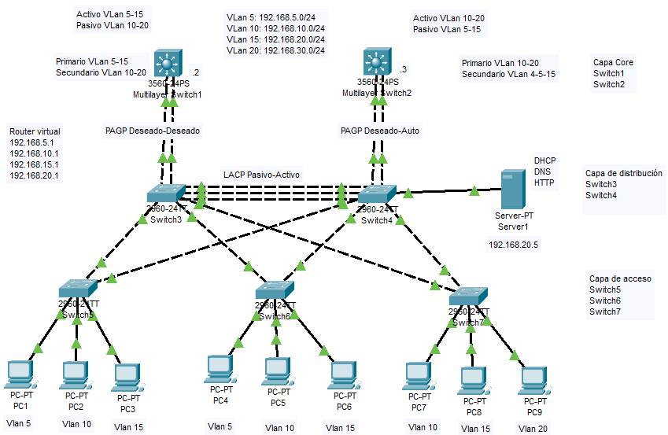

<!-- https://www.youtube.com/watch?v=sG_HCN9ULLI -->
# Configurar Spanning Tree más EtherChannel más HSRP Protocol  CISCO

Demostración de las configuraciones para los protocolos Spanning-tree, EtherChannel y HSRP.

<!-- Con STP,se proporciona redundancia de enlaces y se evitan los bucles de conmutación.

Para habilitar STP con Switch de cisco -->

## Creamos una red para la practica

Creamos una red de ejemplo.

  

<!-- Como puede ver después de conectar los interruptores en la posición de bucle, uno de los puertos se bloquea. Porque por defecto STP está habilitado y nos está evitando cualquier Bucle de Conmutación.
Para entender más detalladamente, revisemos las capturas de pantalla del programa.-->

## Switch de la capa de acceso

Vamos a configurar los switch de la capa de acceso, swith 5, 6 y 7.

### Configuramos el Switch 5

Damos un nombre de host al switch.

``` cisco ios
Switch>en
Switch#config terminal
Enter configuration commands, one per line.  End with CNTL/Z.
Switch(config)#hostname Switch5
Switch5(config)#
```

Cramos la Vlan 5, 10, 20 y 30

``` cisco ios
Switch5(config)#vlan 5
Switch5(config-vlan)#name vlan5
Switch5(config-vlan)#vlan 10
Switch5(config-vlan)#name vlan10
Switch5(config-vlan)#vlan 15
Switch5(config-vlan)#name vlan15
Switch5(config-vlan)#exit
```

Configuramos los interfaces del Switch para asociarlo a cada vlan y como interfaz de acceso, solo acta para conectar un host.

** Nota: Repasar minuto 5:00 para que sirve cada comando.

``` cisco ios
Switch5(config)#interface faste
Switch5(config)#interface fastethernet 0/5
Switch5(config-if)#switchport mode access
Switch5(config-if)#switchport access vlan 5
Switch5(config-if)#spanning-tree portfast
%Warning: portfast should only be enabled on ports connected to a single
host. Connecting hubs, concentrators, switches, bridges, etc... to this
interface  when portfast is enabled, can cause temporary bridging loops.
Use with CAUTION

%Portfast has been configured on FastEthernet0/5 but will only
have effect when the interface is in a non-trunking mode.
Switch5(config-if)#spanning-tree bpduguard enable
```

De igual modo configuramos el resto de los interfaces asociandolo a su correspondiente VLAN.

``` cisco ios
Switch5(config)#interface fastethernet 0/10
Switch5(config-if)#switchport mode access
Switch5(config-if)#switchport access vlan 10
Switch5(config-if)#spanning-tree portfast
Switch5(config-if)#spanning-tree bpduguard enable
Switch5(config-if)#exit
Switch5(config)#interface fastethernet 0/15
Switch5(config-if)#switchport mode access
Switch5(config-if)#switchport access vlan 15
Switch5(config-if)#spanning-tree portfast
Switch5(config-if)#spanning-tree bpduguard enable
```

Ahora configuramos las interfaces troncales

``` cisco ios
Switch5(config)#interface range fastEthernet 0/23-24
Switch5(config-if-range)#switchport mode trunk
Switch5(config-if-range)#switchport nonegotiate
```

Con el comando *switchport nonegotiate* deshabilitamos el protocolo DTP.

### Configuramos el Switch 6 y 7

Los Switch 6 y 7 se configuran de forma similar al Switch 5, atendiendo a las VLan necesarias. En el Switch 7 se han de crear las VLAN 10, 15 y 20 asociado a su interface correspondiente.

## Switch de la capa de distribución

Vamos a configurar los switch de la capa de acceso, swith 3 y 4.

### Configuramos el Switch 3

Damos un nombre de host al switch y cramos las vlan 5, 10, 15 y 20

``` cisco ios
Switch>en
Switch#config terminal
Enter configuration commands, one per line.  End with CNTL/Z.
Switch(config)#hostname Switch3
Switch3(config)#
Switch3(config)#vlan 5
Switch3(config-vlan)#name vlan5
Switch3(config-vlan)#vlan 10
Switch3(config-vlan)#name vlan10
Switch3(config-vlan)#vlan 15
Switch3(config-vlan)#name vlan15
Switch3(config-vlan)#vlan 20
Switch3(config-vlan)#name vlan20
Switch3(config)#exit
```

Configuramos los enlaces que conectan con los switch 5, 6 y 7 como troncales

``` cisco ios
Switch3(config)#interface range fastEthernet 0/22-24
Switch3(config-if)#switchport mode trunk
Switch3(config-if)#switchport nonegotiate
Switch3(config-if-range)#
```

Creamos el Channel Group mediante LACP (Pasivo-Activo), que conectará con el switch 4.

``` cisco ios
Switch3(config)#interface range fastethernet 0/1-3
Switch3(config-if-range)#channel-protocol lacp
Switch3(config-if-range)#channel-group 1 mode passive
Switch3(config-if-range)#
```

Ahora podemos configurar el enlace port-channel 1, que hemos creado anteriormente, como troncal.

``` cisco ios
Switch3(config)#interface port-channel 1
Switch3(config-if)#switchport mode trunk
Switch3(config-if)#switchport nonegotiate
Switch3(config-if)#exit
```

Cramos el Channel Group que conecta con el Switch 1. En este caso con el protocolo PAGP (propidad de CISCO)

``` cisco ios
Switch3(config)#interface range gigabitEthernet 0/1-2
Switch3(config-if-range)#channel-protocol pagp
Switch3(config-if-range)#channel-group 2 mode desirable 
Creating a port-channel interface Port-channel 2
Switch3(config-if-range)#exit
```

Configuramos el port-channel 2 como troncal.

``` cisco ios
Switch3(config-if)#interface port-channel 2
Switch3(config-if)#switchport mode trunk
Switch3(config-if)#switchport nonegotiate
Switch3(config-if)#exit
```

### Configuramos el Switch 4

El switch 4 se configura de manera similar al 3, salvo que el enlace con el swich 3 lo definimos como acitvo.

Damos un nombre de host al switch y cramos las vlan 5, 10, 15 y 20

``` cisco ios
Switch>en
Switch#config terminal
Enter configuration commands, one per line.  End with CNTL/Z.
Switch(config)#hostname Switch4
Switch4(config)#
Switch4(config)#vlan 5
Switch4(config-vlan)#name vlan5
Switch4(config-vlan)#vlan 10
Switch4(config-vlan)#name vlan10
Switch4(config-vlan)#vlan 15
Switch4(config-vlan)#name vlan15
Switch4(config-vlan)#vlan 20
Switch4(config-vlan)#name vlan20
Switch4(config)#exit
```

Configuramos los enlaces que conectan con los switch 5, 6 y 7 como troncales

``` cisco ios
Switch4(config)#interface range fastEthernet 0/22-24
Switch4(config-if)#switchport mode trunk
Switch4(config-if)#switchport nonegotiate
Switch4(config-if-range)#
```

Creamos el Channel Group mediante LACP (Pasivo-Activo), que conectará con el switch 3.

``` cisco ios
Switch4(config)#interface range fastethernet 0/1-3
Switch4(config-if-range)#channel-protocol lacp
Switch4(config-if-range)#channel-group 1 mode passive
Switch4(config-if-range)#
```

Ahora podemos configurar el enlace port-channel 1, que hemos creado anteriormente, como troncal.

``` cisco ios
Switch4(config)#interface port-channel 1
Switch4(config-if)#switchport mode trunk
Switch4(config-if)#switchport nonegotiate
Switch4(config-if)#exit
```

Cramos el Channel Group que conecta con el Switch 2. En este caso con el protocolo PAGP (propidad de CISCO)

``` cisco ios
Switch4(config)#interface range gigabitEthernet 0/1-2
Switch4(config-if-range)#channel-protocol pagp
Switch4(config-if-range)#channel-group 2 mode desirable 
Creating a port-channel interface Port-channel 2
Switch4(config-if-range)#exit
```

Configuramos el port-channel 2 como troncal.

``` cisco ios
Switch4(config-if)#interface port-channel 2
Switch4(config-if)#switchport mode trunk
Switch4(config-if)#switchport nonegotiate
Switch4(config-if)#exit
```

## Switch de la capa core

Vamos a configurar los switch de la capa de acceso, swith 3 y 4, que en este caso son switch de capa 3.

### Configuramos el Switch 1

Damos un nombre de host al switch y cramos las vlan 5, 10, 15 y 20

``` cisco ios
Switch>en
Switch#config terminal
Enter configuration commands, one per line.  End with CNTL/Z.
Switch(config)#hostname Switch1
Switch1(config)#
Switch1(config)#vlan 5
Switch1(config-vlan)#name vlan5
Switch1(config-vlan)#vlan 10
Switch1(config-vlan)#name vlan10
Switch1(config-vlan)#vlan 15
Switch1(config-vlan)#name vlan15
Switch1(config-vlan)#vlan 20
Switch1(config-vlan)#name vlan20
Switch1(config)#exit
```

Cramos el Channel Group que conecta con el Switch 3. En este caso con el protocolo PAGP (propidad de CISCO)

*Nota: El numero de port-channel es algo interno del grupo, así que podriamos configurarlo como channel-group 1, pero por simetria con el switch 3, lo configuraremos como channel-group 2.

``` cisco ios
Switch1(config)#interface range gigabitEthernet 0/1-2
Switch1(config-if-range)#channel-protocol pagp
Switch1(config-if-range)#channel-group 2 mode desirable 
Creating a port-channel interface Port-channel 2
Switch1(config-if-range)#exit
```

Configuramos el port-channel 2 como troncal.

``` cisco ios
Switch1(config-if)#interface port-channel 2
Switch1(config-if)#switchport trunk encapsulation dot1q
Switch1(config-if)#switchport mode trunk
Switch1(config-if)#switchport nonegotiate
Switch1(config-if)#exit
```

#### Configuramos el spanning-tree para switch 1

Configuramos el switch 1 como root primario para las vlan 5 y 10 y root secundario para las vlan 10 y 15.

``` cisco ios
Switch1(config)#spanning-tree vlan 5 root primary
Switch1(config)#spanning-tree vlan 15 root primary
Switch1(config)#spanning-tree vlan 10 root secondary
Switch1(config)#spanning-tree vlan 20 root secondary
```

Otra posibilidad de configurar las prioridades de spanning-tree para cada vlan, seria

``` cisco ios
Switch1(config)#spanning-tree vlan 5 priority 24576
Switch1(config)#spanning-tree vlan 15 priority 24576
Switch1(config)#spanning-tree vlan 10 priority 28672
Switch1(config)#spanning-tree vlan 20 priority 28672
```

### Configuramos el Switch 2

Damos un nombre de host al switch y cramos las vlan 5, 10, 15 y 20

``` cisco ios
Switch>en
Switch#config terminal
Enter configuration commands, one per line.  End with CNTL/Z.
Switch(config)#hostname Switch2
Switch2(config)#
Switch2(config)#vlan 5
Switch2(config-vlan)#name vlan5
Switch2(config-vlan)#vlan 10
Switch2(config-vlan)#name vlan10
Switch2(config-vlan)#vlan 15
Switch2(config-vlan)#name vlan15
Switch2(config-vlan)#vlan 20
Switch2(config-vlan)#name vlan20
Switch2(config)#exit
```

Cramos el Channel Group que conecta con el Switch 3. En este caso con el protocolo PAGP en modo automatico(propidad de CISCO)

*Nota: El numero de port-channel es algo interno del grupo, así que podriamos configurarlo como channel-group 1, pero por simetria con el switch 3, lo configuraremos como channel-group 2.

``` cisco ios
Switch2(config)#interface range gigabitEthernet 0/1-2
Switch2(config-if-range)#channel-protocol pagp
Switch2(config-if-range)#channel-group 2 mode auto 
Creating a port-channel interface Port-channel 2
Switch2(config-if-range)#exit
```

Configuramos el port-channel 2 como troncal.

``` cisco ios
Switch2(config-if)#interface port-channel 2
Switch2(config-if)#switchport trunk encapsulation dot1q
Switch2(config-if)#switchport mode trunk
Switch2(config-if)#switchport nonegotiate
Switch2(config-if)#exit
```

#### Configuramos el spanning-tree para switch 2

Configuramos el switch 1 como root primario para las vlan 15 y 20 y root secundario para las vlan 5 y 10.

``` cisco ios
Switch2(config)#spanning-tree vlan 5 root secondary
Switch2(config)#spanning-tree vlan 15 root secondary
Switch2(config)#spanning-tree vlan 10 root primary
Switch2(config)#spanning-tree vlan 20 root primary
```

Otra posibilidad de configurar las prioridades de spanning-tree para cada vlan, seria

``` cisco ios
Switch2(config)#spanning-tree vlan 5 priority 28672
Switch2(config)#spanning-tree vlan 15 priority 28672
Switch2(config)#spanning-tree vlan 10 priority 24576
Switch2(config)#spanning-tree vlan 20 priority 24576
```

## Configuramos protocolo IP

Se va a generar un router virtual con las IPs 192.168.5.1, 192.168.10.1, 192.168.15.1 y 192.168.20.1

Habilitamos el enrutamiento

``` cisco ios
Switch2(config)#ip routing
```

### Configuramos interface vlan el Switch 1

### Configuramos la VLAN 5 en Switch 1

``` cisco ios
Switch1(config)#interface vlan5
Switch1(config-if)#
%LINK-5-CHANGED: Interface Vlan5, changed state to up
%LINEPROTO-5-UPDOWN: Line protocol on Interface Vlan5, changed state to up
Switch1(config-if)#ip address 192.168.5.2 255.255.255.0
Switch1(config-if)#ip helper-address 192.168.20.5
```

Nota: El comando ip helper-address le indica a un router que reenvie los paquetes UDP en formato unicas a otra red. Este comando es unico para dispositivos CISCO.

Establecemos la dirección del router virtual

``` cisco ios
Switch1(config-if)#standby version 2
Switch1(config-if)#standby 5 ip 192.168.5.1
%HSRP-6-STATECHANGE: Vlan5 Grp 5 state Init -> Init
Switch1(config-if)#standby 5 priority 200
Switch1(config-if)#standby 5 preempt
Switch1(config-if)#exit
```

### Configuramos la VLAN 10 en Switch 1

De igual forma configuramos el interface para la VLAN 10.

``` cisco ios
Switch1(config)#interface vlan10
Switch1(config-if)#
%LINK-5-CHANGED: Interface Vlan10, changed state to up
%LINEPROTO-5-UPDOWN: Line protocol on Interface Vlan5, changed state to up
Switch1(config-if)#ip address 192.168.10.2 255.255.255.0
Switch1(config-if)#ip helper-address 192.168.20.5
```

Establecemos la dirección del router virtual, en este caso con prioridad menor (150).

``` cisco ios
Switch1(config-if)#standby version 2
Switch1(config-if)#standby 10 ip 192.168.10.1
%HSRP-6-STATECHANGE: Vlan5 Grp 10 state Init -> Init
Switch1(config-if)#standby 10 priority 150
Switch1(config-if)#standby 10 preempt
```

### Configuramos la VLAN 15 en Switch 1

De igual forma configuramos el interface para la VLAN 15.

``` cisco ios
Switch1(config)#interface vlan15
Switch1(config-if)#
%LINK-5-CHANGED: Interface Vlan15, changed state to up
%LINEPROTO-5-UPDOWN: Line protocol on Interface Vlan15, changed state to up
Switch1(config-if)#ip address 192.168.15.2 255.255.255.0
Switch1(config-if)#ip helper-address 192.168.20.5
```

Establecemos la dirección del router virtual.

``` cisco ios
Switch1(config-if)#standby version 2
Switch1(config-if)#standby 15 ip 192.168.15.1
%HSRP-6-STATECHANGE: Vlan5 Grp 15 state Init -> Init
Switch1(config-if)#standby 15 priority 200
Switch1(config-if)#standby 15 preempt
```

### Configuramos la VLAN 20 en Switch 1

De igual forma configuramos el interface para la VLAN 20.

``` cisco ios
Switch1(config)#interface vlan20
Switch1(config-if)#
%LINK-5-CHANGED: Interface Vlan20, changed state to up
%LINEPROTO-5-UPDOWN: Line protocol on Interface Vlan15, changed state to up
Switch1(config-if)#ip address 192.168.10.2 255.255.255.0
```

Nota: En este caso no hace falta el comando helper-address porque los dispositivos de la vlan20 conectaran con la ip 192.168.20.5

Establecemos la dirección del router virtual.

``` cisco ios
Switch1(config-if)#standby version 2
Switch1(config-if)#standby 20 ip 192.168.20.1
%HSRP-6-STATECHANGE: Vlan5 Grp 20 state Init -> Init
Switch1(config-if)#standby 20 priority 150
Switch1(config-if)#standby 20 preempt
```

### Configuramos interface vlan el Switch 2

Configuramos de forma similar el Switch 2, pero ahora tien priorida alta la vlan 10 y 20 y prioridad baja las vlan 5 y 15. Las  vlan tien las IP's .3, y mantenemos las mismas IP's para el router virtual.

Habilitamos el enrutamiento

``` cisco ios
Switch2(config)#ip routing
```

### Configuramos la VLAN 5 en Switch 2

``` cisco ios
Switch2(config)#interface vlan5
Switch2(config-if)#
%LINK-5-CHANGED: Interface Vlan5, changed state to up
%LINEPROTO-5-UPDOWN: Line protocol on Interface Vlan5, changed state to up
Switch2(config-if)#ip address 192.168.5.3 255.255.255.0
Switch2(config-if)#ip helper-address 192.168.20.5
```

Nota: El comando ip helper-address le indica a un router que reenvie los paquetes UDP en formato unicas a otra red. Este comando es unico para dispositivos CISCO.

Establecemos la dirección del router virtual

``` cisco ios
Switch2(config-if)#standby version 2
Switch2(config-if)#standby 5 ip 192.168.5.1
%HSRP-6-STATECHANGE: Vlan5 Grp 5 state Init -> Init
Switch2(config-if)#standby 5 priority 150
Switch2(config-if)#standby 5 preempt
Switch2(config-if)#exit
```

### Configuramos la VLAN 10 en Switch 2

De igual forma configuramos el interface para la VLAN 10.

``` cisco ios
Switch2(config)#interface vlan10
Switch2(config-if)#
%LINK-5-CHANGED: Interface Vlan10, changed state to up
%LINEPROTO-5-UPDOWN: Line protocol on Interface Vlan5, changed state to up
Switch2(config-if)#ip address 192.168.10.3 255.255.255.0
Switch2(config-if)#ip helper-address 192.168.20.5
```

Establecemos la dirección del router virtual, en este caso con prioridad menor (150).

``` cisco ios
Switch2(config-if)#standby version 2
Switch2(config-if)#standby 10 ip 192.168.10.1
%HSRP-6-STATECHANGE: Vlan5 Grp 10 state Init -> Init
Switch2(config-if)#standby 10 priority 200
Switch2(config-if)#standby 10 preempt
```

### Configuramos la VLAN 15 en Switch 2

De igual forma configuramos el interface para la VLAN 15.

``` cisco ios
Switch2(config)#interface vlan15
Switch2(config-if)#
%LINK-5-CHANGED: Interface Vlan15, changed state to up
%LINEPROTO-5-UPDOWN: Line protocol on Interface Vlan15, changed state to up
Switch2(config-if)#ip address 192.168.15.3 255.255.255.0
Switch2(config-if)#ip helper-address 192.168.20.5
```

Establecemos la dirección del router virtual.

``` cisco ios
Switch2(config-if)#standby version 2
Switch2(config-if)#standby 15 ip 192.168.15.1
%HSRP-6-STATECHANGE: Vlan5 Grp 15 state Init -> Init
Switch2(config-if)#standby 15 priority 150
Switch2(config-if)#standby 15 preempt
```

### Configuramos la VLAN 20 en Switch 2

De igual forma configuramos el interface para la VLAN 20.

``` cisco ios
Switch2(config)#interface vlan20
Switch2(config-if)#
%LINK-5-CHANGED: Interface Vlan20, changed state to up
%LINEPROTO-5-UPDOWN: Line protocol on Interface Vlan15, changed state to up
Switch2(config-if)#ip address 192.168.20.3 255.255.255.0
```

Nota: En este caso no hace falta el comando helper-address porque los dispositivos de la vlan20 conectaran con la ip 192.168.20.5

Establecemos la dirección del router virtual.

``` cisco ios
Switch2(config-if)#standby version 2
Switch2(config-if)#standby 20 ip 192.168.20.1
%HSRP-6-STATECHANGE: Vlan5 Grp 20 state Init -> Init
Switch2(config-if)#standby 20 priority 200
Switch2(config-if)#standby 20 preempt
```

## Configuramos el servidor

Configuramos el protocolo IP del serivdor con

| IP Address         | 192.168.20.5  |
|--------------------|--------------:|
| Subnet Mask        | 255.255.255.0 |
| Default Gateway    | 192.168.20.1  |
| DNS Server         | 192.168.20.5  |

### Configuración del DHCP

Ahora configuramos el servicio DHCP, con los siguientes Pool.

| Pool Name     | Default gateway  | NSN Server    | Start Ip Addres  | Subnet Mask | Max Users |
| ---------     | ---------        | ---------     | ---------        | --------- | --------- |
| vlan5         | 192.168.5.1      | 192.168.20.5  | 192.168.5.30     | 255.255.255.0 | 100 |
| vlan10        | 192.168.10.1     | 192.168.20.5  | 192.168.10.30    | 255.255.255.0 | 100 |
| vlan15        | 192.168.15.1     | 192.168.20.5  | 192.168.15.30    | 255.255.255.0 | 100 |
| serverPool    | 192.168.20.1     | 192.168.20.5  | 192.168.20.30    | 255.255.255.0 | 100 |

### Configuramos el DNS

Introducimos los registros que veamos oportunos en el DNS, por ejemplo:

| Type     | Name  | Address
| :---------:     | :---------    | ---------:
| A        | practica.com         | 192.168.20.5
| A        | www.practica.com     | 192.168.20.5

### Configura vlan de acceso al Servidor

Para poder acceder al servidor desde el switch 4 debemos asociar la vlan 20 a un puerto.

``` cisco ios
Switch4(config)#interface fastethernet 0/20
Switch4(config-if)#switchport mode access
Switch4(config-if)#switchport access vlan 20
```

Tambien podemos indicar que el dispositivo es un Host, o dispositivo final, con lo que nunca negociara que es un enlace troncal.

``` cisco ios
Switch4(config-if)#spanning-tree portfast
Switch4(config-if)#spanning-tree bpduguard enable
```

## Comprobaciones

Desde el serivdor has de poder hacer Ping las IP's

| IP     |
| :---------:    |
| 192.168.20.5   |
| 192.168.20.2   |
| 192.168.20.3   |
| 192.168.20.1   |
| 192.168.5.2    |
| 192.168.5.3    |
| 192.168.5.1    |
| 192.168.10.2   |
| 192.168.10.3   |
| 192.168.10.1   |
| 192.168.15.2   |
| 192.168.15.3   |
| 192.168.15.1   |

Comprueba que cada PC ha obtenido una IP de la red indicada y que accede a todos los dispositivos virtuales y el servidor.
