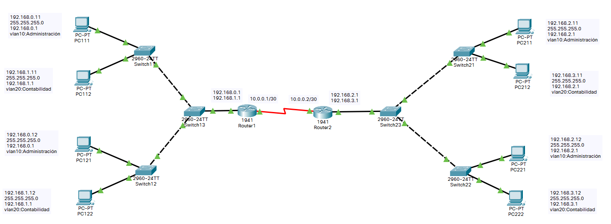

# Enrutar una VLAN

Vamos a configurar dos v-lan las cuales se enrutan con dos routers.

Necesitamos 6 switch y 2 routers.

## Creamo una red para la practica

Creamos una red de prueba y nos conectamos via consola.



### Configuramos los switchs 11, 12, 21 y 22

Le damos un nombre al Switch con el comando **hostname**

``` cisco ios
Switch>enable
Switch#configure terminal
Switch#hostname Switch1
Switch11#
```

Creamos la VLAN 10 de administración y VLAN 20 de contabilidad.

``` cisco ios
Switch11>enable
Switch11#configure terminal
Enter configuration commands, one per line.  End with CNTL/Z.
Switch11(config)#vlan 10
Switch11(config-vlan)#name Administracion
Switch11(config-vlan)#exit
Switch11(config)#vlan 20
Switch11(config-vlan)#name Contabilidad
Switch11(config-vlan)#exit
```

Asignamos las interfaces a la VLAN 10 y VLAN 20

``` cisco ios
Switch11(config)#interface range f0/1-10
Switch11(config-if-range)#switchport access vlan 10
Switch11(config-if-range)#exit
Switch11(config)#interface range f0/11-20
Switch11(config-if-range)#switchport access vlan 20
Switch11(config-if-range)#exit
Switch11(config)#exit
Switch11#
```

Comprobamos que no hay ningún interface troncal.

``` cisco ios
Switch11# show interfaces trunk

Switch11#
```

Configuramos el interface gigabitEthernet 0/1 en modo troncal

``` cisco ios
Switch11#configure 
Configuring from terminal, memory, or network [terminal]? 
Enter configuration commands, one per line.  End with CNTL/Z.
Switch11(config)#interface gigabitEthernet 0/1
Switch11(config-if)#switchport mode trunk
```

<!-- Se puede configurar la interface con el modo dynamic desirable o mode dynamic auto, para que elija el modo trunk automaticamente.
``` cisco ios
Switch11(config-if)#switchport mode dynamic desirable   
``` -->

Comprobamos que el interface gigabitEthernet 0/1 esta configurado como troncal.
Con el parametro *Operational Mode* a *trunk*

``` cisco ios
Switch11#show interface gigabitEthernet 0/1 switchport 
Name: Gig0/1
Switchport: Enabled
Administrative Mode: dynamic desirable
Operational Mode: trunk
Administrative Trunking Encapsulation: dot1q
Operational Trunking Encapsulation: dot1q
Negotiation of Trunking: On
Access Mode VLAN: 1 (default)
Trunking Native Mode VLAN: 1 (default)
Voice VLAN: none
Administrative private-vlan host-association: none
Administrative private-vlan mapping: none
Administrative private-vlan trunk native VLAN: none
Administrative private-vlan trunk encapsulation: dot1q
Administrative private-vlan trunk normal VLANs: none
Administrative private-vlan trunk private VLANs: none
Operational private-vlan: none
Trunking VLANs Enabled: All
Pruning VLANs Enabled: 2-1001
Capture Mode Disabled
Capture VLANs Allowed: ALL
Protected: false
Appliance trust: none
```

Comprobamos que tenemos configurado el enlace troncal

``` cisco ios
Switch11#show interfaces trunk
Port        Mode         Encapsulation  Status        Native vlan
Gig0/1      desirable    n-802.1q       trunking      1

Port        Vlans allowed on trunk
Gig0/1      1-1005

Port        Vlans allowed and active in management domain
Gig0/1      1,10,20,210

Port        Vlans in spanning tree forwarding state and not pruned
Gig0/1      1,10,20,210
```

Comprobamos la configuración de VLAN

``` cisco ios
Switch11#show vlan brief

VLAN Name                             Status    Ports
---- -------------------------------- --------- -------------------------------
1    default                          active    Fa0/21, Fa0/22, Fa0/23, Fa0/24
                                                Gig0/1, Gig0/2
10   Administracion                   active    Fa0/1, Fa0/2, Fa0/3, Fa0/4
                                                Fa0/5, Fa0/6, Fa0/7, Fa0/8
                                                Fa0/9, Fa0/10
20   Contabilidad                     active    Fa0/11, Fa0/12, Fa0/13, Fa0/14
                                                Fa0/15, Fa0/16, Fa0/17, Fa0/18
                                                Fa0/19, Fa0/20
1002 fddi-default                     active    
1003 token-ring-default               active    
1004 fddinet-default                  active    
1005 trnet-default                    active  
```

Guardamos la configuración del switch

``` cisco ios
Switch1#copy running-config startup-config 
```

Repetimos los mismos pasos con los switch 12, 21 y 22.

### Configuramos los switchs 13, 23

Le damos un nombre al switch13 y lo configuramos de forma similar al primer switch

``` cisco ios
Switch>enable
Switch#configure terminal
Switch#hostname Switch13
Switch13#
```

Creamos la VLAN 10 de administración y VLAN 20 de contabilidad.

``` cisco ios
Switch13>enable
Switch13#configure terminal
Enter configuration commands, one per line.  End with CNTL/Z.
Switch13(config)#vlan 10
Switch13(config-vlan)#name Administracion
Switch13(config-vlan)#exit
Switch13(config)#vlan 20
Switch13(config-vlan)#name Contabilidad
Switch13(config-vlan)#exit
```

Configuramos la interfaz que une con el router en modo trunk

``` cisco ios
Switch13(config)#interface FastEthernet0/24
Switch13(config-if)#switchport mode trunk
```

### Configuración de los router

Le damos un nombre al Router1

``` cisco ios
Router>enable
Router#configure terminal
Router#hostname Router1
Router1#
```

Para poder darle dos direcciones IP a una interfaz, debemos definir dos subinterfaces en el router.

``` cisco ios
Router1#configure terminal
Enter configuration commands, one per line.  End with CNTL/Z.
Router1(config)#interface gigabitEthernet 0/0.10
Router1(config-subif)#encapsulation dot1Q 10
Router1(config-subif)#ip address 192.168.0.1 255.255.255.0
Router1(config-subif)#exit
Router1(config)#interface gigabitEthernet 0/0.20
Router1(config-subif)#encapsulation dot1Q 20
Router1(config-subif)#ip address 192.168.1.1 255.255.255.0
Router1(config-subif)#exit
Router1(config)#
```

Encendemos la interface fisica

``` cisco ios
Router1(config)#interface gigabitEthernet 0/0
Router1(config-subif)#no shutdown
Router1(config-subif)#exit
Router1(config)#
```

Configuramos la interface que conecta con el otro router

``` cisco ios
Router1(config)#interface serial 0/0/0
Router1(config-subif)#no shutdown
Router1(config-subif)#ip address 10.0.0.1 255.255.255.252
Router1(config-subif)#exit
Router1(config)#
```

Definimos las rutas

``` cisco ios
Router1(config)#router rip
Router1(config-router)#version 2
Router1(config-router)#no auto-summary
Router1(config-router)#network 192.168.0.0
Router1(config-router)#network 192.168.1.0
Router1(config-router)#network 10.0.0.0
Router1(config-router)#exit
Router1(config)#
```

Ahora configuramos el router 2 de forma semilar.

### Por ultimo probamos que funcionan

Probamos que conecta

``` cmd
C:\>ping 192.168.0.1

Pinging 192.168.0.1 with 32 bytes of data:

Reply from 192.168.0.1: bytes=32 time<1ms TTL=255
Reply from 192.168.0.1: bytes=32 time<1ms TTL=255
Reply from 192.168.0.1: bytes=32 time<1ms TTL=255
Reply from 192.168.0.1: bytes=32 time<1ms TTL=255

Ping statistics for 192.168.0.1:
    Packets: Sent = 4, Received = 4, Lost = 0 (0% loss),
Approximate round trip times in milli-seconds:
    Minimum = 0ms, Maximum = 0ms, Average = 0ms

```

Y probamos las rutas

``` cmd
C:\>tracert 192.168.0.11

Tracing route to 192.168.0.11 over a maximum of 30 hops: 

  1   0 ms      0 ms      0 ms      192.168.2.1
  2   1 ms      1 ms      4 ms      10.0.0.1
  3   0 ms      4 ms      0 ms      192.168.0.11

Trace complete.
```
