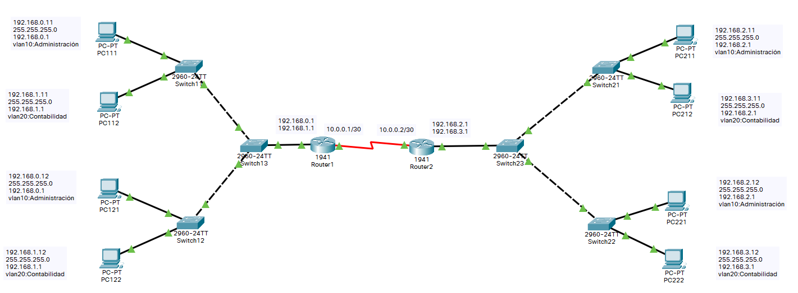

# Configuración switch capa 3

Vamos a configurar un Switch capa 3

Necesitamos ***.

## Creamo una red para la practica

Creamos una red de prueba y nos conectamos via consola.

https://www.youtube.com/watch?v=jjlqrROc5-0
https://www.youtube.com/watch?v=EVLw92Ygxko
https://www.youtube.com/watch?v=rIG7keplaQw