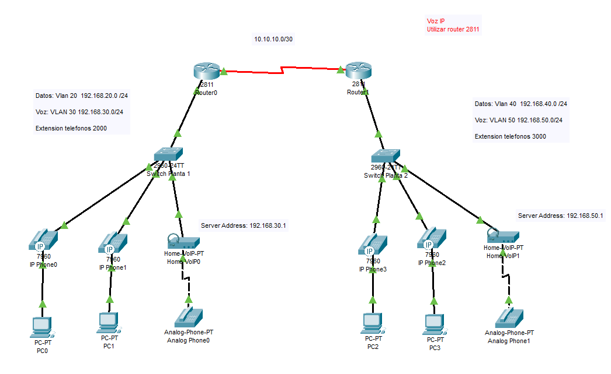

# Configurar VozIp en una WAN

Vamos a crear una red para comunicar VoIP. Pare ello hay que crear dos VLAN's, una para datos y otra para VoIP.
Posteriormente uniremos dos redes para transmitir datos y VoIP entre ellas.

## Creamo una red para la practica

Creamos una red de prueba.



## Configurar VLAN

Creamos dos VLAN's una para datos y otra para voz.

Para configurar los swiches, se crear dos vlan una para datos y otra para voz,
y el interface que conecta con el router lo configuramos en modo trunk.

``` cisco ios
Switch>en
Switch#config terminal
Enter configuration commands, one per line.  End with CNTL/Z.
Switch(config)#vlan 20
Switch(config-vlan)#name datos
Switch(config-vlan)#vlan 30
Switch(config-vlan)#name voz
Switch(config-vlan)#exit
Switch(config)#interface range fastEthernet 0/2-4
Switch(config-if-range)#switchport access vlan 20
Switch(config-if-range)#switchport voice vlan 30
Switch(config-if-range)#no shutdown
Switch(config-if)#exit
Switch(config)#interface FastEthernet0/1
Switch(config-if)#switchport mode trunk
Switch(config-if)#no shutdown
Switch(config)#exit
```

Encendemos el interface del router

``` cisco ios
Router>en
Router#config terminal
Enter configuration commands, one per line.  End with CNTL/Z.
Router(config)#interface fastEthernet 0/0
Router(config)#no shutdown
Router(config)#exit
Router#
```

Para configurar los routers, hay que crear interfaces virutales,
encapsulamos con **dot1Q** al vlan de datos y le damos una IP.

``` cisco ios
Router>en
Router#config terminal
Enter configuration commands, one per line.  End with CNTL/Z.
Router(config)#interface fastEthernet 0/0.2
Router(config-subif)#encapsulation dot1Q 20
Router(config-subif)#ip address 192.168.20.1 255.255.255.0
Router(config-subif)#no shutdown
Router(config-subif)#exit
Router(config)#interface fastEthernet 0/0.3
Router(config-subif)#encapsulation dot1Q 30
Router(config-subif)#ip address 192.168.30.1 255.255.255.0
Router(config-subif)#no shutdown
Router(config-subif)#exit
Router(config)#
```

Configuramos un DHCP para cada VLAN tanto datos como voz

``` cisco ios
Router#config terminal
Enter configuration commands, one per line.  End with CNTL/Z.
Router(config)#ip dhcp pool datos
Router(dhcp-config)#network 192.168.20.0 255.255.255.0
Router(dhcp-config)#default-router 192.168.20.1
Router(dhcp-config)#option 150 ip 192.168.20.1
Router(dhcp-config)#exit
Router(config)#ip dhcp pool voz
Router(dhcp-config)#network 192.168.30.0 255.255.255.0
Router(dhcp-config)#default-router 192.168.30.1
Router(dhcp-config)#option 150 ip 192.168.30.1
Router(dhcp-config)#exit
Router(config)#ip dhcp excluded-address 192.168.20.1
Router(config)#ip dhcp excluded-address 192.168.30.1
```

**Nota** El *comando option 150 ip*, le indica a los telefonos un servidor TFTP desde donde bajarse los archivos de configuración del teléfono.

## Configurar telefonia

Creamos el servicio de telefonia ip en el router con **telephony-service**:

1. Establecemos el número máximo de canales con **max-dn 5**.
2. Establecemos el número máximo de teléfonos con **max-ephones 5**.
3. Establecemos la IP y el puerto del servicio con **ip source-address 192.168.30.1 port 2000**.
4. Establecemos autoasignación de teléfono con **auto assign**.
5. Asignamos los números de telefonos con **number 2001**.

``` cisco ios
Router#config terminal
Enter configuration commands, one per line.  End with CNTL/Z.
Router(config)#telephony-service 
Router(config-telephony)#max-dn 5
Router(config-telephony)#max-ephones 5
Router(config-telephony)#ip source-address 192.168.30.1 port 2000
Router(config-telephony)#auto assign 1 to 3
Router(config-telephony)#exit
Router(config)#
Router(config)#ephone-dn 1
Router(config-ephone-dn)#%LINK-3-UPDOWN: Interface ephone_dsp DN 1.1, changed state to up
Router(config-ephone-dn)#number 2001
Router(config-ephone-dn)#exit
Router(config)#
Router(config)#ephone-dn 2
Router(config-ephone-dn)#%LINK-3-UPDOWN: Interface ephone_dsp DN 1.1, changed state to up
Router(config-ephone-dn)#number 2002
Router(config-ephone-dn)#exit
Router(config)#
Router(config)#ephone-dn 3
Router(config-ephone-dn)#%LINK-3-UPDOWN: Interface ephone_dsp DN 1.1, changed state to up
Router(config-ephone-dn)#number 2003
Router(config-ephone-dn)#exit
```

## Enrutar

Para enrutar, hay que enrutar los datos y la voz

Para enrutar los datos, le damos un ip al interfaz conectada al otro router.

``` cisco ios
Router#config terminal
Router(config)#interface serial 0/2/0
Router(config-if)#ip address 10.10.10.1 255.255.255.252
Router(config-if)#no shutdown
Router(config-if)#exit
```

Definimos la ruta estatica.

``` cisco ios
Router#config terminal
Router(config)#router 
Router(config)#ip route 192.168.40.0 255.255.255.0 10.10.10.2
Router(config)#exit
```

Para enrutar la voz.

1. Definmos el dial
2. Definimos las estensiones de destino con **destination-pattern**,
el '.' representa un comodín.
3. Y definimos el destino con **session target** y la IP del router a donde enviar los paquetes.

``` cisco ios
Router#config terminal
Router(config)#dial-peer voice 1 voip 
Router(config-dial-peer)#destination-pattern 300.
Router(config-dial-peer)#session target ipv4:10.10.10.2
Router(config-dial-peer)#end
```

**Nota:** de Igual modo se configuran el resto de los router.

**Nota:** fijense que no es necesario definir las rutas para las redes de voz ip con el comando *ip route*.

### Enrutar a más de un destino

Para poder enrutar a más una red remota, devemos definir otro dial-peer como aparece en el siguiente ejemplo.

``` cisco ios
Router#config terminal
Router(config)#dial-peer voice 2 voip 
Router(config-dial-peer)#destination-pattern 40..
Router(config-dial-peer)#session target ipv4:10.10.10.3
Router(config-dial-peer)#end
```

## Mostar estado de la telefonía

Podemos ver estado de la telefonía que controla el router.

``` cisco ios
Router#show ephone 

ephone-1 Mac:000B.BE46.020C TCP socket:[1] activeLine:0 REGISTERED in SCCP ver 12 and Server in ver 8
mediaActive:0 offhook:0 ringing:0 reset:0 reset_sent:0 paging 0 debug:0 caps:8
IP:192.168.30.2 1025 7960   keepalive 43 max_line 2
 button 1: dn 1  number 2001 CH1   IDLE

ephone-2 Mac:0090.0C81.1451 TCP socket:[1] activeLine:0 REGISTERED in SCCP ver 12 and Server in ver 8
mediaActive:0 offhook:0 ringing:0 reset:0 reset_sent:0 paging 0 debug:0 caps:8
IP:192.168.30.3 1025 7960   keepalive 43 max_line 2
 button 1: dn 2  number 2002 CH1   IDLE

ephone-3 Mac:00E0.B05C.BC01 TCP socket:[1] activeLine:0 REGISTERED in SCCP ver 12 and Server in ver 8
mediaActive:0 offhook:0 ringing:0 reset:0 reset_sent:0 paging 0 debug:0 caps:8
IP:192.168.20.5 1028 ata   keepalive 43 max_line 2
 button 1: dn 3  number 2003 CH1   IDLE

ephone-4 Mac:0006.2AB9.6723 TCP socket:[1] activeLine:1 UNREGISTERED
mediaActive:0 offhook:1 ringing:0 reset:0 reset_sent:0 paging 0 debug:0 caps:8
IP:0.0.0.0 0    keepalive 43 max_line 2
 button 1: dn  CH1   DOWN
```
