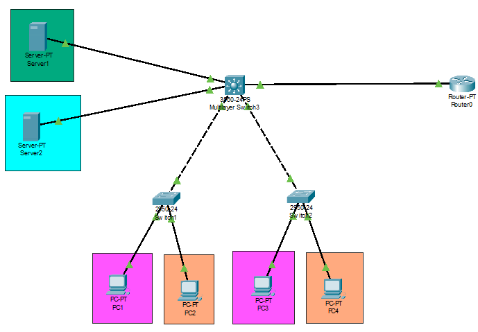

<!-- https://www.youtube.com/watch?v=jjlqrROc5-0
https://www.youtube.com/watch?v=EVLw92Ygxko
https://www.youtube.com/watch?v=rIG7keplaQw -->

# Configuración switch capa 3

Vamos a configurar un Switch capa 3

Necesitamos ***.

## Creamo una red para la practica

Creamos una red de prueba y nos conectamos via consola.



Vamos a crear 5 redes virtuales, las cuales se van a conectar con el SwitchCapa3. En la imagen se pueden apreciar, cada VLAN con un color más la VLAN que conecta con el router.

VLAN    | RED             | Mascara
------- | --------------- |----------
vlan10  | 192.168.100.0   | 255.255.255.192
vlan20  | 192.168.100.64  | 255.255.255.192
vlan30  | 192.168.100.192 | 255.255.255.240  
vlan40  | 192.168.100.254 | 255.255.255.240

## Configuración de la red

### Configuración SWITCH Capa 2

Para los Switch 1 y Switch 2, vamos con configurar dos VLAN.

#### Shitch 1

Le damos un nombre de host

``` cisco ios
Switch>
Switch>en
Switch#conf
Switch#configure terminal
Enter configuration commands, one per line.  End with CNTL/Z.
Switch(config)#hostname Switch1
Switch1(config)#
```

Ahora definimos las VLAN 10 y 20

Creamos la VLan 10 de administración

``` cisco ios
Switch1>enable
Switch1#configure terminal
Enter configuration commands, one per line.  End with CNTL/Z.
Switch1(config)#vlan 10
Switch1(config-vlan)#name vlan10
Switch1(config-vlan)#exit
Switch1(config)#
```

Creamos la VLan 20 de contabilidad

``` cisco ios
Switch1>enable
Switch1#configure terminal
Enter configuration commands, one per line.  End with CNTL/Z.
Switch1(config)#vlan 20
Switch1(config-vlan)#name vlan20
Switch1(config-vlan)#exit
Switch1(config)#
```

Asignamos las interfaces a la VLAN 10

``` cisco ios
Switch1(config)#interface range f0/1-10
Switch1(config-if-range)#switchport access vlan 10
Switch1(config-if-range)#exit
Switch1(config)#
```

Asignamos las interfaces a la VLAN 20

``` cisco ios
Switch1(config)#interface range f0/11-20
Switch1(config-if-range)#switchport access vlan 20
Switch1(config-if-range)#exit
Switch1(config)#exit
Switch1#
```

Configuramos un interface como troncal.

``` cisco ios
Switch1(config)#interface gigabitEthernet 0/1
Switch1(config-if)#switchport mode trunk
```
<!-- Switch1(config-if)#switchport trunk allowed vlan all -->

Podemos comprobar la configuración

``` cisco ios
Switch1#show vlan brief  
```

y

``` cisco ios
Switch1# show interfaces trunk
```

Guardamos la configuración del switch

``` cisco ios
Switch1#copy running-config startup-config 
```

**Nota:** A la hora de conectar los elementos de red hay que tomar especial atención a que se conectar al switch de capa 3 con el enlace troncal y cada PC a un puerto de la VLAN correspondiente.

#### Shitch 2

Repetimos lo mismo para configurar el Switch 2.

#### Configuración de los PC

Ahora debemos configurar los PCs con IP's de las redes a las que pertenecen,
por ejemplo

VLAN    | RED             | Mascara         | Puerta de enlace
------- | --------------- |---------------- | -----------------
PC1     | 192.168.100.2   | 255.255.255.192 | 192.168.100.1
PC2     | 192.168.100.66  | 255.255.255.192 | 192.168.100.65
PC3     | 192.168.100.3   | 255.255.255.192 | 192.168.100.1
PC4     | 192.168.100.67  | 255.255.255.192 | 192.168.100.65

### Configuración SWITCH Capa 3

Le damos un nombre de host

``` cisco ios
Switch>
Switch>en
Switch#conf
Switch#configure terminal
Enter configuration commands, one per line.  End with CNTL/Z.
Switch(config)#hostname Switch3
Switch3(config)#
```

Configuramos el Switch en modo routing

``` cisco ios
ip routing
```

### Cración de VLAN

Creamos 4 VLANS

``` cisco ios
Switch1>enable
Switch1#configure terminal
Enter configuration commands, one per line.  End with CNTL/Z.
Switch3(config)#vlan 10
Switch3(config-vlan)#name vlan10
Switch3(config-vlan)#exit
Switch3(config)#vlan 20
Switch3(config-vlan)#name vlan20
Switch3(config-vlan)#exit
Switch3(config)#vlan 30
Switch3(config-vlan)#name vlan30
Switch3(config-vlan)#exit
Switch3(config)#vlan 40
Switch3(config-vlan)#name vlan40
Switch3(config-vlan)#exit
Switch3(config)#
```

### Configurar enlaces troncales

Configuramos las interfaces que conectan con los witch1 y switch2 que estan en modo troncal.

``` cisco ios
Switch3(config)#interface FastEthernet0/1
Switch3(config-if)#switchport trunk encapsulation dot1q
Switch3(config-if)#switchport mode trunk

Switch3(config-if)#interface FastEthernet0/2
Switch3(config-if)#switchport trunk encapsulation dot1q
Switch3(config-if)#switchport mode trunk
```

### Configurar enlaces VLAN

Configuramos las interfaces que conectan a los servidores con su VLAN correspondiente

``` cisco ios
Switch3(config)#interface FastEthernet0/3
Switch3(config-if)#switchport mode trunk
Switch3(config-if)#switchport access vlan 30

Switch3(config-if)#interface FastEthernet0/4
Switch3(config-if)#switchport trunk encapsulation dot1q
Switch3(config-if)#switchport mode trunk
Switch3(config-if)#switchport access vlan 40
```

### Configuramos la interface en modo router

La interfaz que se conecta con el rotuer está se conecta en modo router para poder salir a Internet utilizando el swithc capa 3.

Para ello debemos indicarle que el puerto funcione en modo router (o decierle que no es un puerto de switch) y asignarle una dirección IP.

``` cisco ios
Switch3(config)#interface FastEthernet0/5
Switch3(config-if)#no switchport
Switch3(config-if)#ip address 192.168.100.242 255.255.255.240
Switch3(config-if)#duplex auto
Switch3(config-if)#speed auto
Switch3(config-if)#no shutdown
```

#### Configuración de los servidores

Ahora debemos configurar los ser con IP's de las redes a las que pertenecen,
por ejemplo

VLAN      | RED             | Mascara         | Puerta de enlace
--------- | --------------- |---------------- | -----------------
Server01  | 192.168.100.226 | 255.255.255.240 | 192.168.100.225
Server02  | 192.168.100.194 | 255.255.255.240 | 192.168.100.193

#### Configuramos el router

Configuramos el router para que tenca conexión con el switch

``` cisco ios
Router#config terminal

Router#(config)#int fa0/0
Router(config-if)#ip address 192.168.100.241 255.255.255.240
Router(config-if)#duplex auto
Router(config-if)#speed auto
Router(config-if)#no shutdown
```

### Configuración de las VLAN

Ahora debemos asignar un IP a las VLAN en el switch capa 3 para que puedan enrutar.

``` cisco ios
Switch3(config)#interface VLAN10
Switch3(config-if)#ip address 192.168.100.1 255.255.255.192
Switch3(config-if)#interface VLAN20
Switch3(config-if)#ip address 192.168.100.65 255.255.255.192
Switch3(config-if)#interface VLAN30
Switch3(config-if)#ip address 192.168.100.193 255.255.255.240
Switch3(config-if)#interface VLAN40
Switch3(config-if)#ip address 192.168.100.225 255.255.255.240
Switch3(config-if)#end
Switch3#
```

## Comprobación

Podemos comprobar que el switch capa 3 funciona como un router y tiene las tablas de rutas bien configuradas.

``` cisco ios
Switch3#show ip route
Codes: C - connected, S - static, I - IGRP, R - RIP, M - mobile, B - BGP
       D - EIGRP, EX - EIGRP external, O - OSPF, IA - OSPF inter area
       N1 - OSPF NSSA external type 1, N2 - OSPF NSSA external type 2
       E1 - OSPF external type 1, E2 - OSPF external type 2, E - EGP
       i - IS-IS, L1 - IS-IS level-1, L2 - IS-IS level-2, ia - IS-IS inter area
       * - candidate default, U - per-user static route, o - ODR
       P - periodic downloaded static route

Gateway of last resort is not set

     192.168.100.0/24 is variably subnetted, 5 subnets, 2 masks
C       192.168.100.0/26 is directly connected, Vlan10
C       192.168.100.64/26 is directly connected, Vlan20
C       192.168.100.192/28 is directly connected, Vlan30
C       192.168.100.224/28 is directly connected, Vlan40
C       192.168.100.240/28 is directly connected, FastEthernet0/5
```

Podemos hacer Ping entre todos los host.

``` cmd
C:\>ping 192.168.100.3

Pinging 192.168.100.3 with 32 bytes of data:

Reply from 192.168.100.3: bytes=32 time=10ms TTL=127
Reply from 192.168.100.3: bytes=32 time<1ms TTL=127
Reply from 192.168.100.3: bytes=32 time<1ms TTL=127
Reply from 192.168.100.3: bytes=32 time<1ms TTL=127

Ping statistics for 192.168.100.3:
    Packets: Sent = 4, Received = 4, Lost = 0 (0% loss),
Approximate round trip times in milli-seconds:
    Minimum = 0ms, Maximum = 10ms, Average = 2ms
```

Todos los paquetes pasan por el switch capa 3

``` cmd
C:\>tracert 192.168.100.3

Tracing route to 192.168.100.3 over a maximum of 30 hops: 

  1   0 ms      0 ms      0 ms      192.168.100.65
  2   14 ms     1 ms      0 ms      192.168.100.3

Trace complete.
```
