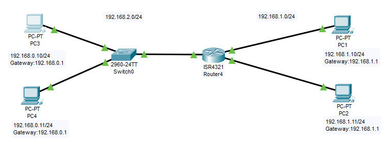
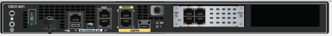

<!-- https://www.youtube.com/watch?v=jjlqrROc5-0
https://www.youtube.com/watch?v=EVLw92Ygxko
https://www.youtube.com/watch?v=rIG7keplaQw -->

# Configurar modulo Swich en un Router

Existen modulos para un Router que se comportan como un Swich los cuales se pueden configurar las VLAN.

Creamo una red para la practica



Y introducimos un modulo Switch al router



Por ejemplo un router de tipo *ISR 4321* se le puede introducir un módulo de tipo *The NIM-2T is a 2 port multi-protocol Synchronous Serial NIM* y al arrancar el router nos abisara que tien nuevas interfaces.

``` cisco ios
--- System Configuration Dialog ---

Would you like to enter the initial configuration dialog? [yes/no]: 
%LINK-5-CHANGED: Interface GigabitEthernet0/1/0, changed state to up

%LINK-5-CHANGED: Interface GigabitEthernet0/1/1, changed state to up

%LINK-5-CHANGED: Interface GigabitEthernet0/1/2, changed state to up

%LINK-5-CHANGED: Interface GigabitEthernet0/1/3, changed state to up

%LINEPROTO-5-UPDOWN: Line protocol on Interface GigabitEthernet0/1/0, changed state to up
```

Configuramos la vlan 1 en el router, dandole una dirección IP.

``` cisco ios
Router>en
Router#conf
Router#configure ter
Router#configure terminal 
Enter configuration commands, one per line.  End with CNTL/Z.
Router(config)#interface vlan 1
Router(config-if)#ip addres 192.168.1.1 255.255.255.0
Router(config-if)#no shutdown

Router(config-if)#
%LINK-5-CHANGED: Interface Vlan1, changed state to up

%LINEPROTO-5-UPDOWN: Line protocol on Interface Vlan1, changed state to up
```

Podemos ver los interfaces que están asociados a la Vlan1, que son los interfaces del modulo switch.

``` cisco ios
Router#show vlan brief

VLAN Name                             Status    Ports
---- -------------------------------- --------- -------------------------------
1    default                          active    Gig0/1/0, Gig0/1/1, Gig0/1/2, Gig0/1/3
1002 fddi-default                     active    
1003 token-ring-default               active    
1004 fddinet-default                  active    
1005 trnet-default                    active    
```

Ahora conectamos un PC a puerto *GigabitEthernet0/1/0* y le damos una IP de la red 192.168.1.0/24 con puerta de enlace 192.168.1.1

Ahora configuramos el interfaz del router de la forma abitual y conectamos el switch al interface *GigabitEthernet0/0/0*

``` cisco ios
Router(config)#interface GigabitEthernet0/0/0
Router(config-if)#ip address 192.168.0.1 255.255.255.0
Router(config-if)#no shutdown
```

## Comprobación

Podemos comprobar que se ven las dos redes con

``` cmd
C:\>ping 192.168.1.10

Pinging 192.168.1.10 with 32 bytes of data:

Reply from 192.168.1.10: bytes=32 time<1ms TTL=127
Reply from 192.168.1.10: bytes=32 time<1ms TTL=127
Reply from 192.168.1.10: bytes=32 time<1ms TTL=127
Reply from 192.168.1.10: bytes=32 time<1ms TTL=127

Ping statistics for 192.168.1.10:
    Packets: Sent = 4, Received = 4, Lost = 0 (0% loss),
Approximate round trip times in milli-seconds:
    Minimum = 0ms, Maximum = 0ms, Average = 0ms
```

Y ver las tablas de enrutamiento del router, viendo como la VLAN funciona como una interfaz virtual

``` cisco ios
Router#show ip route
Codes: L - local, C - connected, S - static, R - RIP, M - mobile, B - BGP
       D - EIGRP, EX - EIGRP external, O - OSPF, IA - OSPF inter area
       N1 - OSPF NSSA external type 1, N2 - OSPF NSSA external type 2
       E1 - OSPF external type 1, E2 - OSPF external type 2, E - EGP
       i - IS-IS, L1 - IS-IS level-1, L2 - IS-IS level-2, ia - IS-IS inter area
       * - candidate default, U - per-user static route, o - ODR
       P - periodic downloaded static route

Gateway of last resort is not set

     192.168.0.0/24 is variably subnetted, 2 subnets, 2 masks
C       192.168.0.0/24 is directly connected, GigabitEthernet0/0/0
L       192.168.0.1/32 is directly connected, GigabitEthernet0/0/0
     192.168.1.0/24 is variably subnetted, 2 subnets, 2 masks
C       192.168.1.0/24 is directly connected, Vlan1
L       192.168.1.1/32 is directly connected, Vlan1
```
