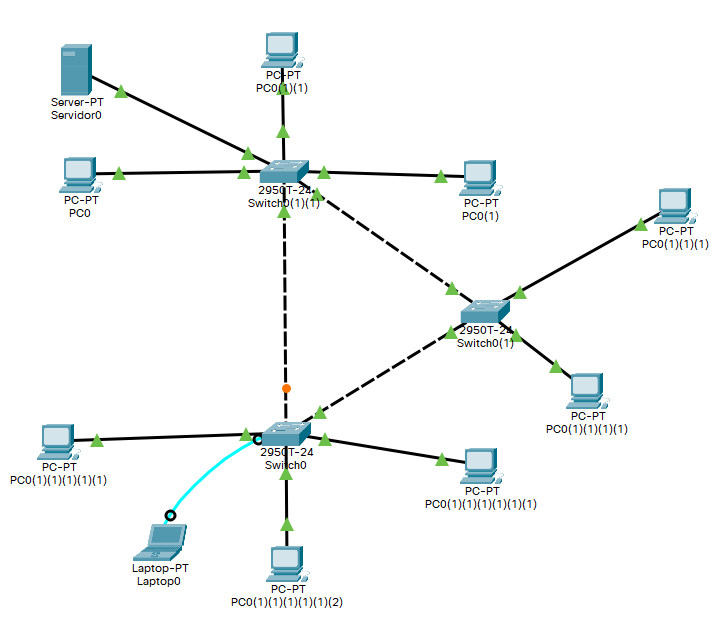

# Acceso a un switch

## Creamo una red para la practica



## Acceso directo a traver del terminal

Entramos a traves del terminal desde el PC que conectamos directamente al switch.

### Acceso via consola

Para configurar el usuario y contraseña de acceso via consola utilizamos la siguiente secuencia.

``` cisco ios
Switch>enable 
Switch#configure terminal
Enter configuration commands, one per line.  End with CNTL/Z.
Switch(config)#line console 0
Switch(config-line)#password <<usuario>>
Switch(config-line)#login
Switch(config-line)#end
Switch#
``` 

Volvemos a entrar en el switch via consola para ver que nos pide un usuario y contraseña.


### Establecer password para entrar en modo configue

Para establecer una contraseña utilizmos el comando **enable password**

``` cisco ios
Switch>enable
Switch#configure terminal
Enter configuration commands, one per line.  End with CNTL/Z.
Switch(config)#enable password <<password>>
``` 

### Agregar clave cifrada

Mediante el comando **show running-config** es posible visualizar todas las contraseñas en el fichero de configuración, 
para que esto no ocurra debemos crear contraseñas cifradas. 

``` cisco ios
Switch>enable
Switch#configure terminal
Enter configuration commands, one per line.  End with CNTL/Z.
Switch(config)#enable secret <<password>>
``` 

Verificar que con **show running-config** ya no es posible ver la contraseña.

## Acceso via telnet

Creamos un usuario con acceso via terminal.

``` cisco ios
Switch>enable
Switch#configure terminal
Enter configuration commands, one per line.  End with CNTL/Z.
Switch(config)#line vty 0 15
Switch(config-line)#no login
Switch(config-line)#login local
Switch(config-line)#username <<usuario>> password <<password>>
Switch(config)#username usuario privilege 15
Switch(config)#
```

Asignamos una IP para la interface

``` cisco ios
Switch>enable
Switch#configure terminal
Enter configuration commands, one per line.  End with CNTL/Z.
Switch(config)#interface vlan1
Switch(config-if)#ip addres 192.168.0.3 255.255.255.0
Switch(config-if)#no shutdown
```

Entramos desde un ordenador de la red, via telnet.
