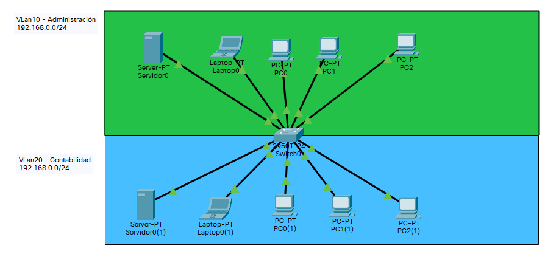

# Configurar DHCP con router CISCO

******************  Arreglar   *******************


Se puede configurar un router CISCO como servidor DHCP mediante comando IOS.

## Creamo una red para la practica

Creamos una red de prueba y nos conectamos via consola.



## Configuramos el router

Configuramos DHCP

``` cisco ios
Router1(config)#dchp pool red10
Router1(dhcp-config)#network 192.168.0.0 255.255.255.0
Router1(dhcp-config)#default-router 192.168.0.1
Router1(dhcp-config)#exit
Router1(config)#dchp pool red20
Router1(dhcp-config)#network 192.168.1.0 255.255.255.0
Router1(dhcp-config)#default-router 192.168.1.1
Router1(dhcp-config)#exit
Router1(config)#ip dhcp excluded-address 192.168.0.1 192.168.0.10
Router1(config)#ip dhcp excluded-address 192.168.1.1 192.168.1.10
```
