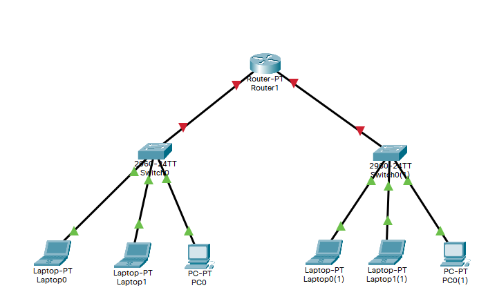

# Configurar DHCP con router CISCO

Para configurar un router CISCO como servidor DHCP mediante comando IOS.

## Creamo una red para la practica

Creamos dos redes unidas por un Router



## Configuramos el router

``` cisco ios
Router>enable
Router#configure terminal 
%SYS-5-CONFIG_I: Configured from console by console
Router(config)#interface fastEthernet 0/0
Router(config-if)#ip address 192.168.0.1 255.255.255.0
Router(config-if)#no shutdown
%LINK-5-CHANGED: Interface FastEthernet0/0, changed state to up

%LINEPROTO-5-UPDOWN: Line protocol on Interface FastEthernet0/0, changed state to up

Router(config-if)#duplex auto
Router(config-if)#speed auto
Router(config-if)#exit
Router(config)#
```

De igual forma configuramos el otro interface.

``` cisco ios
Router>enable
Router#configure terminal 
%SYS-5-CONFIG_I: Configured from console by console
Router(config)#interface fastEthernet 1/0
Router(config-if)#ip address 192.168.1.1 255.255.255.0
Router(config-if)#no shutdown
%LINK-5-CHANGED: Interface FastEthernet1/0, changed state to up

%LINEPROTO-5-UPDOWN: Line protocol on Interface FastEthernet0/0, changed state to up

Router(config-if)#duplex auto
Router(config-if)#speed auto
Router(config-if)#exit
Route
```

## Configuramos el servidor DHCP

Creamos una pool que sirve como almacen de direcciones y definimos

- Él rango de IP's a asignar
- La puerta de enlace por defecto
- El nombre del dominio (opcional)
- La lista de servidores DNS (opcional)

``` cisco ios
Router>enable
Router#configure terminal 
Router(config)#ip dhcp pool red10
Router(dhcp-config)#network 192.168.0.0 255.255.255.0
Router(dhcp-config)#default-router 192.168.0.1
Router(dhcp-config)#domain-name red10.practica.intra
Router(dhcp-config)#dns-server 8.8.8.8 8.8.4.4
Router(dhcp-config)#exit
```

Podemos definir un segundo Pool para otra red.

``` cisco ios
Router(config)#ip dhcp pool red20
Router(dhcp-config)#network 192.168.1.0 255.255.255.0
Router(dhcp-config)#default-router 192.168.1.1
Router(dhcp-config)#exit
```

Podemos definir un o varios rangos de IP's que no se asignaran dinamicamente.

``` cisco ios
Router(config)#ip dhcp excluded-address 192.168.0.1 192.168.0.10
Router(config)#ip dhcp excluded-address 192.168.1.1 192.168.1.10
```

## Asignación dinamica de IP en los clientes

Para que surja efecto la conifiguración en los Host, hay que asegurarse que en la configuración de red se marco la opción obtener IP a traves de DHCP.

La opción menos elegante es reiniciar el ordenador para que se le asigne una IP.
Para que se asigne una IP sin reiniciar, podemos ejecutar el comando

``` CMD
c:\>ipconfig /renew
```

Para liberar la IP que se le a asignado, se puede usar

``` CMD
c:\>ipconfig /release
```

## Comprobación de la configuración

Ver información de las direcciones asignadas

``` cisco ios
Router#show ip dhcp binding
IP address       Client-ID/              Lease expiration        Type
                 Hardware address
192.168.0.11     0002.4ABB.5413           --                     Automatic
192.168.0.12     0001.64E6.0C94           --                     Automatic
192.168.0.13     0001.635C.4E57           --                     Automatic
192.168.1.11     0060.3EBB.3A54           --                     Automatic
192.168.1.12     0060.3E96.E170           --                     Automatic
192.168.1.13     00E0.F7EE.3194           --                     Automatic
```

Ver información sobre los conflictos producido al intentar asignar direcciones que ya estaban en uso.

``` cisco ios
Router#show ip dhcp conflict
```
