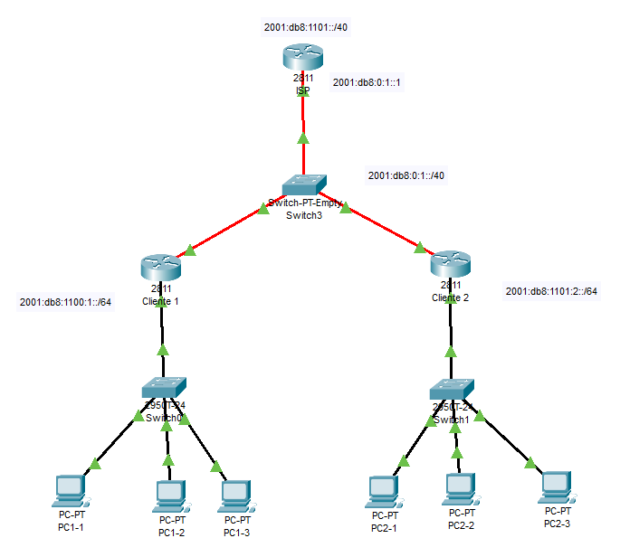

<!-- https://networklessons.com/cisco/ccie-routing-switching-written/ipv6-dhcpv6-prefix-delegation -->

# IPv6 DHCPv6 Delegación de prefijos

La característica de delegación de prefijos permite a un servidor DHCP asignar prefijos elegidos de un grupo global a clientes DHCP. El cliente DHCP puede configurar una dirección IPv6 en su interfaz LAN utilizando el prefijo que recibió. Luego enviará anuncios de enrutador que incluyen el prefijo, lo que permitirá que otros dispositivos usen la configuración automática para configurar sus propias direcciones IPv6.

Esta característica puede ser útil en un entorno de ISP. Aquí hay un ejemplo:



En la imagen de arriba tenemos un ISP que tiene el prefijo global 2001:DB8:1100::/40 que puede asignar a los clientes. Con la función de delegación de prefijos y DHCPv6, asigna automáticamente prefijos a sus clientes:

- Cliente 1 recive 2001:DB8:1100::/48
- Cliente 2 recive 2001:DB8:1101::/48

Cada enrutador del cliente configura una dirección IPv6 basada en el prefijo que recibió del ISP utilizando la función de prefijo general y anuncia el prefijo específico (subred) para alojar dispositivos en los anuncios del enrutador.

Los dispositivos host pueden configurar su propia dirección IPv6 utilizando el prefijo en el anuncio del enrutador y EUI-64.

## ISP

Comencemos con el enrutador ISP. Necesitamos habilitar el enrutamiento de unidifusión IPv6:

``` cisco ios
ISP(config)#ipv6 unicast-routing
```

El prefijo global se configura con el comando **ipv6 local pool**:

``` cisco ios
ISP(config)#ipv6 local pool GLOBAL_POOL 2001:DB8:1100::/40 48
```

Esto le dice al router que tenemos un grupo llamado GLOBAL_POOL y que podemos usar todo el prefijo 2001:DB8:1100::/40. Sin embargo, cada cliente DHCP recibirá un prefijo /48 de este grupo.

Ahora necesitamos configurar el servidor DHCP:

``` cisco ios
ISP(config)#ipv6 dhcp pool CUSTOMERS
ISP(config-dhcpv6)#prefix-delegation pool GLOBAL_POOL
ISP(config-dhcpv6)#dns-server 2001:4860:4860::8888
ISP(config-dhcpv6)#dns-server 2001:4860:4860::8844
ISP(config-dhcpv6)#domain-name midominio.com
```

Me refiero al grupo que acabamos de crear y agrego información adicional como los servidores DNS de Google y un nombre de dominio. En la interfaz que se conecta a los clientes, configuro una dirección IPv6 que no entra dentro del rango del prefijo global (si lo intenta, obtiene un error) y el servidor DHCP debe activarse en la interfaz:

``` cisco ios
ISP(config)#interface GigabitEthernet 0/1
ISP(config-if)#ipv6 address 2001:DB8:0:1::1/64
ISP(config-if)#ipv6 dhcp server CUSTOMERS
C2(config-if)#no shutdown
```

Eso completa la configuración del enrutador ISP.

## Routers para clientes

Configuremos los routers del cliente.

### C1

Asegúrese de habilitar el enrutamiento de unidifusión IPv6:

``` cisco ios
C1(config)#ipv6 unicast-routing
```

La interfaz que se conecta al router ISP utilizará el cliente DHCP:

``` cisco ios
C1(config)#interface GigabitEthernet 0/1
C1(config-if)#ipv6 dhcp client pd ISP_PREFIX
C1(config-if)#ipv6 address autoconfig
C2(config-if)#no shutdown
```

El prefijo que recibamos se almacenará como ISP_PREFIX. Usaremos esto en la interfaz que se conecta a nuestros hosts para configurar una dirección IPv6:

``` cisco ios
C1(config)#interface GigabitEthernet 0/2
C1(config-if)#ipv6 address ISP_PREFIX ::1:0:0:0:1/64
C1(config-if)#ipv6 address fe80::1 link-local
C2(config-if)#no shutdown
```

En el comando de dirección IPv6, me refiero a nuestro ISP_PREFIX para que el enrutador inicie la dirección con ese prefijo. Usaré un prefijo /64 en esta interfaz.

Los router se ven, a traves de un ping

``` cisco ios
C1#ping FE80::205:5EFF:FE85:7870
Output Interface: 
C1#ping 2001:DB8:0:1:205:5EFF:FE85:7870

Type escape sequence to abort.
Sending 5, 100-byte ICMP Echos to 2001:DB8:0:1:205:5EFF:FE85:7870, timeout is 2 seconds:
!!!!!
Success rate is 100 percent (5/5), round-trip min/avg/max = 0/4/9 ms
```

### C2

Podemos hacer exactamente lo mismo en este router que en C1:

``` cisco ios
C2(config)#ipv6 unicast-routing 

C2(config)#interface GigabitEthernet 0/1
C2(config-if)#ipv6 dhcp client pd ISP_PREFIX
C2(config-if)#ipv6 address autoconfig
C2(config-if)#no shutdown

C2(config)#interface GigabitEthernet 0/2
C2(config-if)#ipv6 address ISP_PREFIX ::2:0:0:0:1/64
C2(config-if)#ipv6 address fe80::1 link-local
C2(config-if)#no shutdown
```

La única diferencia es que uso un prefijo específico diferente (subred) en este router.

### Host

En cada uno de nuestros hosts, utilizamos la configuración automática.

## Verificación

¡Verifiquemos nuestro trabajo!

### ISP

Echemos un vistazo más de cerca a nuestro grupo DHCP:

``` cisco ios
ISP#show ipv6 dhcp pool 
DHCPv6 pool: CUSTOMERS
  Prefix pool: GLOBAL_POOL
               preferred lifetime 604800, valid lifetime 2592000
  DNS server: 2001:4860:4860::8888
  DNS server: 2001:4860:4860::8844
  Domain name: NETWORKLESSONS.LOCAL
  Active clients: 2
```

La salida anterior nos dice que tenemos dos clientes y que el router ISP utiliza el GLOBAL_POOL para el prefijo. Echemos un vistazo más de cerca a esos dos clientes DHCP:

``` cisco ios
ISP#show ipv6 dhcp binding 
Client: FE80::F816:3EFF:FEB8:F33E 
  DUID: 000300015E0000010000
  Username : unassigned
  VRF : default
  Interface : GigabitEthernet0/1
  IA PD: IA ID 0x00030001, T1 302400, T2 483840
    Prefix: 2001:DB8:1100::/48
            preferred lifetime 604800, valid lifetime 2592000
            expires at Mar 22 2018 09:41 AM (2591328 seconds)
Client: FE80::F816:3EFF:FEC4:B7CB 
  DUID: 000300015E0000030000
  Username : unassigned
  VRF : default
  Interface : GigabitEthernet0/1
  IA PD: IA ID 0x00030001, T1 302400, T2 483840
    Prefix: 2001:DB8:1101::/48
            preferred lifetime 604800, valid lifetime 2592000
            expires at Mar 22 2018 09:43 AM (2591430 seconds)
```

La salida anterior es interesante ya que nos dice qué prefijos tiene el router asignado a los clientes DHCP.

### Clientes

Echemos un vistazo a esos clientes DHCP, los enrutadores de clientes.

#### C1

Echemos un vistazo a la información DHCP desde la perspectiva de C1:

``` cisco ios
C1#show ipv6 dhcp interface                 
GigabitEthernet0/1 is in client mode
  Prefix State is OPEN
  Renew will be sent in 3d11h
  Address State is IDLE
  List of known servers:
    Reachable via address: FE80::F816:3EFF:FE00:EF72
    DUID: 000300015E0000000000
    Preference: 0
    Configuration parameters:
      IA PD: IA ID 0x00030001, T1 302400, T2 483840
        Prefix: 2001:DB8:1100::/48
                preferred lifetime 604800, valid lifetime 2592000
                expires at Mar 22 2018 09:41 AM (2591299 seconds)
      DNS server: 2001:4860:4860::8888
      DNS server: 2001:4860:4860::8844
      Domain name: NETWORKLESSONS.LOCAL
      Information refresh time: 0
  Prefix name: ISP_PREFIX
  Prefix Rapid-Commit: disabled
  Address Rapid-Commit: disable
```

Arriba vemos que recibimos nuestro prefijo del ISP, incluyendo algunos otros detalles como los servidores DNS y el nombre de dominio. También puede ver que este enrutador nombró el prefijo "ISP_PREFIX".

Aquí podemos ver la dirección IPv6 que C1 configuró en su interfaz GigabitEthernet 0/1:

``` cisco ios
C1#show ipv6 interface GigabitEthernet 0/1 | include 2001
    2001:DB8:0:1:F816:3EFF:FEB8:F33E, subnet is 2001:DB8:0:1::/64 [EUI/CAL/PRE]
```

También podemos comprobar que el router ha almacenado el prefijo que recibió del ISP:

``` cisco ios
C1#show ipv6 general-prefix 
IPv6 Prefix ISP_PREFIX, acquired via DHCP PD
  2001:DB8:1100::/48 Valid lifetime 2591177, preferred lifetime 603977
   GigabitEthernet0/2 (Address command)
```

Que se utiliza para configurar la interfaz GigabitEthernet 0/2:

``` cisco ios
C1#show ipv6 interface GigabitEthernet 0/2 | include 2001
    2001:DB8:1100:1::1, subnet is 2001:DB8:1100:1::/64 [CAL/PRE]
```

Eso es todo lo que necesitamos para verificar en C1.

### C2

Verifiquemos que C2 ha recibido un prefijo del ISP:

``` cisco ios
C1#show ipv6 dhcp interface                 
GigabitEthernet0/1 is in client mode
  Prefix State is OPEN
  Renew will be sent in 3d11h
  Address State is IDLE
  List of known servers:
    Reachable via address: FE80::F816:3EFF:FE00:EF72
    DUID: 000300015E0000000000
    Preference: 0
    Configuration parameters:
      IA PD: IA ID 0x00030001, T1 302400, T2 483840
        Prefix: 2001:DB8:1100::/48
                preferred lifetime 604800, valid lifetime 2592000
                expires at Mar 22 2018 09:41 AM (2591299 seconds)
      DNS server: 2001:4860:4860::8888
      DNS server: 2001:4860:4860::8844
      Domain name: NETWORKLESSONS.LOCAL
      Information refresh time: 0
  Prefix name: ISP_PREFIX
  Prefix Rapid-Commit: disabled
  Address Rapid-Commit: disable
```

Arriba vemos que recibimos nuestro prefijo del ISP, incluyendo algunos otros detalles como los servidores DNS y el nombre de dominio. También puede ver que este enrutador nombró el prefijo "ISP_PREFIX".

Aquí podemos ver la dirección IPv6 que C2 configuró en su interfaz GigabitEthernet 0/1:

``` cisco ios
C1#show ipv6 interface GigabitEthernet 0/1 | include 2001
    2001:DB8:0:1:F816:3EFF:FEB8:F33E, subnet is 2001:DB8:0:1::/64 [EUI/CAL/PRE]
```

También podemos comprobar que el router ha almacenado el prefijo que recibió del ISP:

``` cisco ios
C1#show ipv6 general-prefix 
IPv6 Prefix ISP_PREFIX, acquired via DHCP PD
  2001:DB8:1100::/48 Valid lifetime 2591177, preferred lifetime 603977
   GigabitEthernet0/2 (Address command)
```

Que se utiliza para configurar la interfaz GigabitEthernet 0/2:

``` cisco ios
C1#show ipv6 interface GigabitEthernet 0/2 | include 2001
    2001:DB8:1100:1::1, subnet is 2001:DB8:1100:1::/64 [CAL/PRE]
```

### Host

Desde los PC's podemos hacer ping a máquinas de la misma red o de la otra red.

``` cmd
C:\>ping 2001:db8:1100:1:260:2fff:fe35:1e23

Pinging 2001:db8:1100:1:260:2fff:fe35:1e23 with 32 bytes of data:

Reply from 2001:DB8:1100:1:260:2FFF:FE35:1E23: bytes=32 time<1ms TTL=128
Reply from 2001:DB8:1100:1:260:2FFF:FE35:1E23: bytes=32 time<1ms TTL=128
Reply from 2001:DB8:1100:1:260:2FFF:FE35:1E23: bytes=32 time<1ms TTL=128
Reply from 2001:DB8:1100:1:260:2FFF:FE35:1E23: bytes=32 time<1ms TTL=128

Ping statistics for 2001:DB8:1100:1:260:2FFF:FE35:1E23:
    Packets: Sent = 4, Received = 4, Lost = 0 (0% loss),
Approximate round trip times in milli-seconds:
    Minimum = 0ms, Maximum = 0ms, Average = 0ms
```
