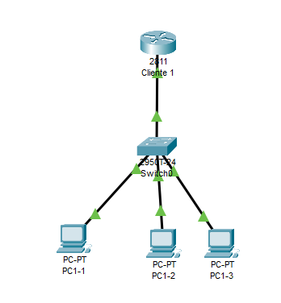

# IPv6 DHCPv6 sin estados

## Creamo una red para la practica

Creamos una red de prueba y nos conectamos via consola.



## Configuramos el router

Le asignamos una IP al router

``` cisco ios
Router#configure terminal
Router(config)#ipv6 unicast-routing 
Router(config)#interface FastEthernet0/0
Router(config-if)#ipv6 add 2001:abcd:cafe:1::1/64
Router(config-if)#no shutdown 
Router(config-if)#exit
Router(config)#exit
```

Con esto es suficiente para que los PC's obtengan una IPv6 por SLAAC .

Podemos ver por linea de comandos la configuración de un PC

``` ps
C:\>ipconfig /all

FastEthernet0 Connection:(default port)

   Connection-specific DNS Suffix..: 
   Physical Address................: 000D.BD57.220B
   Link-local IPv6 Address.........: FE80::20D:BDFF:FE57:220B
   IPv6 Address....................: 2001:ABCD:CAFE:1:20D:BDFF:FE57:220B
   IPv4 Address....................: 0.0.0.0
   Subnet Mask.....................: 0.0.0.0
   Default Gateway.................: FE80::201:42FF:FE5C:8A01
                                     0.0.0.0
   DHCP Servers....................: 0.0.0.0
   DHCPv6 IAID.....................: 
   DHCPv6 Client DUID..............: 00-01-00-01-EB-19-90-20-00-0D-BD-57-22-0B
   DNS Servers.....................: ::
                                     0.0.0.0
```

Aunque el router se asigna una IPv6 link-local por defecto, podemos asignar nosotros una
para que nos sea más sencillo localizarla.

``` cisco ios
Router#configure terminal
Router(config)#interface FastEthernet0/0
Router(config-if)#ipv6 address fe80::1 link-local
Router(config-if)#exit
Router(config)#exit
```

Ahora vermos, que sin hacer nada los PC's han actualizado la direción de la puerta de enlace
a la nueva link-local del router.

## configuramos el DHCPv6 sin estado

Necesitamos que el PC pueda obtener de la red, la configuración que nos falta,
por ejemplo el DNS y el nombre de dominio.

Creamos el pool de DHCP.

``` cisco ios
Router#configure terminal
Router(config)#ipv6 dhcp pool lan1
Router(config-dhcpv6)#dns-server 2001:4860:4860::8888
Router(config-dhcpv6)#dns-server 2001:4860:4860::8844
Router(config-dhcpv6)#domain-name lan1.midominio.com
Router(config-dhcpv6)#exit
Router(config)#
```

Y asignamos el pool a una interface.

``` cisco ios
Router(config)#interface FastEthernet0/0
Router(config-if)#ipv6 dhcp server lan1
```

Y le indicamos que el DHCPv6 trabaje sin estado.

``` cisco ios
Router(config-if)#ipv6 nd other-config-flag 
Router(config-if)#exit
Router(config)#exit
```

Podemos ver por linea de comandos la configuración de un PC

``` ps
C:\>ipconfig /all

FastEthernet0 Connection:(default port)

   Connection-specific DNS Suffix..: lan1.midominio.com
   Physical Address................: 0001.43DC.3EAD
   Link-local IPv6 Address.........: FE80::201:43FF:FEDC:3EAD
   IPv6 Address....................: 2001:ABCD:CAFE:1:201:43FF:FEDC:3EAD
   IPv4 Address....................: 0.0.0.0
   Subnet Mask.....................: 0.0.0.0
   Default Gateway.................: FE80::1
                                     0.0.0.0
   DHCP Servers....................: 0.0.0.0
   DHCPv6 IAID.....................: 363184279
   DHCPv6 Client DUID..............: 00-01-00-01-68-CD-60-99-00-01-43-DC-3E-AD
   DNS Servers.....................: 2001:4860:4860::8844
                                     0.0.0.0
```
