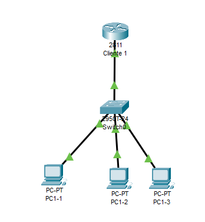

# IPv6 DHCPv6 con estados

## Creamo una red para la practica

Creamos una red de prueba y nos conectamos via consola.



## Configuramos el router

Creamos el pool indicando el prefijo de red que queremos usar y
el tiempo de vida valido y el tiempo de vida deseado (en segundos) de vida de las IPv6 asignadas.
Recordar que por motivos de confidencialidad es preferible que los host renueven su IPv6 periodicamente.

Tambien indicamos un servidor DNS y un nombre de dominio.

``` cisco ios
Router#configure terminal
Router(config)#ipv6 dhcp pool lan2
Router(config-dhcpv6)#address prefix 2001:ABCD:CAFE:2::/64 lifetime 300 500
Router(config-dhcpv6)#dns-server 2001:4860:4860::8888
Router(config-dhcpv6)#dns-server 2001:4860:4860::8844
Router(config-dhcpv6)#domain-name lan2.midominio.com
Router(config-dhcpv6)#ipv6 nd other-config-flag
Router(config-dhcpv6)#exit
Router(config)#
```

Le asignamos una IP al interface del router y le decimos que utilice el pool lan2 de DHCP.

``` cisco ios
Router#configure terminal
Router(config)#ipv6 unicast-routing 
Router(config)#interface FastEthernet0/0
Router(config-if)#ipv6 add 2001:abcd:cafe:2::1/64
Router(config-if)#ipv6 address fe80::1 link-local
Router(config-if)#ipv6 dhcp server lan2
Router(config-if)#no shutdown 
Router(config-if)#exit
Router(config)#exit
```

## Comprobar la configuración del PC

Al poner configuración IPv6 en Automico optendremos por linea de comandos

Podemos ver por linea de comandos la configuración de un PC

``` ps

C:\>ipconfig /all

FastEthernet0 Connection:(default port)

   Connection-specific DNS Suffix..: lan2.midominio.com 
   Physical Address................: 0001.C738.D046
   Link-local IPv6 Address.........: FE80::201:C7FF:FE38:D046
   IPv6 Address....................: 2001:ABCD:CAFE:2:201:C7FF:FE38:D046
   IPv4 Address....................: 0.0.0.0
   Subnet Mask.....................: 0.0.0.0
   Default Gateway.................: FE80::1
                                     0.0.0.0
   DHCP Servers....................: 0.0.0.0
   DHCPv6 IAID.....................: 363184279
   DHCPv6 Client DUID..............: 00-01-00-01-68-CD-60-99-00-01-C7-38-D0-46
   DNS Servers.....................: 2001:4860:4860::8844
                                     0.0.0.0
```
