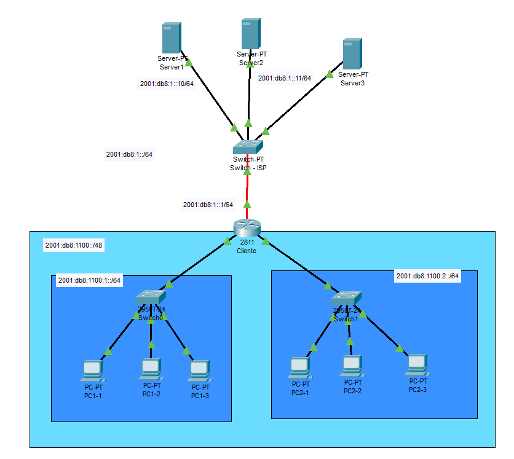

<!-- https://networklessons.com/cisco/ccie-routing-switching-written/ipv6-dhcpv6-prefix-delegation -->

# IPv6 DHCPv6 Delegación de prefijos con Router del cliente

La característica de delegación de prefijos permite a un servidor DHCP asignar prefijos elegidos de un grupo global a clientes DHCP. El cliente DHCP puede configurar una dirección IPv6 en su interfaz LAN utilizando el prefijo que recibió. Luego enviará anuncios de enrutador que incluyen el prefijo, lo que permitirá que otros dispositivos usen la configuración automática para configurar sus propias direcciones IPv6.

Supongamos que a una organización le han asignado una red /48,
la cual quiere dividir su rede en varias redes /64.

Disponemos de un router con varios interfaces, los cuales vamos a utilizar unos para cada sub-red.



Vamos a configurar manualmente cada subred, configurando el router con DHCPv6 sin estado, asignando a cada LAN sendas subredes y utilizando
DHCPv6 para asignar la dirección del servidor DNS y el dominio a los HOST de cada red.

## Router

Configuramos el router para que acepte enrutamient IPv6 Unicast.

``` cisco ios
Router>enable
Router#configure terminal 
%SYS-5-CONFIG_I: Configured from console by console
Router(config)#ipv6 unicast-routing
```

Inhabilite la búsqueda DNS para evitar que el router intente traducir los comandos mal introducidos como si fueran nombres de host.

``` cisco ios
ISP(config)#no ip domain-lookup
```

Por sinplificación, vamos a asignarle una IP estatica a nuestro router
en la interface que se conecta al ISP.

``` cisco ios
Router(config)#interface GigabitEthernet0/0/0
Router(config-if)#ipv6 address 2001:DB8:1::1/64
Router(config-if)#no shutdown
Router(config-if)#
Router(config)#exit
Router#exit
```

Si hemos configurado los servidores del ISP con IP fija, podemos probar que funciona la conexión haciendo ping a uno de los servidores.

``` cisco ios
Router#ping 2001:DB8:1::10

Type escape sequence to abort.
Sending 5, 100-byte ICMP Echos to 2001:DB8:1::10, timeout is 2 seconds:
!!!!!
Success rate is 100 percent (5/5), round-trip min/avg/max = 0/0/1 ms
```

Ahora configuramos un pool DHCPv6 para cada sub red y observese que no asignamos los rangos de IP's que se van a dar a cada pool.

``` cisco ios
Router#configure terminal

Router(config)#ipv6 dhcp pool lan1
Router(config-dhcpv6)#dns-server 2001:4860:4860::8888
Router(config-dhcpv6)#domain-name lan1.midominio.com
Router(config-dhcpv6)#exit

Router(config)#ipv6 dhcp pool lan2
Router(config-dhcpv6)#dns-server 2001:4860:4860::8844
Router(config-dhcpv6)#domain-name lan2.midominio.com
Router(config-dhcpv6)#exit

Router(config)#
```

Y ahora configuramos cada interfaz de red, indicando que pool de DHCPv6 utilizar y que trabaje sin estado.

Y asignamos el pool a una interface.

``` cisco ios
Router(config)#interface FastEthernet0/0
Router(config-if)#ipv6 add 2001:db8:1100:1::1/64
Router(config-if)#ipv6 address fe80::1 link-local
Router(config-if)#ipv6 dhcp server lan1
Router(config-if)#ipv6 nd other-config-flag 
Router(config-if)#exit

Router(config)#interface FastEthernet0/1
Router(config-if)#ipv6 add 2001:db8:1100:2::1/64
Router(config-if)#ipv6 address fe80::1 link-local
Router(config-if)#ipv6 dhcp server lan2
Router(config-if)#ipv6 nd other-config-flag 
Router(config-if)#exit

Router(config)#exit
```

## Comprobamos la configuración

### Configuración del router

Podemos ver la configuración de cada interfaz del router con

``` cisco ios
Router#show ipv6 interface brief 
FastEthernet0/0            [up/up]
    FE80::1
    2001:DB8:1100:1::1
FastEthernet0/1            [up/up]
    FE80::1
    2001:DB8:1100:2::1
GigabitEthernet0/0/0       [up/up]
    FE80::1
    2001:DB8:1::1
Vlan1                      [administratively down/down]
    unassigned
```

### Configuración de los Host

Podemos ver toda la configuración de un host con el comando

``` cmd
C:\>ipconfig /all

FastEthernet0 Connection:(default port)

   Connection-specific DNS Suffix..: lan1.midominio.com lan2.midominio.com 
   Physical Address................: 0001.43DC.3EAD
   Link-local IPv6 Address.........: FE80::201:43FF:FEDC:3EAD
   IPv6 Address....................: 2001:DB8:1100:1:201:43FF:FEDC:3EAD
   IPv4 Address....................: 0.0.0.0
   Subnet Mask.....................: 0.0.0.0
   Default Gateway.................: FE80::1
                                     0.0.0.0
   DHCP Servers....................: 0.0.0.0
   DHCPv6 IAID.....................: 1863813456
   DHCPv6 Client DUID..............: 00-01-00-01-68-CD-60-99-00-01-43-DC-3E-AD
   DNS Servers.....................: 2001:4860:4860::8888
                                     0.0.0.0
```

Podemos ver si hay conexión con otros host de otra red con

``` cmd
C:\>ping 2001:DB8:1100:1:201:43FF:FEDC:3EAD

Pinging 2001:DB8:1100:1:201:43FF:FEDC:3EAD with 32 bytes of data:

Reply from 2001:DB8:1100:1:201:43FF:FEDC:3EAD: bytes=32 time<1ms TTL=127
Reply from 2001:DB8:1100:1:201:43FF:FEDC:3EAD: bytes=32 time<1ms TTL=127
Reply from 2001:DB8:1100:1:201:43FF:FEDC:3EAD: bytes=32 time=6ms TTL=127
Reply from 2001:DB8:1100:1:201:43FF:FEDC:3EAD: bytes=32 time<1ms TTL=127

Ping statistics for 2001:DB8:1100:1:201:43FF:FEDC:3EAD:
    Packets: Sent = 4, Received = 4, Lost = 0 (0% loss),
Approximate round trip times in milli-seconds:
    Minimum = 0ms, Maximum = 6ms, Average = 1ms
```

Tambien podemos ver que tenemos desde los HOST del ISP tenemos acceso a los HOST de las redes LAN.

