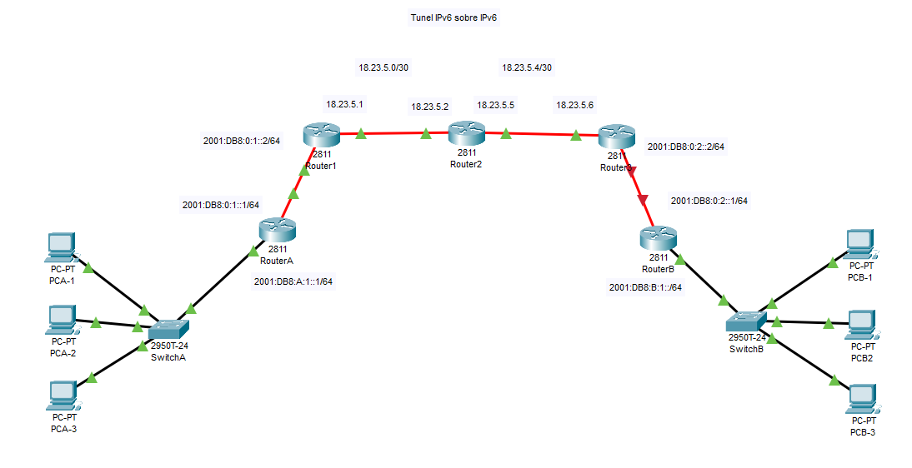

# Tunel IPv6 sobre IPv4

Vamos a crear un puente IPv6 sobre una red IPv4

## Creamo una red para la practica

Creamos una red de prueba, con la siguiente topologia.



## Configuración red IPv4

Primero configuramos la IPV4

### Configuración Router1

Configuramos el router1 con IPv4

``` cisco ios
Router>en
Router#configure terminal 
Router(config)#hostname Router1
Router1(config)#interface GigabitEthernet0/3/0
Router1(config-if)#ip address 18.23.5.1 255.255.255.252
Router1(config-if)#no shutdown
```

### Configuración Router2

Configuramos el router2 con IPv4

``` cisco ios
Router>en
Router#configure terminal 
Router(config)#hostname Router2
Router2(config)#interface GigabitEthernet0/2/0
Router2(config-if)#ip address 18.23.5.1 255.255.255.252
Router2(config-if)#no shutdown
```

``` cisco ios
Router>en
Router#configure terminal 
Router(config)#hostname Router2
Router2(config)#interface GigabitEthernet0/2/0
Router2(config-if)#ip address 18.23.5.2 255.255.255.252
Router2(config-if)#no shutdown
Router2(config)#interface GigabitEthernet0/3/0
Router2(config-if)#ip address 18.23.5.5 255.255.255.252
Router2(config-if)#no shutdown
```

### Configuración Router3

Configuramos el router3 con IPv4

``` cisco ios
Router>en
Router#configure terminal 
Router(config)#hostname Router1
Router3(config)#interface GigabitEthernet0/3/0
Router3(config-if)#ip address 18.23.5.6 255.255.255.252
Router3(config-if)#no shutdown
```

### configuración de enrutamiento dinamico po OSPF sobre IPv4

Vamos a configurar el enrutamiento dinamico en la red IPv4 con OSPF.

### Configuración OSPF Router1

``` cisco ios
Router>en
Router#configure terminal 
Router1(config)#router ospf 1
Router1(config-router)#router-id 1.1.1.1
Router1(config-router)#log-adjacency-changes
Router1(config-router)#network 18.23.5.0 0.0.0.3 area 0
Router(config-router)#exit
```

### Configuración OSPF Router2

``` cisco ios
Router>en
Router#configure terminal 
Router2(config)#router ospf 1
Router2(config-router)#router-id 2.2.2.2
Router2(config-router)#log-adjacency-changes
Router2(config-router)#network 18.23.5.0 0.0.0.3 area 0
Router2(config-router)#network 18.23.5.4 0.0.0.3 area 0
Router(config-router)#exit
```

### Configuración OSPF Router3

``` cisco ios
Router>en
Router#configure terminal 
Router3(config)#router ospf 1
Router3(config-router)#router-id 3.3.3.3
Router3(config-router)#log-adjacency-changes
Router3(config-router)#network 18.23.5.4 0.0.0.3 area 0
Router(config-router)#exit
```

### Comprobación de la detección de redes por OSPF

Podemos comporbar que se han detectado las redes por OSPF con el los siguientes.

``` cisco ios
Router3#show ip ospf neighbor


Neighbor ID     Pri   State           Dead Time   Address         Interface
18.23.5.5         1   FULL/DR         00:00:37    18.23.5.5       GigabitEthernet0/2/0
```

O comprobando la  tabla de rutas

``` cisco ios
Router3#show ip route
Codes: L - local, C - connected, S - static, R - RIP, M - mobile, B - BGP
       D - EIGRP, EX - EIGRP external, O - OSPF, IA - OSPF inter area
       N1 - OSPF NSSA external type 1, N2 - OSPF NSSA external type 2
       E1 - OSPF external type 1, E2 - OSPF external type 2, E - EGP
       i - IS-IS, L1 - IS-IS level-1, L2 - IS-IS level-2, ia - IS-IS inter area
       * - candidate default, U - per-user static route, o - ODR
       P - periodic downloaded static route

Gateway of last resort is not set

     18.0.0.0/8 is variably subnetted, 3 subnets, 2 masks
O       18.23.5.0/30 [110/2] via 18.23.5.5, 00:01:59, GigabitEthernet0/2/0
C       18.23.5.4/30 is directly connected, GigabitEthernet0/2/0
L       18.23.5.6/32 is directly connected, GigabitEthernet0/2/0
```

## Configuramos redes IPv6

Devemos configurar las redes A y B con Ipv6.

Vamos a utilizar RIP, para crear las tablas de enrutamiento en IPv6.

### Configuración router A

``` cisco ios
Router>en
Router#config terminal
Router(config)#hostname RouterA

RouterA(config)#ipv6 unicast-routing
RouterA(config)#ipv6 router rip Redv6
RouterA(config-rtr)#exit

RouterA(config)#interface GigabitEthernet0/0/0
RouterA(config-if)#ipv6 address 2001:db8:A:1::1/64
RouterA(config-if)#ipv6 address fe80::1 link-local
RouterA(config-if)#ipv6 rip Redv6 enable
RouterA(config-if)#no shutdown

RouterA(config)#interface GigabitEthernet0/2/0
RouterA(config-if)#ipv6 address 2001:DB8:0:1::1/64
RouterA(config-if)#ipv6 rip redv6 enable 
RouterA(config-if)#no shutdown
RouterA(config-if)#end
RouterA#
```

### Configuración router B

``` cisco ios
Router>en
Router#config terminal
Router(config)#hostname RouterB

RouterB(config)#ipv6 unicast-routing
RouterB(config)#ipv6 router rip Redv6
RouterB(config-rtr)#exit

RouterB(config)#interface GigabitEthernet0/0/0
RouterB(config-if)#ipv6 address 2001:db8:B:1::1/64
RouterB(config-if)#ipv6 address fe80::1 link-local
RouterB(config-if)#ipv6 rip Redv6 enable
RouterB(config-if)#no shutdown

RouterB(config)#interface GigabitEthernet0/2/0
RouterB(config-if)#ipv6 address 2001:DB8:0:2::1/64
RouterB(config-if)#ipv6 rip Redv6 enable 
RouterB(config-if)#no shutdown
RouterB(config-if)#end
RouterB#
```

### Configuración del router 1 con IPv6

Configuramos el router 1 con una IPv6 y Rip.
Vease que este router tien una IPv4 y una IPv6 y utiliza enrutamiento con OSPF sobre IPv4 y RIP sobre IPv6.

``` cisco ios
Router1(config)#ipv6 unicast-routing
Router1(config)#ipv6 router rip redv6
Router1(config-rtr)#exit

Router1(config)#interface GigabitEthernet0/0/0
Router1(config-if)#ipv6 address 2001:db8:0:1::2/64
Router1(config-if)#ipv6 rip Redv6 enable
Router1(config-if)#no shutdown
```

### Configuración del router 2 con IPv6

Configuramos el router 2 con una IPv6 y Rip.
Vease que este router tien una IPv4 y una IPv6 y utiliza enrutamiento con OSPF sobre IPv4 y RIP sobre IPv6.

``` cisco ios
Router3(config)#ipv6 unicast-routing
Router3(config)#ipv6 router rip Redv6
Router3(config-rtr)#exit

Router3(config)#interface GigabitEthernet0/0/0
Router3(config-if)#ipv6 address 2001:db8:0:2::2/64
Router3(config-if)#ipv6 rip Redv6 enable
Router3(config-if)#no shutdown
```

### Configuramos el tunel

Ahora cramos el tunes IPv6 sobre IPv4. Para ello hay que modificar la configuración de los router 1 y 3.

Para ello vamos a configurar una interfaz llamada tunnel, con el IP 0, con una IPv6 y le decimos que utilice el enrutamiento rip. Definimos el origen del tunel con el nombre del interfaz de salida y el destino con la IPv4 del router de destino. Tambien debemos indicar el modo del tunel con ipv6 sobre ipv4.

#### Configuración del tunel en router 1

``` cisco ios
Router1(config)#interface Tunnel0
Router1(config-if)#ipv6 address 3000::1/112
Router1(config-if)#ipv6 rip Redv6 enable
Router1(config-if)#tunnel source gigabitEthernet 0/3/0
Router1(config-if)#tunnel destination 18.23.5.6
Router1(config-if)#tunnel mode ipv6ip
Router1(config-if)#end
Router1#
```

#### Configuración del tunel en router 3

``` cisco ios
Router1(config)#interface Tunnel0
Router1(config-if)#ipv6 address 3000::2/112
Router1(config-if)#ipv6 rip Redv6 enable
Router1(config-if)#tunnel source gigabitEthernet 0/2/0
Router1(config-if)#tunnel destination 18.23.5.1
Router1(config-if)#tunnel mode ipv6ip
Router1(config-if)#end
Router1#
```

## Comprobaciones

### Configuración RIP

Podemos comprobamos la base de datos de RIP

``` cisco ios
RouterB#show ipv6 rip ?
  database  RIP local RIB
RouterB#show ipv6 rip database
RIP process "redv6" local RIB 
RIP process "Redv6" local RIB 
 2001:DB8:0:1::/64, metric 3, installed
    GigabitEthernet0/2/0/FE80::250:FFF:FECB:6594, expires in 177 sec
 2001:DB8:A:1::/64, metric 4, installed
    GigabitEthernet0/2/0/FE80::250:FFF:FECB:6594, expires in 177 sec
 3000::/112, metric 2, installed
    GigabitEthernet0/2/0/FE80::250:FFF:FECB:6594, expires in 177 sec
```

### Tablas de rutas

Tablas de rutas IPv6

``` cisco ios
RouterB#show ipv6 route
IPv6 Routing Table - 8 entries
Codes: C - Connected, L - Local, S - Static, R - RIP, B - BGP
       U - Per-user Static route, M - MIPv6
       I1 - ISIS L1, I2 - ISIS L2, IA - ISIS interarea, IS - ISIS summary
       ND - ND Default, NDp - ND Prefix, DCE - Destination, NDr - Redirect
       O - OSPF intra, OI - OSPF inter, OE1 - OSPF ext 1, OE2 - OSPF ext 2
       ON1 - OSPF NSSA ext 1, ON2 - OSPF NSSA ext 2
       D - EIGRP, EX - EIGRP external
R   2001:DB8:0:1::/64 [120/3]
     via FE80::250:FFF:FECB:6594, GigabitEthernet0/2/0
C   2001:DB8:0:2::/64 [0/0]
     via GigabitEthernet0/2/0, directly connected
L   2001:DB8:0:2::1/128 [0/0]
     via GigabitEthernet0/2/0, receive
R   2001:DB8:A:1::/64 [120/4]
     via FE80::250:FFF:FECB:6594, GigabitEthernet0/2/0
C   2001:DB8:B:1::/64 [0/0]
     via FastEthernet0/0, directly connected
L   2001:DB8:B:1::1/128 [0/0]
     via FastEthernet0/0, receive
R   3000::/112 [120/2]
     via FE80::250:FFF:FECB:6594, GigabitEthernet0/2/0
L   FF00::/8 [0/0]
     via Null0, receive
```

### Doble pila

Vease que en los rutes 1 y 3 tenemos una doble pila, una para IPv4 y otra para IPv6.


``` cisco

``` cisco ios
Router3#show ip route
Codes: L - local, C - connected, S - static, R - RIP, M - mobile, B - BGP
       D - EIGRP, EX - EIGRP external, O - OSPF, IA - OSPF inter area
       N1 - OSPF NSSA external type 1, N2 - OSPF NSSA external type 2
       E1 - OSPF external type 1, E2 - OSPF external type 2, E - EGP
       i - IS-IS, L1 - IS-IS level-1, L2 - IS-IS level-2, ia - IS-IS inter area
       * - candidate default, U - per-user static route, o - ODR
       P - periodic downloaded static route

Gateway of last resort is not set

     18.0.0.0/8 is variably subnetted, 3 subnets, 2 masks
O       18.23.5.0/30 [110/2] via 18.23.5.5, 00:22:26, GigabitEthernet0/2/0
C       18.23.5.4/30 is directly connected, GigabitEthernet0/2/0
L       18.23.5.6/32 is directly connected, GigabitEthernet0/2/0
Router3#
Router3#
Router3#show ipv6 route
IPv6 Routing Table - 8 entries
Codes: C - Connected, L - Local, S - Static, R - RIP, B - BGP
       U - Per-user Static route, M - MIPv6
       I1 - ISIS L1, I2 - ISIS L2, IA - ISIS interarea, IS - ISIS summary
       ND - ND Default, NDp - ND Prefix, DCE - Destination, NDr - Redirect
       O - OSPF intra, OI - OSPF inter, OE1 - OSPF ext 1, OE2 - OSPF ext 2
       ON1 - OSPF NSSA ext 1, ON2 - OSPF NSSA ext 2
       D - EIGRP, EX - EIGRP external
R   2001:DB8:0:1::/64 [120/2]
     via FE80::20B:BEFF:FEE0:B4C2, Tunnel0
C   2001:DB8:0:2::/64 [0/0]
     via GigabitEthernet0/3/0, directly connected
L   2001:DB8:0:2::2/128 [0/0]
     via GigabitEthernet0/3/0, receive
R   2001:DB8:A:1::/64 [120/3]
     via FE80::20B:BEFF:FEE0:B4C2, Tunnel0
R   2001:DB8:B:1::/64 [120/2]
     via FE80::209:7CFF:FEC9:998B, GigabitEthernet0/3/0
C   3000::/112 [0/0]
     via Tunnel0, directly connected
L   3000::2/128 [0/0]
     via Tunnel0, receive
L   FF00::/8 [0/0]
     via Null0, receive
```

### Configuración entre host

Desde un PC probamos el ping

``` ps
C:\>ping 2001:DB8:B:1:2E0:A3FF:FEA2:26D2

Pinging 2001:DB8:B:1:2E0:A3FF:FEA2:26D2 with 32 bytes of data:

Reply from 2001:DB8:B:1:2E0:A3FF:FEA2:26D2: bytes=32 time=16ms TTL=124

Ping statistics for 2001:DB8:B:1:2E0:A3FF:FEA2:26D2:
    Packets: Sent = 2, Received = 1, Lost = 1 (50% loss),
Approximate round trip times in milli-seconds:
    Minimum = 16ms, Maximum = 16ms, Average = 16ms
```

O tracert

``` ps
C:\>tracert 2001:DB8:B:1:2E0:A3FF:FEA2:26D2

Tracing route to 2001:DB8:B:1:2E0:A3FF:FEA2:26D2 over a maximum of 30 hops: 

  1   0 ms      0 ms      0 ms      2001:DB8:A:1::1
  2   0 ms      0 ms      0 ms      2001:DB8:0:1::2
  3   0 ms      0 ms      0 ms      3000::2
  4   0 ms      0 ms      0 ms      2001:DB8:0:2::1
  5   0 ms      0 ms      0 ms      2001:DB8:B:1:2E0:A3FF:FEA2:26D2

Trace complete.
```