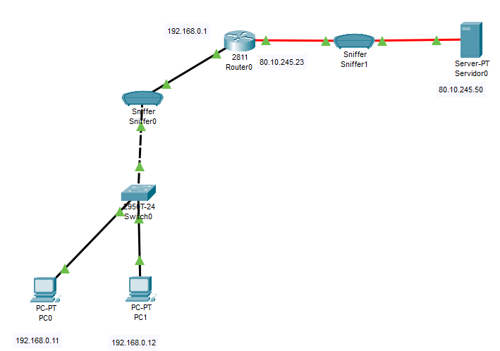

# Configurar NAT estatico con router CISCO

<!-- Cuidado que falta 

Router2(config)# ip default-gateway 212.100.100.2
Router2(config)# no ip routing

https://ipcisco.com/lesson/pat-configuration-with-packet-tracer-2/ -->

Para configurar un router CISCO con NAT estático.

## Creamo una red para la practica

Creamos dos redes unidas por un Router



## Configuramos el router

Configuramos el primer router

``` cisco ios
Router>enable
Router#configure terminal 
%SYS-5-CONFIG_I: Configured from console by console
Router(config)#interface fastEthernet 0/0
Router(config-if)#ip address 192.168.0.1 255.255.255.0
Router(config-if)#no shutdown
%LINK-5-CHANGED: Interface FastEthernet0/0, changed state to up

%LINEPROTO-5-UPDOWN: Line protocol on Interface FastEthernet0/0, changed state to up

Router(config-if)#exit
Router(config)#
```

De igual forma configuramos el otro interface.

``` cisco ios
Router>enable
Router#configure terminal 
%SYS-5-CONFIG_I: Configured from console by console
Router(config)#interface fastEthernet 1/0
Router(config-if)#ip address 80.10.245.23 255.255.255.0
Router(config-if)#no shutdown
%LINK-5-CHANGED: Interface FastEthernet1/0, changed state to up

%LINEPROTO-5-UPDOWN: Line protocol on Interface FastEthernet0/0, changed state to up
Router(config-if)#exit
Route
```

## Configuramos NAT estatico

Vamos a decirle al router que traduzca la IP privada 192.168.0.11 como la IP publica 80.10.245.23 y la IP privada 192.168.0.12 como la IP publica 80.10.245.24

``` cisco ios
Router(config)#ip nat inside source static 192.168.0.11 80.10.245.23
Router(config)#ip nat inside source static 192.168.0.12 80.10.245.24
Router(config)#interface fastEthernet 0/0
Router(config-if)#ip nat inside
Router(config-if)#exit
Router(config)#interface fastEthernet 1/0
Router(config-if)#ip nat outside
Router(config-if)#exit
```

## Comprobamos la configuración desde un PC

Ahora tenemos una red privada y una publica. Podemos ver que desde las máquinas con IP privada podemos hacer Ping a las máquinas con IP publica, pero no al reves.

Tambien podemos comprobar que al hacer un TraceRt a las direcciones 80.10.245.23 y 80.10.245.23 el paquete se reenvia a las 192.168.0.11 y 192.168.0.12 respectivamente.

## Comprobaciones desde el rotuer

Desde el router podemos hacer las siguientes comprobaciones

Muestra la tabla de correspondencias entre direcciones privadas y públicas que están activas actualmente.

``` cisco ios
Router#show ip nat translation
```

Muestra inforamación estadística sobre la traducción de direcciones NAT

``` cisco ios
Router#show ip nat statistics
```

Activar la visualización de los eventos que produce el protocolo NAT

``` cisco ios
Router#debug ip nat
```
