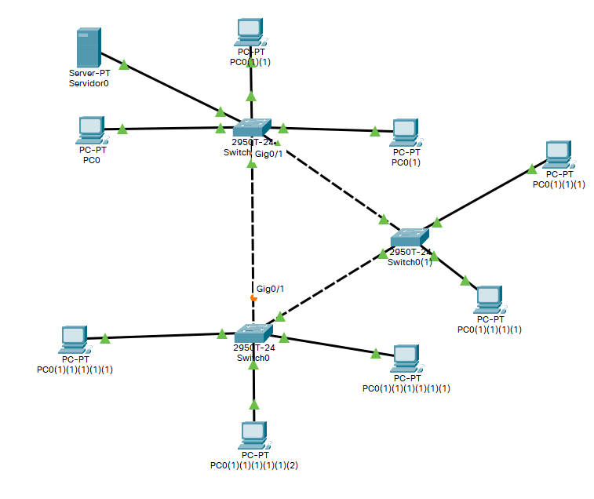

# Switches

Configuración de Switches

## Mostrar estado

Mostrar el estado con el comando **show**

### Mostrar prcesos

Mostrar los procesos que se están ejecutando en el switch con **show process**.

```
Switch#show process
CPU utilization for five seconds: 0%/0%; one minute: 0%; five minutes: 0%
 PID QTy       PC Runtime (ms)    Invoked  uSecs     Stacks TTY Process
   1 Csp 602F3AF0            0       1627       0 2600/3000   0 Load Meter 
   2 Lwe 60C5BE00            4        136      29 5572/6000   0 CEF Scanner 
   3 Lst 602D90F8         1676        837    2002 5740/6000   0 Check heaps 
   4 Cwe 602D08F8            0          1       0 5568/6000   0 Chunk Manager 
   5 Cwe 602DF0E8            0          1       0 5592/6000   0 Pool Manager 
   6 Mst 60251E38            0          2       0 5560/6000   0 Timers 
   7 Mwe 600D4940            0          2       0 5568/6000   0 Serial Backgrou
   8 Mwe 6034B718            0          1       0 2584/3000   0 OIR Handler 
   9 Mwe 603FA3C8            0          1       0 5612/6000   0 IPC Zone Manage
  10 Mwe 603FA1A0            0       8124       0 5488/6000   0 IPC Periodic Ti
  11 Mwe 603FA220            0          9       0 4884/6000   0 IPC Seat Manage
  12 Lwe 60406818          124       2003      61 5300/6000   0 ARP Input
  13 Mwe 60581638            0          1       0 5760/6000   0 HC Counter Time
  14 Mwe 605E3D00            0          2       0 5564/6000   0 DDR Timers
  15 Msp 80164A38            0      79543       0 5608/6000   0 GraphIt
  16 Mwe 802DB0FC            0          2       011576/12000  0 Dialer event
  17 Cwe 801E74BC            0          1       0 5808/6000   0 Critical Bkgnd
  18 Mwe 80194D20            4       9549       010428/12000  0 Net Background
  19 Lwe 8011E9CC            0         20       011096/12000  0 Logger
  20 Mwe 80140160            8      79539       0 5108/6000   0 TTY Background
  21 Msp 80194114            0      95409       0 8680/9000   0 Per-Second Job
  22 Mwe 8047E960            0          2       0 5544/6000   0 dot1x
  23 Mwe 80222C8C            4          2    2000 5360/6000   0 DHCPD Receive
  24 Mwe 800844A0            0          1       0 5796/6000   0 HTTP Timer
  25 Mwe 80099378            0          1       0 5612/6000   0 RARP Input
  26 Mst 8022F178            0          1       011796/12000  0 TCP Timer
  27 Lwe 802344C8            0          1       011804/12000  0 TCP Protocols
  28 Hwe 802870E8            0          1       0 5784/6000   0 Socket Timers
  29 Mwe 80426048           64          3   21333 4488/6000   0 L2MM
  30 Mwe 80420010            4          1    4000 5592/6000   0 MRD
  31 Mwe 8041E570            0          1       0 5584/6000   0 IGMPSN
  32 Hwe 80429B40            0          1       0 2604/3000   0 IGMP Snooping P
  33 Mwe 804F43B0            0          5       0 5472/6000   0 Cluster L2
  34 Mwe 804F18D0            0         17       0 5520/6000   0 Cluster RARP
  35 Mwe 804EA650            0         23       0 5440/6000   0 Cluster Base
  36 Lwe 802A1158            4          1    4000 5592/6000   0 Router Autoconf
  37 Mwe 80022058            0          1       0 5624/6000   0 Syslog Traps
  38 Mwe 8031CE88            0          1       0 5788/6000   0 AggMgr Process
  39 Mwe 8035EF88            0        407       0 5592/6000   0 PM Callback
  40 Mwe 80437B58            0          3       0 5556/6000   0 VTP Trap Proces
  41 Mwe 80027D40            0          2       0 5676/6000   0 DHCPD Timer
  42 Mwe 8040D3B0            0          2       0 2560/3000   0 STP STACK TOPOL
  43 Hwe 8040E338            0          2       0 2560/3000   0 STP FAST TRANSI
```

### Muestra topologia de red.



``` cisco ios
Switch#show spanning-tree 
VLAN0001
  Spanning tree enabled protocol ieee
  Root ID    Priority    32769
             Address     0002.163E.CE87
             Cost        19
             Port        4(FastEthernet0/4)
             Hello Time  2 sec  Max Age 20 sec  Forward Delay 15 sec

  Bridge ID  Priority    32769  (priority 32768 sys-id-ext 1)
             Address     00E0.F737.5475
             Hello Time  2 sec  Max Age 20 sec  Forward Delay 15 sec
             Aging Time  20

Interface        Role Sts Cost      Prio.Nbr Type
---------------- ---- --- --------- -------- --------------------------------
Fa0/1            Desg FWD 19        128.1    P2p
Fa0/2            Desg FWD 19        128.2    P2p
Fa0/3            Desg FWD 19        128.3    P2p
Fa0/4            Root FWD 19        128.4    P2p
Gi0/1            Altn BLK 4         128.25   P2p
```

Al crear un bucle vemos como el puerto Gi0/1 está en estado BLK (bloqueado).

