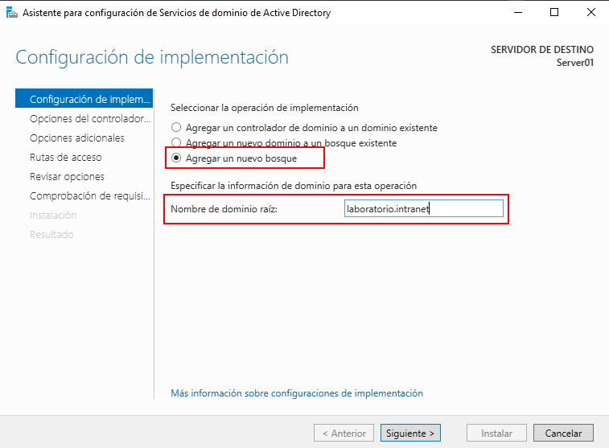

# Instalar directorio activo

## Configurar Servidor Windows

Instalamos un servidor Windows y configuramos la contraseña del administrador local, 
un nombre único y las IP fijas.

## Instalar role 

Instalamos el role de *Servicios de dominio de Active Directory*,
al instalar este role tambien se nos instalar el role de *Servidor DNS* aunque no hace falta marcarlo.


Promovemos el servidor como servidor de *Directorio Activo*


## Crear un nuevo bosque 



Configuramos los siguientes parámetros:
- Configuramos la compativilidad de versiones del dominio a nivel de bosque y a nivel de dominio. 
- Marcamos como servidor de sistema de nombre de dominio (DNS)
- Marcamos como catalogo global (GC) con lo que va a tener información de todo el bosque.


### Crear un nuevo arbol agregando un nuevo dominio a un bosque existente

De igual forma instalamos el role de *Servicios de dominio de Active Directory* en un nuevo servidor, 
configuramos el nombre del servidor con IP fija y como DNS apuntamos al servidor de dominio previamente montado.


Si utilizamos una imagen o copia de seguridad de un servidor de dominio podemos tener problemas con el SID de este.
Para generar un nuevo SID, se puede utilizar el comando

``` ps
%WINDIR%\System32\Sysprep\Sysprep /generalize /shutdown
```

Otra herramienta para ver el SID es **PsGetsid.exe** perteneciente a las sysinternals.
